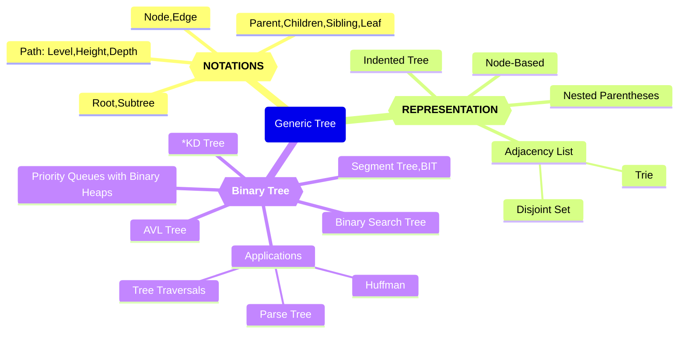
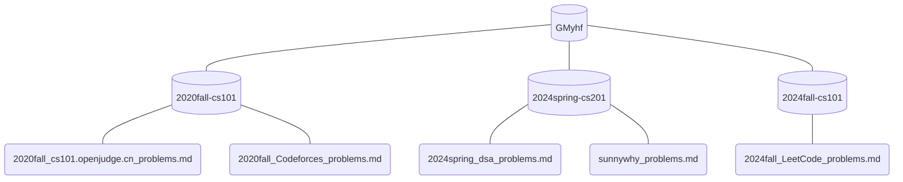
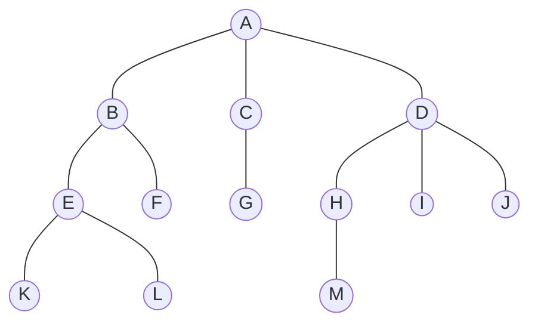

# Week6~9 🌲算

Updated 1348 GMT+8 Apr 15, 2025

2025 spring, Complied by Hongfei Yan


> 说明：
>
> 20250401 Week7说明：课件中编程题目，“示例。。。”是学习了概念，顺便看懂示例程序。“练习。。。”是希望先不看答案，自己尝试先完成。
>
> 20250326 Week6说明：与树相关的题目，还挺难的，因为通常涉及到把输入字符串parse/build成一棵树，这个过程比较麻烦，通常用到stack+dfs。然后再按照题面要求输出。
>
> 1）计划一讲包括树的相关概念、表示方法；二讲树的构建/解析、遍历、哈夫曼算法；三讲堆实现、AVL实现、并查集。
>
> 2）md文件有目录，内容推进思路是原理学习+编程题目实际。


# 前言：树形结构学习方法

在计算机科学领域内，树形结构是最为关键同时也是掌握难度较高的概念之一。不同于计算机概论，数据结构与算法的学习不仅需要借助面向对象编程的抽象和复用理念，还要通过<mark>使用链表来表达树结构，并采用递归的方法进行树的遍历</mark>。在这一过程中，经典算法和编程技巧的应用至关重要，而对于时间复杂度的优化技巧也是必不可少的。

即便是参加过计算机概论提高班的学生，也可能会发现树结构的学习颇具挑战。一些学生可能会通过类比和综合的方式来促进理解，比如通过深度优先搜索（DFS）来深入理解树的前序遍历和后序遍历；有的学生可能会通过吟诵诗歌来激励自己；还有的学生则投入大量时间复现经典算法，或在集成开发环境（IDE）中探索如何调试递归程序。

教材中不免存在一些内容遗漏或逻辑不连贯的部分，因此我们制作的课件也在持续更新以补充和完善这些内容。
预计需要至少三周掌握树结构的相关知识。

> 《Python数据结构与算法分析》 这本书，树这一章没有讲generic tree，直接就到binary tree了。之前感觉它的 算法分析 那章不好，现在感觉树这章也差强人意，写的比较随意。树有个重要的应用，文本压缩——哈夫曼编码。在该书中，搜不到“哈夫曼”，也搜不到"Huffman"。
>


**Q: 有没有直接的理解**，就是比如给我一棵树，我可以直接用遍历方法给出中序和后序?

> 前序遍历就是dfs序列，后序的反序是不是就是原树优先走右边的dfs。
>
> 你的问题涉及到树的遍历方法以及它们之间的关系。我们来逐一分析：
>


> **1. 树的遍历方法**
>
> 对于一棵树（尤其是二叉树），常见的遍历方法有三种：
>
> - **前序遍历**（Preorder）：根 -> 左子树 -> 右子树
>- **中序遍历**（Inorder）：左子树 -> 根 -> 右子树
> - **后序遍历**（Postorder）：左子树 -> 右子树 -> 根
>
> 这些遍历方法可以通过递归或迭代实现，本质上是深度优先搜索（DFS）的不同变体。
>
> ---
>
>**2. 前序遍历和DFS的关系**
>>
>你提到“前序遍历就是DFS序列”，这是正确的！  
> - **前序遍历**的顺序正是标准的深度优先搜索（DFS）访问节点的顺序。
> - 在DFS过程中，第一次访问某个节点时就记录它，这就是前序遍历的结果。
> 
>例如，给定以下二叉树：
> ```
>     A
>    / \
>   B   C
>  / \
>D   E
> ```
> 前序遍历结果是：`A -> B -> D -> E -> C`
> 
>这正是DFS从根节点开始访问的顺序。
> 
> ---
> 
> **3. 后序遍历的反序与DFS的关系**
> 
> 你提到“后序的反序是不是就是原树优先走右边的DFS”，这个说法在某些情况下是对的，但需要具体分析。
> 
> **后序遍历的特点**
> 
>后序遍历的顺序是：先访问左子树，再访问右子树，最后访问根节点。  
> 以上面的树为例，后序遍历结果是：`D -> E -> B -> C -> A`
>
> **后序遍历的反序**
>
> 将后序遍历结果反转，得到：`A -> C -> B -> E -> D`
>
> **优先走右边的DFS**
>
> 如果我们在DFS过程中优先访问右子树（即先访问右子树再访问左子树），那么得到的访问顺序是：`A -> C -> B -> E -> D`
>
> 可以看到，后序遍历的反序确实等于优先走右边的DFS的顺序。
> 
>---
> 
>**4. 中序遍历**
> 
>中序遍历的顺序是：左子树 -> 根 -> 右子树。  
> 以上面的树为例，中序遍历结果是：`D -> B -> E -> A -> C`
>
> 中序遍历没有直接等价于某种DFS顺序，因为它的顺序依赖于左子树、根、右子树的特定排列。
>
> ---
>
> **总结**
>
> - **前序遍历** = 标准DFS访问顺序。
>- **后序遍历的反序** = 优先走右边的DFS访问顺序。
> - **中序遍历** = 左子树 -> 根 -> 右子树，没有直接等价于某种DFS顺序。
> 


> 【往年同学作业总结】：
>
> 树状数组惨遭内存超出，现学分治依旧遥遥领先。
>合法出栈序列简单模拟，树节无树求二叉树深度。
> 双端队列还是宝宝巴士，波兰表达式仍游刃有余。
>中序转后序写了两小时，水平不够还得多家练习！
> 
>
> 
>本周算是真正进入了数算的重点章节，难度肉眼可见地增长。百字令一首，聊表感受。
> 树
>不熟
>真可恶
>>无能狂怒
>找大佬求助
> WA百般苦楚
> 心茫然拔剑四顾
> 栈与队列前后弹出
>好在学东西可以顿悟
> 各种序表达式需要关注
>逐渐解决了本周题目
> 尤其写栈有如神助
>但没到精通程度
> 递归循环次数
>AC趣味足
> 乐不思蜀
> 刚上路
> 刻苦
>赴 


# 一、🌲的概念和表示方法

## 0 Recap 

### 0.1 递归 & BFS

鉴于各班在《计算概论B》课程中的进度不一，各位老师对于《计算概论》和《数据结构与算法》内容的覆盖和理解也存在差异，我们建议复习递归和BFS的相关内容。

1）<mark>**递归**是数算中不可或缺的核心技能</mark>，强烈推荐优先掌握。可以参考 https://github.com/GMyhf/2024fall-cs101/blob/main/20241029_recursion.md

2）<mark>**队列**在广度优先搜索（BFS）中有着广泛的应用</mark>。考虑到其他班级可能尚未讲授搜索算法，我们提供学习资源，https://github.com/GMyhf/2024fall-cs101/blob/main/20241119_searching.md


### 0.2用OOP写程序

接下来开始学习树，有时程序会给出类的实现代码。复习一个类写法的小程序，可以debug模式运行，或者 https://pythontutor.com 可视化运行，辅助理解。类实现程序，补充缺失行代码。是笔试中必考的题目。

OOP 的写法属于语法范畴，可参看 https://www.runoob.com/python3/python3-class.html

数算的精华是复制（类的精华是复制），不需要深拷贝，<mark>只要创建多个对象，就有各自的内存空间</mark>。例如下面并查集的例子，创建了A, B两个对象，A的修改不影响B的。并查集的内容在 三.7部分。

```python
class DisjSet:
    def __init__(self, n):
        # Constructor to create and
        # initialize sets of n items
        self.rank = [1] * n
        self.parent = [i for i in range(n)]

    def find(self, x):
        # Find the root of the set in which element x belongs
        if self.parent[x] != x:
            # Path compression: Make the parent of x the root of its set
            self.parent[x] = self.find(self.parent[x])
        return self.parent[x]

    def union(self, x, y):
        # Perform union of two sets
        x_root = self.find(x)
        y_root = self.find(y)

        if x_root == y_root:
            return

        # Attach smaller rank tree under root of higher rank tree
        if self.rank[x_root] < self.rank[y_root]:
            self.parent[x_root] = y_root
        elif self.rank[x_root] > self.rank[y_root]:
            self.parent[y_root] = x_root
        else:
            self.parent[y_root] = x_root
            self.rank[x_root] += 1


if __name__ == '__main__':
    A = DisjSet(5)
    B = DisjSet(5)

    A.union(0, 1)
    A.union(2, 3)

    print(A.rank)  # Output: [2, 1, 2, 1, 1]
    print(A.parent)  # Output: [0, 0, 2, 2, 4]
    print(B.rank)  # Output: [1, 1, 1, 1, 1]
    print(B.parent)  # Output: [0, 1, 2, 3, 4]

```


## 1 术语Notations

**Q. 请讲解数据结构中的树**

> **数据结构中的树**
>
> **树（Tree）** 是一种重要的非线性数据结构，它由**节点（Node）** 组成，节点之间具有**层级关系**。树结构广泛应用于计算机科学领域，如文件系统、数据库索引、搜索算法等。
>
> ---
>
> **1. 树的基本概念**
>
> **(1) 节点的组成**
>
> 每个节点通常包含：
> - **值（Value）**：存储的数据。
> - **子节点（Children）**：指向其他节点的指针。
> - **父节点（Parent）**：指向其上级节点的指针（根节点除外）。
> - **度（Degree）**：节点的子节点数量。
> - **深度（Depth）**：从根节点到当前节点的路径长度。
> - **高度（Height）**：从当前节点到叶子节点的最长路径长度。
>
> **(2) 树的术语**
>
> - **根节点（Root）**：树的起始节点，没有父节点。
> - **叶子节点（Leaf）**：没有子节点的节点。
> - **子树（Subtree）**：以某个节点为根的部分树。
> - **层级（Level）**：从根节点开始，根为第 0 层，根的子节点为第 1 层，以此类推。
> - **节点间关系**：父节点、子节点、兄弟节点、祖先节点、后代节点等。
>
> ---
>
> **2. 树的分类**
>
> **(1) 普通树**
>
> 普通树的每个节点可以有任意多个子节点。
>
> **(2) 二叉树（Binary Tree）**
>
> 二叉树是树的一种特殊形式，每个节点最多有**两个子节点**：
> - **满二叉树（Full Binary Tree）**：所有非叶子节点都有两个子节点。
> - **完全二叉树（Complete Binary Tree）**：只有最后一层可以不满，并且节点从左到右排列。
> - **平衡二叉树（Balanced Binary Tree）**：左右子树的高度差不超过 1，如 AVL 树。
> - **二叉搜索树（Binary Search Tree，BST）**：对于任意节点，左子树的所有节点值小于该节点值，右子树的所有节点值大于该节点值。
>
> **(3) 特殊树**
>
> - **平衡搜索树（Balanced Search Tree）**：如 AVL 树、红黑树（Red-Black Tree）。
> - **B 树（B-Tree）** 和 **B+ 树（B+ Tree）**：用于数据库索引。
> - **Trie 树（前缀树）**：用于字符串存储和搜索。例如：<mark>OJ的按照标题搜索功能</mark>
> - **堆（Heap）**：如最大堆（Max Heap）、最小堆（Min Heap），用于优先队列。
>
> ---
>
> **3. 树的基本操作**
>
> 树的常见操作包括：
> 1. **插入（Insertion）**
> 2. **删除（Deletion）**
> 3. **查找（Search）**
> 4. **遍历（Traversal）**：
>    - **深度优先遍历（DFS）**：
>      - **前序遍历（Preorder）**：根 → 左 → 右
>      - **中序遍历（Inorder）**：左 → 根 → 右（BST 中序遍历结果为有序数组）
>      - **后序遍历（Postorder）**：左 → 右 → 根
>    - **广度优先遍历（BFS）**（层序遍历）：按层从左到右依次遍历。
>
> ---
>
> **4. 树的应用**
>
> - **文件系统**（目录结构）
> - **数据库索引**（B 树、B+ 树）
> - **编译器**（语法树、抽象语法树 AST）
> - **网络路由**（Trie 树）
> - **人工智能**（搜索树、决策树）
> - **数据压缩**（Huffman 树）
>
> ---
>
> **5. 树的 Python 实现**
>
> **(1) 二叉树的基本实现**
>
> ```python
> class TreeNode:
>     def __init__(self, value):
>         self.value = value
>         self.left = None
>         self.right = None
> 
> # 创建二叉树
> root = TreeNode(1)
> root.left = TreeNode(2)
> root.right = TreeNode(3)
> root.left.left = TreeNode(4)
> root.left.right = TreeNode(5)
> ```
>
> **(2) 二叉树的遍历**
>
> ```python
> # 前序遍历
> def preorder_traversal(node):
>     if node:
>         print(node.value, end=" ")
>         preorder_traversal(node.left)
>         preorder_traversal(node.right)
> 
> # 中序遍历
> def inorder_traversal(node):
>     if node:
>         inorder_traversal(node.left)
>         print(node.value, end=" ")
>         inorder_traversal(node.right)
> 
> # 后序遍历
> def postorder_traversal(node):
>     if node:
>         postorder_traversal(node.left)
>         postorder_traversal(node.right)
>         print(node.value, end=" ")
> 
> print("前序遍历:")
> preorder_traversal(root)
> print("\n中序遍历:")
> inorder_traversal(root)
> print("\n后序遍历:")
> postorder_traversal(root)
> ```
>
> ---
>
> **总结**
>
> - **树是一种层级结构的数据结构，适用于多种应用场景。**
> - **二叉树是最常见的树类型，具有多种变体（如 BST、AVL 树、红黑树）。**
> - **树的遍历方式主要包括 DFS（前序、中序、后序）和 BFS（层序遍历）。**
> - **树在数据库、编译器、搜索算法等领域有广泛应用。**
>


树算覆盖的内容和知识点总结如下：树的知识图谱。



<center>树的知识图谱</center>


**🌲的示例**，树适合表示层级结构，例如：我的github中<mark>数算题解</mark>的分布, https://github.com/GMyhf




在看了树的例子之后，现在来正式地定义树及其构成。

**节点 Node**：节点是树的基础部分。
每个节点具有名称，或“键值”。节点还可以保存额外数据项，数据项根据不同的应用而变。

**边 Edge**：边是组成树的另一个基础部分。
每条边恰好连接两个节点，表示节点之间具有关联，边具有出入方向；
每个节点（除根节点）恰有一条来自另一节点的入边；
每个节点可以有零条/一条/多条连到其它节点的出边。<u>如果加限制不能有 “多条边”，这里树结构就特殊化为线性表</u>

**根节 Root**: 树中唯一没有入边的节点。

**路径 Path**：由边依次连接在一起的有序节点列表。比如，哺乳纲→食肉目→猫科→猫属→家猫就是一条路径。

**子节点 Children**：入边均来自于同一个节点的若干节点，称为这个节点的子节点。

**父节点 Parent**：一个节点是其所有出边连接节点的父节点。

**兄弟节点 Sibling**：具有同一父节点的节点之间为兄弟节点。

**子树 Subtree**：一个节点和其所有子孙节点，以及相关边的集合。

**叶节点 Leaf Node**：没有子节点的节点称为叶节点。

**层级 Level**：
从根节点开始到达一个节点的路径，<mark>所包含的边的数量</mark>，称为这个节点的层级。
下图中 D 的层级为 2，根节点的层级为 0。


<center>图 树的层级显示</center> 


**高度 Height**：树中所有节点的最大层级称为树的高度，如图1所示树的高度为 2。

对于只有一个节点的树来说，高度为0，深度为0。如果是空树，高度、深度都是 -1.

这是合理的定义方式，但需要⚠️：

高度：通常定义为从根节点到最远叶子节点的边数。对于空树，高度为 -1 是一种常见的约定（<mark>但也有人定义为空树的高度为 0</mark>）。
深度：通常是指从根节点到某个节点的边数。对于空树，深度没有意义，也可以定义为 -1。

> **1 教材《Python数据结构与算法分析（第2版）》第六章**
>
> 层级 Level：从根节点开始到达一个节点的路径，所包含的边的数量，称为这个节点的层级。根节点的层级为 0。
>
> 高度 Height：树中所有节点的最大层级称为树的高度。因此空树的高度是-1。
> 
>
> 
>**2 Tree (graph theory)**
> 
>https://en.wikipedia.org/wiki/Tree_(graph_theory)#:~:text=The%20height%20of%20a%20vertex,its%20root%20(root%20path).
> 
><mark>The *height* of a vertex in a rooted tree is the length of the longest downward path to a leaf</mark> from that vertex. The *height* of the tree is the height of the root. <mark>The *depth* of a vertex is the length of the path to its root (*root path*)</mark>. This is commonly needed in the manipulation of the various self-balancing trees, AVL trees in particular. The root has depth zero, leaves have height zero, and a tree with only a single vertex (hence both a root and leaf) has depth and height zero. 
> 
>Conventionally, an empty tree (a tree with no vertices, if such are allowed) has depth and height −1.
> 
>
> 
>**3 2013-book-DataStructuresAndAlgorithmsInPython, page 308, Chapter 8. Trees**
> 
>Let p be the position of a node of a tree T . The depth of p is the number of ancestors of p, excluding p itself. Note that this definition implies that the depth of the root of T is 0. The depth of p can also be recursively defined as follows:
> • If p is the root, then the depth of p is 0.
>• Otherwise, the depth of p is one plus the depth of the parent of p
> 
>```python
> def depth(self, p):
># Return the number of levels separating Position p from the root.
> if self.is_root(p):
>  return 0
> else:
>   return 1 + self.depth(self.parent(p))
> 
>```
> 
> 
>  
>  Height and Depth of a node in a Binary Tree,  https://www.geeksforgeeks.org/height-and-depth-of-a-node-in-a-binary-tree/   The depth of a node is the number of edges present in path from the root node of a tree to that node.
>    The height of a node is the number of edges present in the longest path connecting that node to a leaf node.
>  


根据前四个参考出处，高度、深度，都是数边的个数。

**4 ⚠️有的题目中定义**：与上面常见的深度定义不一致。例如：

> 06646:二叉树的深度，http://cs101.openjudge.cn/practice/06646/
>
> 二叉树深度：从根结点到叶结点依次经过的结点（含根、叶结点）形成树的一条路径，最长路径的节点个数为树的深度。
>
> 
> 
>LC104.二叉树的最大深度，https://leetcode.cn/problems/maximum-depth-of-binary-tree/
> 
>给定一个二叉树 `root` ，返回其最大深度。
> 
>二叉树的 **最大深度** 是指从根节点到最远叶子节点的最长路径上的节点数。


**树 Tree**:

定义基本术语后，就可以进一步给出树的正式定义。将提供两种定义，其中一种涉及节点和边，另一种涉及递归。在后面会看到，<mark>递归定义很有用。</mark>

**定义一：**树由节点及连接节点的边构成。树有以下属性：
❏ 有一个根节点；
❏ 除根节点外，其他每个节点都与其唯一的父节点相连；
❏ 从根节点到其他每个节点都有且仅有一条路径；
❏ 如果每个节点最多有两个子节点，我们就称这样的树为二叉树。
图2展示了一棵符合定义一的树。边的箭头表示连接方向。


<center>图2 由节点和边构成的树</center>


**定义二：**一棵树要么为空，要么由一个根节点和零棵或多棵子树构成，子树本身也是一棵树。每棵子树的根节点通过一条边连到父树的根节点。图3展示了树的递归定义。从树的递归定义可知，图中的树至少有4个节点，因为三角形代表的子树必定有一个根节点。这棵树或许有更多的节点，但必须更深入地查看子树后才能确定。


<center>图3 树的递归定义</center>


> Q: 树用递归实现才简洁易懂吧？
>
> A: 是的，递归实现通常更简洁易懂，特别是在处理树这种递归结构时。<mark>递归的思想与树的结构自然契合</mark>，因为树的定义本身就是递归的：树由根节点和若干子树组成，每个子树也可以看作是一棵树。
>
> 递归实现的优点包括：
>
> 1. 自然而直观：递归实现能够直接模拟树的结构，更符合我们对树的直觉认知，使代码更易理解和编写。
>
> 2. 代码简洁：递归实现通常比迭代实现代码更为简洁，因为递归能够利用函数的自身调用来处理子树。
>
> 3. 逻辑清晰：递归实现能够清晰地表达树的遍历和处理逻辑，使代码更易读。
>
> 然而，递归实现也有一些潜在的缺点，例如在处理大规模的树时可能导致栈溢出（Stack Overflow）的问题。此外，递归实现有时可能会导致性能较差，因为在递归过程中可能会进行重复的计算。
>
> 
>
> Q: 树的规模较小，较大，具体大概指多少个节点呢？
>
> A: 一般来说，树的规模较小和较大是相对的概念，具体的节点数量取决于问题的上下文和实际需求。以下是一些常见的节点数量范围，尽管这只是一种常见的划分，并不是严格的界定：
>
> 1. 小型树：通常指节点数量在几十到几百个之间的树。在这种情况下，递归实现往往是简洁易懂的选择，并且性能方面的差异可能并不明显。
>
> 2. 中型树：通常指节点数量在几百到几千个之间的树。对于中型树，递归实现仍然可以考虑使用，但在性能方面可能需要更加谨慎，以避免潜在的栈溢出问题。在这种情况下，迭代实现可能是更好的选择。
>
> 3. 大型树：通常指节点数量在几千到几百万（甚至更多）之间的树。对于大型树，递归实现可能会面临栈溢出的风险，并且性能方面的差异可能会更加明显。在这种情况下，迭代实现通常是更可靠和高效的选择。


**Application of Tree Data Structure**

**树数据结构的应用**

- **文件系统**：这使得文件的导航和组织更加高效。
- **数据压缩**：<mark>**霍夫曼编码（Huffman coding）**</mark> 是一种流行的数据压缩技术，它通过构建一棵二叉树来实现，其中叶子节点表示字符及其出现频率。生成的树用于以最小化存储需求的方式对数据进行编码。
- **编译器设计**：在编译器设计中，<mark>**抽象语法树（Abstract Syntax Tree）** </mark>用于表示程序的结构。
- **数据库索引**：B 树和其他树结构被用于数据库索引，以便高效地搜索和检索数据。

---

**树数据结构的优点**

- 树提供**高效的搜索**，具体效率取决于树的类型。例如，像 AVL 树这样的平衡树，其平均搜索时间为 O(log n)。
- 树以分层方式表示数据，使大量信息的**组织和导航变得简单**。
- <mark>树的递归特性使其能够通过递归算法**轻松遍历和操作**。</mark>

---

**树数据结构的缺点**

- 不平衡的树会导致树的高度偏向一侧，从而可能引发**低效的搜索时间**。
- 树需要**更多的内存空间**，相比数组和链表等其他数据结构，尤其是在树非常大的情况下。


> - **File System**: This allows for efficient navigation and organization of files.
> - **Data Compression**: <mark>**Huffman coding**</mark> is a popular technique for data compression that involves constructing a binary tree where the leaves represent characters and their frequency of occurrence. The resulting tree is used to encode the data in a way that minimizes the amount of storage required.
> - **Compiler Design:** In compiler design, a **syntax tree** is used to represent the structure of a program. 
> - **Database Indexing**: B-trees and other tree structures are used in database indexing to efficiently search for and retrieve data. 
>
> 
>
> **Advantages of Tree Data Structure**
>
> - Tree offer **Efficient Searching** depending on the type of tree, with average search times of O(log n) for balanced trees like AVL. 
> - Trees provide a hierarchical representation of data, making it **easy to organize and navigate** large amounts of information.
> - <mark>The recursive nature of trees makes them **easy to traverse and manipulate** using recursive algorithms.</mark>
>
> 
>
> **Disadvantages of Tree Data Structure**
>
> - Unbalanced Trees, meaning that the height of the tree is skewed towards one side, which can lead to **inefficient search times.**
> - Trees demand **more memory space requirements** than some other data structures like arrays and linked lists, especially if the tree is very large.
>


### 1.1 n阶多叉树 (N-ary Trees)

普通树（Generic trees）是由若干节点组成的集合，其中每个节点是一个数据结构，包含记录和一个指向其子节点的引用列表（不允许重复引用）。与链表不同，每个节点存储了多个节点的地址。<mark>每个节点存储其子节点的地址</mark>，而第一个节点的地址则存储在一个名为<mark>根（root）</mark>的独立指针中。

普通树是 N 叉树的一种，具有以下特性：

1. 每个节点可以有多个子节点。
2. 每个节点的子节点数量事先未知。

> https://www.geeksforgeeks.org/generic-treesn-array-trees/?ref=outind
>
> Last Updated : 27 Jul, 2024
>
> Generic trees are a collection of nodes where each node is a data structure that consists of records and a list of references to its children (duplicate references are not allowed). Unlike the linked list, each node stores the address of multiple nodes. <mark>Every node stores address of its children</mark> and the very first node’s address will be stored in a separate pointer called <mark>root</mark>.
>
> The Generic trees are the N-ary trees which have the following properties: 
>
> ​      1. Many children at every node.
>
> ​      2. The number of nodes for each node is not known in advance.
>

**Example:** 


 


Generic Tree

为了表示上述树结构，我们必须考虑最坏的情况，即拥有最多子节点的节点（在上面的例子中，有 6 个子节点），并为每个节点分配相应数量的指针。  
基于此方法的节点表示可以写为：

> To represent the above tree, we have to consider the worst case, that is the node with maximum children (in above example, 6 children) and allocate that many pointers for each node.
> The node representation based on this method can be written as:

```python
class Node: 
	def __init__(self, data): 
		self.data = data 
		self.firstchild = None
		self.secondchild = None
		self.thirdchild = None
		self.fourthchild = None
		self.fifthchild = None
		self.sixthchild = None

```


上述表示方法的缺点是：

1. **内存浪费** – 并非所有情况下都需要用到所有的指针，因此会造成大量的内存浪费。
2. **子节点数量未知** – 每个节点的子节点数量事先无法确定。


**简单方法：**

<mark>为了存储节点中子节点的地址，我们可以使用数组或链表</mark>。但两种方法都会带来一些问题。

1. 在**链表**中，我们无法随机访问任意子节点的地址，因此效率较低，成本较高。
2. 在**数组**中，我们可以随机访问任意子节点的地址，但只能存储固定数量的子节点地址。


**更好的方法：**

我们可以使用**动态数组**来存储子节点的地址。它既可以随机访问任意子节点的地址，其大小（容量）也没有固定的限制。

> Disadvantages of the above representation are: 
>
> 1. Memory Wastage – All the pointers are not required in all the cases. Hence, there is lot of memory wastage.
> 2. Unknown number of children – The number of children for each node is not known in advance.
>
> 
>
> Simple Approach: 
>
> <mark>For storing the address of children in a node we can use an array or linked list</mark>. But we will face some issues with both of them.
>
> 1. In **Linked list**, we can not randomly access any child’s address. So it will be expensive.
> 2. In **array**, we can randomly access the address of any child, but we can store only fixed number of children’s addresses in it.
>
> 
>
> **Better Approach:**
>
> We can use **Dynamic Arrays** for storing the address of children. We can randomly access any child’s address and the size of the vector is also not fixed.
>

```python
class Node: 
	
	def __init__(self,data): 
		self.data=data 
		self.children=[]

```


#### 高效方法：长子-兄弟表示法

在“长子 / 下一个兄弟”表示法中，采取的步骤如下：

1. 将同一父节点的所有子节点（即兄弟节点）从左到右链接起来。
2. 移除父节点到所有子节点的链接，只保留到第一个孩子的链接。

由于子节点之间已经建立了链接，因此不需要从父节点到所有子节点的额外链接。这种表示法允许我们通过从父节点的第一个孩子开始，遍历所有的元素。


> #### Efficient Approach
>
> <mark>First child / Next sibling representation</mark>
>
>  In the first child/next sibling representation, the steps taken are: 
>
> At each node-link the children of the same parent(siblings) from left to right.
>
> - Remove the links from parent to all children except the first child.
>
> Since we have a link between children, we do not need extra links from parents to all the children. This representation allows us to traverse all the elements by starting at the first child of the parent.
>


 


FIRST CHILD/NEXT SIBLING REPRESENTATION


The node declaration for first child / next sibling representation can be written as: 

```python
class Node: 
	def __init__(self, data): 
		self.data = data 
		self.firstChild = None
		self.nextSibling = None

		# This code is contributed by aadityamaharshi

```

**优点：**

- **内存高效** – 不需要额外的链接，因此节省了大量内存。
- **可视为二叉树** – 由于我们能够将任何通用树转换为二叉树表示形式，因此可以<mark>将所有使用“第一个孩子/下一个兄弟”表示法的通用树视为二叉树</mark>。我们只需使用 `firstChild`（第一个孩子）和 `nextSibling`（下一个兄弟），而不用传统的左指针和右指针。
- **算法更易表达** – 因为它本质上是一棵二叉树，许多算法可以更轻松地实现。
- **节点大小固定** – 每个节点的大小是固定的，因此不需要辅助数组或向量来存储子节点信息。

> **Advantages:** 
>
> - Memory efficient – No extra links are required, hence a lot of memory is saved.
> - Treated as binary trees – Since we are able to convert any generic tree to binary representation, we can <mark>treat all generic trees with a first child/next sibling representation as binary trees</mark>. Instead of left and right pointers, we just use firstChild and nextSibling.
> - Many algorithms can be expressed more easily because it is just a binary tree.
> - Each node is of fixed size, so no auxiliary array or vector is required.
>


##### 笔试填空@20240618

Q. 设森林F中有4棵树，第1、2、3、4棵树的结点个数分别为10、9、11、7，当把森林F转换成一棵二叉树后，其根结点的右子树中有多少个结点？

> **森林转换为二叉树**
>
> 在树的转换过程中，我们使用 **“长子-兄弟表示法”**，即：
> 1. **每棵树的根节点不变**，它的**第一个子节点**作为它的**左孩子**。
> 2. **每个节点的兄弟节点**作为它的**右孩子**。
>
> **分析题目**
>
> 森林 \( F \) 由 4 棵树组成：
> - **第 1 棵树**：10 个节点
> - **第 2 棵树**：9 个节点
> - **第 3 棵树**：11 个节点
> - **第 4 棵树**：7 个节点
>
> 森林转换为二叉树后：
> - **二叉树的根节点** 是 **森林的第一棵树的根节点**。
> - **根节点的右孩子** 是 **第二棵树的根节点**，它的右孩子是 **第三棵树的根节点**，依次类推。
> - **根节点的右子树** 包含 **所有其他树的节点**，即**第 2、3、4 棵树的所有节点**。
>
> **计算根节点右子树的节点数**
>
> 根节点的右子树包括：
> - 第 2 棵树的 9 个节点
> - 第 3 棵树的 11 个节点
> - 第 4 棵树的 7 个节点
>
> 9 + 11 + 7 = 27


### 1.2 🌲的题目递归写法通常是首选

树结构的题目非常适合用递归来解决，因为树本身就是一个递归定义的数据结构——每个节点都可以看作是一个包含子节点的小树。使用递归方法来解决问题可以使代码更简洁、易读，并且通常更容易理解。以下是一些常见的树操作示例，以及如何使用递归<mark>优雅</mark>地实现它们。

使用类（class）来定义树的节点。每个节点包含三个属性：节点的值 (`val`)、指向左子节点的引用 (`left`) 和指向右子节点的引用 (`right`)。

```python
class TreeNode:
    def __init__(self, val=0, left=None, right=None):
        self.val = val
        self.left = left
        self.right = right
```


#### 1. 遍历（Traversal）

##### 前序遍历（Pre-order Traversal）

先访问根节点，然后递归地前序遍历左子树，最后递归地前序遍历右子树。

```python
def preorder_traversal(root):
    if root:
        print(root.val)  # 访问根节点
        preorder_traversal(root.left)  # 递归遍历左子树
        preorder_traversal(root.right)  # 递归遍历右子树
```


##### 中序遍历（In-order Traversal）

先递归地中序遍历左子树，然后访问根节点，最后递归地中序遍历右子树。

```python
def inorder_traversal(root):
    if root:
        inorder_traversal(root.left)  # 递归遍历左子树
        print(root.val)  # 访问根节点
        inorder_traversal(root.right)  # 递归遍历右子树
```


###### 示例LC94.二叉树的中序遍历

https://leetcode.cn/problems/binary-tree-inorder-traversal/

给定一个二叉树的根节点 `root` ，返回 *它的 **中序** 遍历* 。

 

**示例 1：**


```
输入：root = [1,null,2,3]
输出：[1,3,2]
```

**示例 2：**

```
输入：root = []
输出：[]
```

**示例 3：**

```
输入：root = [1]
输出：[1]
```

 

**提示：**

- 树中节点数目在范围 `[0, 100]` 内
- `-100 <= Node.val <= 100`


```python
from typing import Optional, List

# Definition for a binary tree node.
class TreeNode:
    def __init__(self, val=0, left=None, right=None):
        self.val = val
        self.left = left
        self.right = right

class Solution:
    def inorderTraversal(self, root: Optional[TreeNode]) -> List[int]:
        result = []
        
        def dfs(node: Optional[TreeNode]):
            if not node:
                return
            dfs(node.left)
            result.append(node.val)
            dfs(node.right)
        
        dfs(root)
        return result
```


> 用stack模拟的“<mark>颜色填充法</mark>”，和递归的思路其实很相似。
>
> 核心思想如下：
>
> - 使用颜色标记节点的状态，新节点为白色，已访问的节点为灰色。
>- 如果遇到的节点为白色，则将其标记为灰色，然后将其右子节点、自身、左子节点依次入栈。
> - 如果遇到的节点为灰色，则将节点的值输出。
>
> ```python
> # Definition for a binary tree node.
> # class TreeNode:
>#     def __init__(self, val=0, left=None, right=None):
> #         self.val = val
> #         self.left = left
> #         self.right = right
> class Solution:
>     def inorderTraversal(self, root: Optional[TreeNode]) -> List[int]:
>         white, gray = 0, 1
>         res = []
>         stack = [(white, root)]
>         while stack:
>             color, node = stack.pop()
>             if node is None: continue
>             if color == white:
>                 stack.append((white, node.right))
>                 stack.append((gray, node))
>                 stack.append((white, node.left))
>             else:
>                 res.append(node.val)
>         return res
> ```
> 


##### 后序遍历（Post-order Traversal）

先递归地后序遍历左子树，然后递归地后序遍历右子树，最后访问根节点。

```python
def postorder_traversal(root):
    if root:
        postorder_traversal(root.left)  # 递归遍历左子树
        postorder_traversal(root.right)  # 递归遍历右子树
        print(root.val)  # 访问根节点
```


##### 层序遍历：按层从左到右依次遍历

###### 练习LC102.二叉树的层序遍历

bfs, https://leetcode.cn/problems/binary-tree-level-order-traversal/

给你二叉树的根节点 `root` ，返回其节点值的 **层序遍历** 。 （即逐层地，从左到右访问所有节点）。

**示例 1：**


```
输入：root = [3,9,20,null,null,15,7]
输出：[[3],[9,20],[15,7]]
```

**示例 2：**

```
输入：root = [1]
输出：[[1]]
```

**示例 3：**

```
输入：root = []
输出：[]
```

 

**提示：**

- 树中节点数目在范围 `[0, 2000]` 内
- `-1000 <= Node.val <= 1000`


```python
# Definition for a binary tree node.
# class TreeNode:
#     def __init__(self, val=0, left=None, right=None):
#         self.val = val
#         self.left = left
#         self.right = right
class Solution:
    def levelOrder(self, root: Optional[TreeNode]) -> List[List[int]]:
        if not root:
            return []

        result = []
        queue = deque([root])

        while queue:
            level_size = len(queue)
            level = []

            for _ in range(level_size):
                node = queue.popleft()
                level.append(node.val)
                if node.left:
                    queue.append(node.left)
                if node.right:
                    queue.append(node.right)

            result.append(level)

        return result
        
```


#### 2. 求树的高度/深度

```python
def tree_height(root):
    if not root:  # 空树的高度为 0
        return 0
    
    left_height = tree_height(root.left)  # 左子树的高度
    right_height = tree_height(root.right)  # 右子树的高度
    
    return max(left_height, right_height) + 1  # 树的高度是左右子树最大高度加 1
```


###### 示例LC104.二叉树的最大深度

tree, dfs, https://leetcode.cn/problems/maximum-depth-of-binary-tree/

给定一个二叉树 `root` ，返回其最大深度。

二叉树的 **最大深度** 是指从根节点到最远叶子节点的最长路径上的节点数。

 

**示例 1：**


 

```
输入：root = [3,9,20,null,null,15,7]
输出：3
```

**示例 2：**

```
输入：root = [1,null,2]
输出：2
```

 

**提示：**

- 树中节点的数量在 `[0, 10^4]` 区间内。
- `-100 <= Node.val <= 100`


已知树根root

```python
# Definition for a binary tree node.
# class TreeNode:
#     def __init__(self, val=0, left=None, right=None):
#         self.val = val
#         self.left = left
#         self.right = right
class Solution:
    def maxDepth(self, root: Optional[TreeNode]) -> int:
        def tree_depth(node):
            if node is None:
                return 0
            left_depth = tree_depth(node.left)
            right_depth = tree_depth(node.right)
            return max(left_depth, right_depth) + 1
        
        return tree_depth(root)
```


###### 练习M06646: 二叉树的深度

http://cs101.openjudge.cn/practice/06646/

给定一棵二叉树，求该二叉树的深度

二叉树**深度**定义：从根结点到叶结点依次经过的结点（含根、叶结点）形成树的一条路径，最长路径的节点个数为树的深度

**输入**

第一行是一个整数n，表示二叉树的结点个数。二叉树结点编号从1到n，根结点为1，n <= 10
接下来有n行，依次对应二叉树的n个节点。
每行有两个整数，分别表示该节点的左儿子和右儿子的节点编号。如果第一个（第二个）数为-1则表示没有左（右）儿子

**输出**

输出一个整型数，表示树的深度

样例输入

```
3
2 3
-1 -1
-1 -1
```

样例输出

```
2
```


 推荐这种类的写法，在笔试中也常见。<mark>根据输入建树，知道树根位置</mark>。

```python
class TreeNode:
    def __init__(self, val=0, left=None, right=None):
        self.val = val
        self.left = left
        self.right = right


def build_tree(nodes):
    if not nodes:
        return None

    tree_nodes = [None] * (len(nodes) + 1)
    for i in range(1, len(nodes) + 1):
        tree_nodes[i] = TreeNode(i)

    for i, (left, right) in enumerate(nodes, start=1):
        if left != -1:
            tree_nodes[i].left = tree_nodes[left]
        if right != -1:
            tree_nodes[i].right = tree_nodes[right]

    return tree_nodes[1]


def tree_depth(root):
    if not root:
        return 0
    left_depth = tree_depth(root.left)
    right_depth = tree_depth(root.right)
    return max(left_depth, right_depth) + 1


def main():
    n = int(input())
    nodes = []
    index = 1
    for _ in range(n):
        left, right = map(int, input().split())
        nodes.append((left, right))

    root = build_tree(nodes)
    depth = tree_depth(root)
    print(depth)


if __name__ == "__main__":
    main()

```


###### 练习M27638: 求二叉树的高度和叶子数目

http://cs101.openjudge.cn/practice/27638/

给定一棵二叉树，求该二叉树的高度和叶子数目二叉树**高度**定义：从根结点到叶结点依次经过的结点（含根、叶结点）形成树的一条路径，最长路径的结点数减1为树的高度。只有一个结点的二叉树，高度是0。

**输入**

第一行是一个整数n，表示二叉树的结点个数。二叉树结点编号从0到n-1，根结点n <= 100 接下来有n行，依次对应二叉树的编号为0,1,2....n-1的节点。 每行有两个整数，分别表示该节点的左儿子和右儿子的编号。如果第一个（第二个）数为-1则表示没有左（右）儿子

**输出**

在一行中输出2个整数，分别表示二叉树的高度和叶子结点个数

样例输入

```
3
-1 -1
0 2
-1 -1
```

样例输出

```
1 2
```


根据输入建树，<mark>找到树根</mark>。

```python
class TreeNode:
    def __init__(self):
        self.left = None
        self.right = None

def tree_height(node):
    if node is None:
        return -1  # 根据定义，空树高度为-1
    return max(tree_height(node.left), tree_height(node.right)) + 1

def count_leaves(node):
    if node is None:
        return 0
    if node.left is None and node.right is None:
        return 1
    return count_leaves(node.left) + count_leaves(node.right)

n = int(input())  # 读取节点数量
nodes = [TreeNode() for _ in range(n)]
has_parent = [False] * n  # 用来标记节点是否有父节点

for i in range(n):
    left_index, right_index = map(int, input().split())
    if left_index != -1:
        nodes[i].left = nodes[left_index]
        has_parent[left_index] = True
    if right_index != -1:
        #print(right_index)
        nodes[i].right = nodes[right_index]
        has_parent[right_index] = True

# 寻找根节点，也就是没有父节点的节点
root_index = has_parent.index(False)
root = nodes[root_index]

# 计算高度和叶子节点数
height = tree_height(root)
leaves = count_leaves(root)

print(f"{height} {leaves}")
```


#### 3. 判断两棵树是否相同

```python
def is_same_tree(p, q):
    if not p and not q:
        return True
    if not p or not q:
        return False
    return (p.val == q.val and
            is_same_tree(p.left, q.left) and
            is_same_tree(p.right, q.right))
```


###### 示例LC101.对称二叉树

https://leetcode.cn/problems/symmetric-tree/

给你一个二叉树的根节点 `root` ， 检查它是否轴对称。

 

**示例 1：**


```
输入：root = [1,2,2,3,4,4,3]
输出：true
```

**示例 2：**


```
输入：root = [1,2,2,null,3,null,3]
输出：false
```

 

**提示：**

- 树中节点数目在范围 `[1, 1000]` 内
- `-100 <= Node.val <= 100`


```
# Definition for a binary tree node.
# class TreeNode:
#     def __init__(self, val=0, left=None, right=None):
#         self.val = val
#         self.left = left
#         self.right = right
class Solution:
    def isSymmetric(self, root: Optional[TreeNode]) -> bool:
        if not root:
            return True

        def isMirror(left: TreeNode, right: TreeNode) -> bool:
            if not left and not right:
                return True
            if not left or not right:
                return False
            return (left.val == right.val) and isMirror(left.left, right.right) and isMirror(left.right, right.left)

        return isMirror(root.left, root.right)
```


#### 4. 翻转二叉树

```python
def invert_tree(root):
    if root:
        root.left, root.right = invert_tree(root.right), invert_tree(root.left)
    return root
```


###### 示例LC226.翻转二叉树

https://leetcode.cn/problems/invert-binary-tree/

给你一棵二叉树的根节点 `root` ，翻转这棵二叉树，并返回其根节点。

 

**示例 1：**


```
输入：root = [4,2,7,1,3,6,9]
输出：[4,7,2,9,6,3,1]
```

**示例 2：**


```
输入：root = [2,1,3]
输出：[2,3,1]
```

**示例 3：**

```
输入：root = []
输出：[]
```

 

**提示：**

- 树中节点数目范围在 `[0, 100]` 内
- `-100 <= Node.val <= 100`


```python
# Definition for a binary tree node.
# class TreeNode:
#     def __init__(self, val=0, left=None, right=None):
#         self.val = val
#         self.left = left
#         self.right = right
class Solution:
    def invertTree(self, root: Optional[TreeNode]) -> Optional[TreeNode]:
        if not root:
            return root
        
        left = self.invertTree(root.left)
        right = self.invertTree(root.right)
        root.left, root.right = right, left
        return root
```


#### 5. 寻找二叉搜索树中的最小值/最大值

对于二叉搜索树（BST），最小值在最左边，最大值在最右边。<mark>BST各种翻译的名字都需要认识</mark>。

| 中文翻译  | 英文原名                    | 使用场景         |
| ----- | ---------------------------- | ------------ |
| 二叉搜索树 | **Binary Search Tree (BST)** | 最常见翻译，通用性强   |
| 二叉查找树 | **Binary Search Tree**       | 强调查找功能       |
| 二叉排序树 | **Binary Ordered Tree**      | 强调排序特性       |
| 二叉检索树 | **Binary Retrieval Tree**    | 强调检索功能       |
| 有序二叉树 | **Ordered Binary Tree**      | 强调有序性        |
| BST   | **BST (Binary Search Tree)** | 技术文档、代码注释中常用 |


```python
def find_min(root):
    if not root.left:
        return root.val
    return find_min(root.left)

def find_max(root):
    if not root.right:
        return root.val
    return find_max(root.right)
```


###### 练习M230.二叉搜索树中第K小的元素

https://leetcode.cn/problems/kth-smallest-element-in-a-bst/

给定一个二叉搜索树的根节点 `root` ，和一个整数 `k` ，请你设计一个算法查找其中第 `k` 小的元素（从 1 开始计数）。

 

**示例 1：**


```
输入：root = [3,1,4,null,2], k = 1
输出：1
```

**示例 2：**


```
输入：root = [5,3,6,2,4,null,null,1], k = 3
输出：3
```

 

 

**提示：**

- 树中的节点数为 `n` 。
- `1 <= k <= n <= 10^4`
- `0 <= Node.val <= 10^4`

 

**进阶：**如果二叉搜索树经常被修改（插入/删除操作）并且你需要频繁地查找第 `k` 小的值，你将如何优化算法？


BST的中序遍历是升序的。只需要对BST进行 **中序遍历**，遍历到第 `k` 个节点时返回它即可。

```python
# Definition for a binary tree node.
# class TreeNode:
#     def __init__(self, val=0, left=None, right=None):
#         self.val = val
#         self.left = left
#         self.right = right
class Solution:
    def kthSmallest(self, root, k):
        self.k = k
        self.result = None

        def inorder(node):
            if not node or self.result is not None:
                return
            inorder(node.left)
            self.k -= 1
            if self.k == 0:
                self.result = node.val
                return
            inorder(node.right)

        inorder(root)
        return self.result

        
```


#### 6. 判断是否为平衡二叉树

一个二叉树是平衡的，如果它的左右两个子树的高度差不超过1。

```python
class TreeNode:
    def __init__(self, val=0, left=None, right=None):
        self.val = val
        self.left = left
        self.right = right

def is_balanced(root):
    def check_height(node):
        if not node:
            return 0
        
        left_height = check_height(node.left)
        if left_height == -1:
            return -1  # Left subtree is unbalanced
        
        right_height = check_height(node.right)
        if right_height == -1:
            return -1  # Right subtree is unbalanced
        
        if abs(left_height - right_height) > 1:
            return -1  # Current node is unbalanced
        
        return max(left_height, right_height) + 1
    
    return check_height(root) != -1


# 构建如下所示的平衡二叉树：
#         3
#        / \
#       9  20
#         /  \
#        15   7

root_balanced = TreeNode(3)
root_balanced.left = TreeNode(9)
root_balanced.right = TreeNode(20, TreeNode(15), TreeNode(7))

print("Balanced Tree:", "Yes" if is_balanced(root_balanced) else "No")
# Balanced Tree: Yes

# 构建如下所示的不平衡二叉树：
#         1
#          \
#           2
#            \
#             3
#              \
#               4

root_unbalanced = TreeNode(1)
root_unbalanced.right = TreeNode(2)
root_unbalanced.right.right = TreeNode(3)
root_unbalanced.right.right.right = TreeNode(4)

print("Unbalanced Tree:", "Yes" if is_balanced(root_unbalanced) else "No")
# Unbalanced Tree: No
```

以上这些例子展示了如何通过递归优雅地解决一些常见的树问题。递归解法通常能够清晰地表达算法逻辑，使得代码更加容易理解和维护。不过，值得注意的是，在某些情况下，递归可能会导致栈溢出的问题，尤其是在处理非常深的树时。然而，通常树的题目不卡时间，因此递归写法通常是首选</mark>。


### 1.3 编程题目more

力扣热题100中，有15个题目是二叉树相关，是比重最大的一类题目。


《算法笔记》配套晴问网站中，有46个题目是树相关，是比重最大的一类题目。


## 2 🌲的表示方法Representation

https://blog.csdn.net/qq_41891805/article/details/104473065

2020-02-24

树是n (n>=0) 个结点的有限集。在任意一棵非空树中：
（1）有且仅有一个根结点；（2）除根结点外，其余的结点可分为m (m>=0) 个互不相交的子树。


**树的表示方法包括**

### 2.1 嵌套括号表示法 

Nested parentheses representation 是一种表示树结构的方法，通过括号的嵌套来表示树的层次关系。

先将根结点放入一对圆括号中，然后把它的子树按由左而右的顺序放入括号中，而对子树也采用同样方法处理：同层子树与它的根结点用圆括号括起来，同层子树之间用逗号隔开，最后用闭括号括起来。例如下图可写成如下形式
$(a(b,c,d,e))$
    a
/ | | \
b c d e


#### 练习T27637:括号嵌套二叉树

dfs, stack, http://cs101.openjudge.cn/practice/27637

可以用括号嵌套的方式来表示一棵二叉树。

方法如下：

`*`表示空的二叉树。如果一棵二叉树只有一个结点，则该树就用一个非`*`字符表示，代表其根结点。

如果一棵二叉左右子树都非空，则用“树根(左子树,右子树)”的形式表示。树根是一个非'*'字符，左右子树之间用逗号隔开，没有空格。左右子树都用括号嵌套法表示。

如果左子树非空而右子树为空，则用`树根(左子树,*)`形式表示；如果左子树为空而右子树非空，则用<mark>`树根(*,右子树)`</mark>形式表示。

给出一棵树的括号嵌套表示形式，请输出其前序遍历序列、中序遍历序列、后序遍历序列。例如，`A(B(*,C),D(E))`表示的二叉树如图所示


输入

第一行是整数n表示有n棵二叉树(n<100) 接下来有n行，每行是1棵二叉树的括号嵌套表示形式

输出

对每棵二叉树，输出其前序遍历序列和中序遍历序列

样例输入

```
2
A
A(B(*,C),D(E,*))
```

样例输出

```
A
A
ABCDE
BCAED
```

来源：改编自 http://dsbpython.openjudge.cn/dspythonbook/P0680/


将输入的括号嵌套形式转换成二叉树，然后实现了前序和中序遍历。

```python
class TreeNode:
    def __init__(self, value):
        self.value = value
        self.left = None
        self.right = None


def parse_tree(s):
    """ 解析括号嵌套格式的二叉树 """
    if s == '*':  # 处理空树
        return None
    if '(' not in s:  # 只有单个根节点
        return TreeNode(s)

    root_value = s[0]  # 根节点值
    subtrees = s[2:-1]  # 去掉根节点和外层括号

    # 使用栈找到逗号位置
    stack = []
    comma_index = None
    for i, char in enumerate(subtrees):
        if char == '(':
            stack.append(char)
        elif char == ')':
            stack.pop()
        elif char == ',' and not stack:
            comma_index = i
            break

    left_subtree = subtrees[:comma_index] if comma_index is not None else subtrees
    right_subtree = subtrees[comma_index + 1:] if comma_index is not None else None

    root = TreeNode(root_value)
    root.left = parse_tree(left_subtree)  # 解析左子树
    root.right = parse_tree(right_subtree) if right_subtree else None  # 解析右子树
    return root


def preorder_traversal(root):
    """前序遍历：根 -> 左 -> 右"""
    return root.value + preorder_traversal(root.left) + preorder_traversal(root.right) if root else ""


def inorder_traversal(root):
    """中序遍历：左 -> 根 -> 右"""
    return inorder_traversal(root.left) + root.value + inorder_traversal(root.right) if root else ""


# 读取输入
n = int(input().strip())  
results = []

for _ in range(n):
    tree_string = input().strip().replace(" ", "")  # 去掉可能的空格
    tree = parse_tree(tree_string)
    results.append(preorder_traversal(tree))
    results.append(inorder_traversal(tree))

print("\n".join(results))  # 按格式输出

```


### 2.2 树形表示

<mark>Node-Based</mark> or Node-Link structure
In computer science, a general tree is typically represented using this data structure. Each node in the tree contains information and references (links) to its child nodes.



> 它的嵌套括号表示为：
>
> $(A(B(E(K,L),F),C(G),D(H(M),I,J))$​
>


#### 练习M08581: 扩展二叉树

http://cs101.openjudge.cn/practice/08581/

由于先序、中序和后序序列中的任一个都不能唯一确定一棵二叉树，所以对二叉树做如下处理，将二叉树的空结点用·补齐，如图所示。我们把这样处理后的二叉树称为原二叉树的扩展二叉树，扩展二叉树的先序和后序序列能唯一确定其二叉树。 现给出扩展二叉树的先序序列，要求输出其中序和后序序列。


**输入**

扩展二叉树的先序序列（全部都由大写字母或者.组成）

**输出**

第一行：中序序列
第二行：后序序列

样例输入

```
ABD..EF..G..C..
```

样例输出

```
DBFEGAC
DFGEBCA
```


通过递归方法解析扩展二叉树的先序序列，并输出其中序和后序序列：

```python
class Node:
    def __init__(self, val):
        self.val = val
        self.left = None
        self.right = None

def build_tree(s, index):
    # 如果当前字符为'.'，表示空结点，返回None，并将索引后移一位
    if s[index] == '.':
        return None, index + 1
    # 否则创建一个结点
    node = Node(s[index])
    index += 1
    # 递归构造左子树
    node.left, index = build_tree(s, index)
    # 递归构造右子树
    node.right, index = build_tree(s, index)
    return node, index

def inorder(node, res):
    if node is None:
        return
    inorder(node.left, res)
    res.append(node.val)
    inorder(node.right, res)

def postorder(node, res):
    if node is None:
        return
    postorder(node.left, res)
    postorder(node.right, res)
    res.append(node.val)

def main():
    s = input().strip()
    root, _ = build_tree(s, 0)
    
    in_res = []
    inorder(root, in_res)
    
    post_res = []
    postorder(root, post_res)
    
    print("".join(in_res))
    print("".join(post_res))

if __name__ == '__main__':
    main()
```

代码说明

- **build_tree 函数**  
  递归地根据扩展二叉树的先序序列构造二叉树：  
  - 当遇到 `'.'` 时表示空结点，直接返回 `None`。  
  - 否则以当前字符创建一个结点，然后递归构造其左子树和右子树。

- **inorder 和 postorder 函数**  
  分别实现中序遍历（左-根-右）和后序遍历（左-右-根）。

- **main 函数**  
  读取输入字符串，构造树后计算中序和后序遍历结果，并输出。  


### 2.3 文氏图

Venn diagram

Venn图是在所谓的集合论（或者类的理论）数学分支中，在不太严格的意义下用以表示集合（或类）的一种草图。


### 2.4 凹入表

Indented Tree Representation


#### 练习T02775: 文件结构“图”

http://cs101.openjudge.cn/practice/02775/

在计算机上看到文件系统的结构通常很有用。Microsoft Windows上面的"explorer"程序就是这样的一个例子。但是在有图形界面之前，没有图形化的表示方法的，那时候最好的方式是把目录和文件的结构显示成一个"图"的样子，而且使用缩排的形式来表示目录的结构。比如：


```
ROOT
|     dir1
|     file1
|     file2
|     file3
|     dir2
|     dir3
|     file1
file1
file2
```

这个图说明：ROOT目录包括三个子目录和两个文件。第一个子目录包含3个文件，第二个子目录是空的，第三个子目录包含一个文件。

**输入**

你的任务是写一个程序读取一些测试数据。每组测试数据表示一个计算机的文件结构。每组测试数据以`*`结尾，而所有合理的输入数据以`#`结尾。一组测试数据包括一些文件和目录的名字（虽然在输入中我们没有给出，但是我们总假设ROOT目录是最外层的目录）。在输入中,以`]`表示一个目录的内容的结束。目录名字的第一个字母是'd'，文件名字的第一个字母是`f`。文件名可能有扩展名也可能没有（比如`fmyfile.dat`和`fmyfile`）。文件和目录的名字中都不包括空格,长度都不超过30。一个目录下的子目录个数和文件个数之和不超过30。

**输出**

在显示一个目录中内容的时候，先显示其中的子目录（如果有的话），然后再显示文件（如果有的话）。<u>文件要求按照名字的字母表的顺序显示</u>（目录不用按照名字的字母表顺序显示，只需要按照目录出现的先后显示）。对每一组测试数据，我们要先输出`DATA SET x:`，这里`x`是测试数据的编号（从1开始）。在两组测试数据之间要输出一个空行来隔开。

你需要注意的是，我们使用一个`|`和5个空格来表示出缩排的层次。

样例输入

```
file1
file2
dir3
dir2
file1
file2
]
]
file4
dir1
]
file3
*
file2
file1
*
#
```

样例输出

```
DATA SET 1:
ROOT
|     dir3
|     |     dir2
|     |     file1
|     |     file2
|     dir1
file1
file2
file3
file4

DATA SET 2:
ROOT
file1
file2
```

提示

一个目录和它的子目录处于不同的层次
一个目录和它的里面的文件处于同一层次

来源

翻译自 Pacific Northwest 1998 的试题


```python
# 夏天明，元培学院
from sys import exit

class dir:
    def __init__(self, dname):
        self.name = dname
        self.dirs = []
        self.files = []
    
    def getGraph(self):
        g = [self.name]
        for d in self.dirs:
            subg = d.getGraph()
            g.extend(["|     " + s for s in subg])
        for f in sorted(self.files):
            g.append(f)
        return g

n = 0
while True:
    n += 1
    stack = [dir("ROOT")]
    while (s := input()) != "*":
        if s == "#": exit(0)
        if s[0] == 'f':
            stack[-1].files.append(s)
        elif s[0] == 'd':
            stack.append(dir(s))
            stack[-2].dirs.append(stack[-1])
        else:
            stack.pop()
    print(f"DATA SET {n}:")
    print(*stack[0].getGraph(), sep='\n')
    print()
```


### 2.5 邻接表表示法

邻接表表示法（Adjacency List Representation）是一种常见的树的表示方法，特别<mark>适用于表示稀疏树</mark>（树中节点的度数相对较小）。

在邻接表表示法中，<mark>使用一个数组来存储树的节点，数组中的每个元素对应一个节点。对于每个节点，使用链表或数组等数据结构来存储它的子节点。</mark>

下面是一个示例，展示了如何使用邻接表表示法表示一个树：

假设我们有以下树的结构：

```
       A
     / | \
    B  C  D
   / \    \
  E   F    G
       \
        H
```

使用邻接表表示法，我们可以得到如下的表示：

```
A: ['B', 'C', 'D']
B: ['E', 'F']
E: []
F: ['H']
H: []
C: []
D: ['G']
G: []
```

在这个示例中，每个节点用一个数组来表示，数组的索引对应节点的标识。数组中的每个元素是一个链表，存储了该节点的子节点。

这种表示方法可以有效地存储树的结构，并且可以快速地查找和访问节点的子节点。

```python
class TreeNode:
    def __init__(self, value):
        self.value = value
        self.children = []

def build_tree():
    # 创建树节点
    root = TreeNode('A')
    node_b = TreeNode('B')
    node_c = TreeNode('C')
    node_d = TreeNode('D')
    node_e = TreeNode('E')
    node_f = TreeNode('F')
    node_g = TreeNode('G')
    node_h = TreeNode('H')

    # 构建树的结构
    root.children.extend([node_b, node_c, node_d])
    node_b.children.extend([node_e, node_f])
    node_d.children.append(node_g)
    node_f.children.append(node_h)

    return root

def print_tree_adjacency_list(root):
    adjacency_list = {}

    # 递归构建邻接表
    def build_adjacency_list(node):
        adjacency_list[node.value] = [child.value for child in node.children]
        for child in node.children:
            build_adjacency_list(child)

    # 构建并打印邻接表
    build_adjacency_list(root)
    for node, children in adjacency_list.items():
        print(f"{node}: {children}")

# 构建树
root_node = build_tree()

# 打印邻接表表示的树
print_tree_adjacency_list(root_node)

"""
A: ['B', 'C', 'D']
B: ['E', 'F']
E: []
F: ['H']
H: []
C: []
D: ['G']
G: []
"""
```


邻接表，不陌生。

18182: 打怪兽，data structures, http://cs101.openjudge.cn/practice/18182/

用字典模拟邻接表，存储相同时刻的技能。


#### 练习T24729: 括号嵌套树

http://cs101.openjudge.cn/practice/24729/

可以用括号嵌套的方式来表示一棵树。表示方法如下：

1) 如果一棵树只有一个结点，则该树就用一个大写字母表示，代表其根结点。
2) 如果一棵树有子树，则用“树根(子树1,子树2,...,子树n)”的形式表示。树根是一个大写字母，子树之间用逗号隔开，没有空格。子树都是用括号嵌套法表示的树。

给出一棵不超过26个结点的树的括号嵌套表示形式，请输出其前序遍历序列和后序遍历序列。

输入样例代表的树如下图：


**输入**

一行，一棵树的括号嵌套表示形式

**输出**

两行。第一行是树的前序遍历序列，第二行是树的后序遍历序列


样例输入

```
A(B(E),C(F,G),D(H(I)))
```

样例输出

```
ABECFGDHI
EBFGCIHDA
```

来源：Guo Wei


主要步骤：

1. **解析括号嵌套表示**：用栈来构建树结构，每次遇到字母创建节点，遇到 `)` 弹出栈顶节点表示子树结束。
2. **前序遍历**：根节点 -> 依次遍历子节点。
3. **后序遍历**：依次遍历子节点 -> 根节点。

下面两个代码。先给出用类表示node

```python
class TreeNode:
    def __init__(self, value): #类似字典
        self.value = value
        self.children = []

def parse_tree(s):
    stack = []
    node = None
    for char in s:
        if char.isalpha():  # 如果是字母，创建新节点
            node = TreeNode(char)
            if stack:  # 如果栈不为空，把节点作为子节点加入到栈顶节点的子节点列表中
                stack[-1].children.append(node)
        elif char == '(':  # 遇到左括号，当前节点可能会有子节点
            if node:
                stack.append(node)  # 把当前节点推入栈中
                node = None
        elif char == ')':  # 遇到右括号，子节点列表结束
            if stack:
                node = stack.pop()  # 弹出当前节点
    return node  # 根节点


def preorder(node):
    output = [node.value]
    for child in node.children:
        output.extend(preorder(child))
    return ''.join(output)

def postorder(node):
    output = []
    for child in node.children:
        output.extend(postorder(child))
    output.append(node.value)
    return ''.join(output)

# 主程序
def main():
    s = input().strip()
    s = ''.join(s.split())  # 去掉所有空白字符
    root = parse_tree(s)  # 解析整棵树
    if root:
        print(preorder(root))  # 输出前序遍历序列
        print(postorder(root))  # 输出后序遍历序列
    else:
        print("input tree string error!")

if __name__ == "__main__":
    main()
```


用字典表示node

```python
def parse_tree(s):
    stack = []
    node = None
    for char in s:
        if char.isalpha():  # 如果是字母，创建新节点
            node = {'value': char, 'children': []}
            if stack:  # 如果栈不为空，把节点作为子节点加入到栈顶节点的子节点列表中
                stack[-1]['children'].append(node)
        elif char == '(':  # 遇到左括号，当前节点可能会有子节点
            if node:
                stack.append(node)  # 把当前节点推入栈中
                node = None
        elif char == ')':  # 遇到右括号，子节点列表结束
            if stack:
                node = stack.pop()  # 弹出当前节点
    return node  # 根节点


def preorder(node):
    output = [node['value']]
    for child in node['children']:
        output.extend(preorder(child))
    return ''.join(output)

def postorder(node):
    output = []
    for child in node['children']:
        output.extend(postorder(child))
    output.append(node['value'])
    return ''.join(output)

# 主程序
def main():
    s = input().strip()
    s = ''.join(s.split())  # 去掉所有空白字符
    root = parse_tree(s)  # 解析整棵树
    if root:
        print(preorder(root))  # 输出前序遍历序列
        print(postorder(root))  # 输出后序遍历序列
    else:
        print("input tree string error!")

if __name__ == "__main__":
    main()
```


#### 练习M27928:遍历树

http://cs101.openjudge.cn/practice/27928/

请你对输入的树做遍历。遍历的规则是：遍历到每个节点时，按照该节点和所有子节点的值从小到大进行遍历，例如：

```
        7
    /   |   \
  10    3     6
```

对于这个树，你应该先遍历值为3的子节点，然后是值为6的子节点，然后是父节点7，最后是值为10的子节点。

本题中每个节点的值为互不相同的正整数，最大不超过9999999。

输入

第一行：节点个数n (n<500)

接下来的n行：第一个数是此节点的值，之后的数分别表示它的所有子节点的值。每个数之间用空格隔开。如果没有子节点，该行便只有一个数。

输出

输出遍历结果，一行一个节点的值。

样例输入

```
sample1 input:
4
7 10 3 6
10
6
3

sample1 output:
3
6
7
10
```

样例输出

```
sample2 input:
6
10 3 1
7
9 2 
2 10
3 7
1

sample2 output:
2
1
3
7
10
9
```

来源：2024spring zht


总体思路分为三步：1.通过字典建立输入数据的父子关系；2.找到树的根（这里我将父节点和子节点分别用两个列表记录，最后使用集合减法）；3.通过递归实现要求的从小到大遍历。


```python
from collections import defaultdict
import sys
sys.setrecursionlimit(10000)

def main():
    n = int(sys.stdin.readline())
    tree = defaultdict(list)
    all_nodes = set()
    child_nodes = set()
    
    for _ in range(n):
        parts = list(map(int, sys.stdin.readline().split()))
        parent, *children = parts
        tree[parent].extend(children)
        all_nodes.add(parent)
        all_nodes.update(children)
        child_nodes.update(children)
    
    # 根节点 = 出现在 all_nodes 但没出现在 child_nodes 的那个
    root = (all_nodes - child_nodes).pop()
    
    def traverse(u):
        # 把 u 自己和它的所有直接孩子放一起排序
        group = tree[u] + [u]
        group.sort()
        for x in group:
            if x == u:
                print(u)
            else:
                traverse(x)
    
    traverse(root)

if __name__ == "__main__":
    main()

```


#### Height of a generic tree from parent array

https://www.geeksforgeeks.org/height-generic-tree-parent-array/

Last Updated : 01 Nov, 2024

给定一棵**大小为 n**的树，以数组 `parent[0..n-1]` 的形式表示，其中 `parent[]` 中的每个索引 `i` 代表一个节点，而 `i` 处的值表示该节点的**直接父节点**。对于根节点，其值为 **-1**。 <mark>根据给定的父节点链接，求这棵通用树的**高度**。</mark>

> Given a tree of **size n** as array `parent[0..n-1]` where every index `i` in the `parent[]` represents a node and the value at `i` represents the **immediate parent** of that node. For root, the node value will be **-1**. <mark>Find the **height** of the generic tree given the parent links.</mark>
>

**Examples:** 

> ```
> Input : parent[] = [-1, 0, 0, 0, 3, 1, 1, 2]
> Output : 2
> ```
>
> 
>
> ```
> Input  : parent[] = [-1, 0, 1, 2, 3]
> Output : 4
> ```
>
> 
>
> 
>
> 
>
> Here, a **generic tree** is sometimes also called an N-ary tree or N-way tree where N denotes the maximum number of child a node can have. In this problem, the array represents n number of nodes in the tree.


朴素的方法是从**节点**向上**遍历**树，直到到达值为 **-1** 的**根节点**。在遍历每个节点时，记录**最大路径长度**。该解决方案的时间复杂度为 $O(n^2)$。

> The naive approach is to **traverse** up the tree from the **node** till the **root node** is reached with node **value -1**. While Traversing for each node stores **maximum path length**. The Time Complexity of this solution is $O(n^2)$.
>


**[Expected Approach – 1] Using BFS – O(n) Time and O(n) Space**

> Build **graph** for **N-ary Tree in O(n)** time and apply **BFS** on the stored graph in **O(n)** time and while doing BFS store **maximum reached level.** This solution does **two iterations** to find the **height** of N-ary tree.

**Implementation:**

```python
# find height of N-ary tree in O(n)
from collections import deque

MAX = 1001
adj = [[] for i in range(MAX)] # Adjacency list to store N-ary tree

def build_tree(arr, n): # Build tree in tree in O(n)
    root_index = 0

    for i in range(n):
        if (arr[i] == -1): # if root node, store index
            root_index = i
        else:
            adj[i].append(arr[i])
            adj[arr[i]].append(i)

    return root_index


def BFS(start):
    vis = {} # map is used as visited array

    q = deque()
    max_level_reached = 0

    q.append([start, 0]) # height of root node is zero

    # p[0] denotes node in adjacency list
    # p[1] denotes level of p[0]
    p = []

    while (len(q) > 0):
        p = q.popleft()
        vis[p[0]] = 1

        max_level_reached = max(max_level_reached, p[1])

        for i in range(len(adj[p[0]])):
            if (adj[p[0]][i] not in vis):
                q.append([adj[p[0]][i], p[1] + 1]) # adding 1 to pre_level

    return max_level_reached


# Driver code
if __name__ == '__main__':
    parent = [-1, 0, 1, 2, 3] # node 0 to node n-1
    n = len(parent) # Number of nodes in tree

    root_index = build_tree(parent, n)
    ma = BFS(root_index)
    print("Height of N-ary Tree =", ma)

# output: Height of N-ary Tree = 4

```

**Time Complexity:** O(n) which converges to O(n) for very large n.
**Auxiliary Space:** O(n), we are using an <mark>adjacency list</mark> to store the tree in memory. The size of the adjacency list is proportional to the number of nodes in the tree, so the space complexity of the algorithm is O(n).


**[Expected Approach – 2\] Without using map – O(n) Time and O(n) Space**

我们可以在**一次迭代**中找到**N叉树**的**高度**。我们以迭代方式访问从**0 到 n-1**的所有节点，并递归地标记那些尚未被访问过的**祖先节点**，直到到达一个已被访问过的节点，或者到达**根节点**。<mark>如果在通过父节点链接向上遍历树时遇到一个已访问过的节点，那么我们会使用它的**高度**，并停止进一步的递归。</mark>

> We can find the **height** of the **N-ary Tree** in only one **iteration**. We visit nodes from **0 to n-1** iteratively and mark the unvisited **ancestors** recursively if they are not visited before till we reach a node which is visited, or we reach the **root** node. If we reach the visited node while traversing up the tree using parent links, then we use its **height** and will not go further in recursion.

```python
# find height of N-ary tree in O(n) (Efficient Approach)

# Recur For Ancestors of node and store height of node at last
def fillHeight(p, node, visited, height):
    if (p[node] == -1):  # If root node
        visited[node] = 1  # mark root node as visited
        return 0

    if (visited[node]):
        return height[node]

    visited[node] = 1

    # recur for the parent node
    height[node] = 1 + fillHeight(p, p[node], visited, height)

    # return calculated height for node
    return height[node]


def findHeight(parent):
    n = len(parent)
    maxHeight = 0
    visited = [0] * n
    height = [0] * n

    for i in range(n):
        if (not visited[i]):
            height[i] = fillHeight(parent, i, visited, height)

        maxHeight = max(maxHeight, height[i])

    return maxHeight


if __name__ == '__main__':
    parent = [-1, 0, 0, 0, 3, 1, 1, 2]
    n = len(parent)

    print(findHeight(parent))

# 2

```

**Time Complexity:** O(n)
**Auxiliary Space**: O(n), this is because we need to store the visited and height arrays which are of size n.


#### General Tree Level Order Traversal层序遍历

https://www.geeksforgeeks.org/generic-tree-level-order-traversal/

Last Updated : 14 Mar, 2023

<mark>树的遍历，除了前序、中序、后序，还有一个是层序遍历，就是使用队列的bfs方式。</mark>

Given a generic tree, perform a Level order traversal and print all of its nodes

**Examples:** 

```
Input :            10
             /   /    \   \
            2  34    56   100
           / \        |   / | \
          77  88      1   7  8  9

Output : 10
         2 34 56 100
         77 88 1 7 8 9

Input :             1
             /   /    \   \
            2  3      4    5
           / \        |  /  | \
          6   7       8 9  10  11
Output : 1
         2 3 4 5
         6 7 8 9 10 11
```

The approach to this problem is similar to [Level Order traversal in a binary tree](https://www.geeksforgeeks.org/level-order-tree-traversal/). We Start with pushing root node in a queue and for each node we pop it, print it and push all its child in the queue.

In case of a generic tree we store child nodes in a vector. Thus we put all elements of the vector in the queue. 

> 实现代码，我做了部分调整，主要是用deque

```python
# do level order traversal of a generic tree
from collections import deque

# Represents a node of an n-ary tree
class Node:
    def __init__(self, key):
        self.key = key
        self.children = []  


def create_node(key):
    """Helper function to create a new node."""
    return Node(key)


def level_order_traversal(root):
    """
    Perform level order traversal (BFS) of a generic n-ary tree.
    Prints nodes level by level.
    """
    if root is None:
        return

    queue = deque([root])  # Initialize the queue with the root node

    while queue:
        level_size = len(queue)  # Number of nodes at the current level

        # Process all nodes in the current level
        for _ in range(level_size):
            current_node = queue.popleft()  # Dequeue the front node
            print(current_node.key, end=' ')  # Print the node's key

            # Enqueue all children of the current node
            for child in current_node.children:
                queue.append(child)

        print()  # Separate levels with a newline


# Driver program
if __name__ == '__main__':
    '''
    Create the following n-ary tree:
               10
            / / \ \
           2 34 56 100
         / \      | / | \
        77 88     1 7 8 9
    '''
    root = create_node(10)
    root.children.append(create_node(2))
    root.children.append(create_node(34))
    root.children.append(create_node(56))
    root.children.append(create_node(100))
    
    root.children[0].children.append(create_node(77))
    root.children[0].children.append(create_node(88))
    
    root.children[2].children.append(create_node(1))
    
    root.children[3].children.append(create_node(7))
    root.children[3].children.append(create_node(8))
    root.children[3].children.append(create_node(9))

    print("Level order traversal of the tree:")
    level_order_traversal(root)

"""
Level order traversal Before Mirroring
10 
2 34 56 100 
77 88 1 7 8 9 
"""

```

Time Complexity: O(n) where n is the number of nodes in the n-ary tree.
Auxiliary Space: O(n)


# 二、🌲的基本性质、AST & Huffman

## 3 树的基本性质

### 3.1 $ m $-叉树的性质

1. **<mark>总结点数</mark>**：设树中总的结点数为 $ N $，则：
   $$
   N = N_0 + N_1 + N_2 + \dots + N_m
   $$
   其中 $ N_0 $ 表示度数为 0 的结点数（即叶结点），$ N_1, N_2, \dots, N_m $ 分别表示度数为 1, 2, ..., $ m $ 的结点数。

2. **<mark>总分支数</mark>**：在树中，每个度数为 $ k $ 的结点贡献了 $ k $ 条分支。因此，树中的总分支数可以表示为：
   $$
   \text{总分支数} = 1 \cdot N_1 + 2 \cdot N_2 + \dots + m \cdot N_m
   $$

3. **树的总分支数与总结点数的关系**：对于一棵树，总分支数等于总结点数减去 1（因为除了根结点外，每个结点都由一条分支连接到其父结点）。因此：
   $$
   \text{总分支数} = N - 1
   $$

> 将以上关系结合起来，我们可以得到关于 $ N_0 $ 的方程。


<mark>对任何一棵非空二叉树，如果叶节点数 $n_0$，度为2的非叶节点数 $n_2$，则：</mark>

<mark>$n_0 = n_2 + 1$</mark>

> 在一棵二叉树中，除了度为0的叶子节点，就是度为1的节点和为2的节点，则树的总节点数为：
>
> $N = n_0 + n_1 + n_2$
>
> 在二叉树中节点总数为 $N$ 和边数之间的关系是：<mark>边数 = $N - 1$</mark>，所以有：
>
> $n_0 + n_1 + n_2 - 1 = 2n_2 + n_1$ 
>
> 最后得到：$n_0 = n_2 + 1$


#### 笔试填空@20240618

设一棵m叉树中有$N_1$个度数为1的结点（度数表示子结点个数），$N_2$个度数为2的结点，……，$N_m$个度数为m的结点，则该m叉树中共有$\underline{\hspace{4cm}}$个终端结点（即叶结点）。<mark>$ 1 + \sum_{i=2}^{m} (i-1) N_i $</mark>

> 从树的总结点数和总分支数两条性质出发：
>
> 1. 总分支数的两种表达式相等：
>    $$
>    1 \cdot N_1 + 2 \cdot N_2 + \dots + m \cdot N_m = N - 1
>    $$
>
> 2. 将 $ N = N_0 + N_1 + N_2 + \dots + N_m $ 代入上式：
>    $$
>    1 \cdot N_1 + 2 \cdot N_2 + \dots + m \cdot N_m = (N_0 + N_1 + N_2 + \dots + N_m) - 1
>    $$
>
> 3. 化简后得到：
>    $$
>    N_0 = 1 + (0 \cdot N_0) + (1 \cdot N_1) + (2 \cdot N_2) + \dots + (m \cdot N_m) - (N_1 + N_2 + \dots + N_m)
>    $$
>
> 4. 合并同类项：
>    $$
>    N_0 = 1 + \sum_{k=1}^m (k - 1) N_k
>    $$
>
> ---
>
> **最终公式**
>
> 一棵 $ m $-叉树中，叶结点的数量 $ N_0 $ 可以表示为：
> $$
> N_0 = 1 + \sum_{k=1}^m (k - 1) N_k
> $$
>
> 其中：
>
> - $ N_k $ 是度数为 $ k $ 的结点数；
> - $ k - 1 $ 表示每个度数为 $ k $ 的结点对叶结点数量的贡献。


#### 笔试填空@20240618

设森林F中有4棵树，第1、2、3、4棵树的结点个数分别为10、9、11、7，当把森林F转换成一棵二叉树后，其根结点的右子树中有$\underline{\hspace{4cm}}$个结点。<mark>27</mark>

> 
>
> **森林转换为二叉树的规则**
>
> 1. **第一棵树的根结点**：森林中第一棵树的根结点成为二叉树的根结点。
> 2. **左子树**：每棵树的根结点的左子树是其在原树中的第一个子树。
> 3. **右子树**：每棵树的根结点的右子树是森林中下一棵树的根结点。
>
> 换句话说：
>
> - 第一棵树的根结点成为二叉树的根结点。
> - 第一棵树的子树构成二叉树根结点的左子树。
> - 第二棵树的根结点成为第一棵树根结点的右子树。
> - 第三棵树的根结点成为第二棵树根结点的右子树，依此类推。
>
> ---
>
> **分析题目**
>
> 森林 $ F $ 中有 4 棵树，分别包含 10、9、11、7 个结点。按照上述规则：
>
> - 第一棵树的根结点成为二叉树的根结点。
> - 第二棵树的根结点成为第一棵树根结点的右子树。
> - 第三棵树的根结点成为第二棵树根结点的右子树。
> - 第四棵树的根结点成为第三棵树根结点的右子树。
>
> 因此，二叉树根结点的右子树包含的是**第二、第三和第四棵树的所有结点**。


### 3.2 二叉树的性质

> 1. **每个节点最多有两个子节点**：
>
> 二叉树中每个节点最多有两个子节点，分别是“左子节点”和“右子节点”。
>
> 2. **二叉树的高度与深度**：
>
> - **树的高度**：从根节点到叶子节点的最长路径的长度（即经过的边的数量）。空树的高度为-1，只有一个节点时树的高度为0。
> - **节点的深度**：从根节点到该节点的路径长度（即经过的边的数量）。根节点的深度为0，其他节点的深度是其父节点的深度加1。
>
> 3. **二叉树的节点数**：
>
> - 对于一个完全二叉树，节点数目与树的高度h有关系：节点数 `n <= 2^(h+1) - 1`。
> - 对于一般二叉树，节点数目是有限的，可以通过遍历计算。
>
> 4. **满二叉树**：
>
> - 满二叉树是一种特殊的二叉树，其中每一层的节点数都达到最大值（即每个非叶子节点都有两个子节点）。假设树的高度为h，则满二叉树的节点数为 `2^(h+1) - 1`。
>
> 5. **完全二叉树**：
>
> - 完全二叉树是一种特殊的二叉树，其中每一层的节点都被完全填满，且最底层的节点集中在左边。如果一个完全二叉树有n个节点，那么它的高度为 `log2(n)`（向下取整）。
>
> 6. **叶子节点和非叶子节点**：
>
> - **叶子节点**：没有子节点的节点。
> - **非叶子节点**：有一个或两个子节点的节点。
>
> 7. **二叉树的遍历方式**：
>
> - **前序遍历**（Pre-order）：根节点 -> 左子树 -> 右子树
> - **中序遍历**（In-order）：左子树 -> 根节点 -> 右子树
> - **后序遍历**（Post-order）：左子树 -> 右子树 -> 根节点
> - **层序遍历**（Level-order）：从上到下、从左到右逐层访问节点。
>
> 8. **二叉树的平衡性**：
>
> - 如果一个二叉树的左右子树的高度差的绝对值大于1，那么这个二叉树就是**不平衡的**。如果一个二叉树在任何时刻都满足左右子树高度差不超过1，那么它就是**平衡二叉树**。
>
> 这些性质是理解二叉树结构的基础，有助于设计和优化基于二叉树的算法，比如二叉查找树、平衡树等。


#### 笔试选择@20240618

Q. 定义一棵没有1度结点的二叉树为满二叉树。对于一棵包含k个结点的满二叉树，其叶子结点的个数为（ <mark>C</mark>  ）。
A.   ⌊k/2⌋   B. ⌊k/2⌋-1  C.⌊k/2⌋+1   D.以上三个都有可能


#### 笔试选择@20230620

Q. 定义二叉树中一个结点的度数为其子结点的个数。现有一棵结点总数为 101 的二叉树，其中度数为 1 的结点数有 30 个，则度数为 0 结点有 _ _ _ _ 个。

> 推导过程
>
> 1. 根据总结点数公式：
>    $N = N_0 + N_1 + N_2$
>    将已知值代入：
>    $101 = N_0 + 30 + N_2$
>    化简得：
>    $$
>    N_0 + N_2 = 71 \tag{1}
>    $$
>
> 2. 根据总分支数公式：
>    $N_1 + 2N_2 = N - 1$
>    将已知值代入：
>    $30 + 2N_2 = 101 - 1$
>    化简得：
>    $$
>    2N_2 = 70 \quad \Rightarrow \quad N_2 = 35 \tag{2}
>    $$
>
> 3. 将 $ N_2 = 35 $ 代入 (1) 式：
>    $N_0 + 35 = 71$
>    化简得：
>    $N_0 = 36$
>
> <mark>36</mark>


#### 笔试选择@20230620

Q. 定义完全二叉树的根结点所在层为第一层。如果一个完全二叉树的第六层有 23 个叶结点，则它的总结点数可能为 _ _ _ _ （请填写所有 3 个可能的结点数，写对 1 个得 1 分，2 个得 1.5 分，写 错 1 个不得分）。

> 54，是 1+2+4+8+16+23= 54
>
> 在完全二叉树中，除了最底层，其他每一层的节点都是满的。在最底层，从左往右填充节点。
>
> 可以是第六层是满的。但是叶节点只有23个，还有9个结点是非叶结点。这样第七层要么是17个节点要么是18个。(1+2+4+8+16+32) + 17 或 18 = 80，或 81
>
> <mark>54,80,81</mark>


## 4 二叉树的应用

### 4.1 解析树/抽象语法树AST

现在来看看如何用树解决一些实际问题。本节介绍解析树，可以用它来表示现实世界中像句子（如图1所示）或数学表达式这样的构造。


<center>图1 一个简单句子的解析树</center>


图1展示了一个简单句子的层次结构。用树状结构表示句子可以使用子树处理句子的独立部分。

也可以将` ( ( 7 + 3) * ( 5 - 2 ) )` 这样的数学表达式表示成解析树，如图2所示。这是完全括号表达式，乘法的优先级高于加法和减法，但因为有括号，所以在做乘法前必须先做括号内的加法和减法。<mark>树的层次性有助于理解整个表达式的计算次序。在计算顶层的乘法前，必须先计算子树中的加法和减法。</mark>加法（左子树）的结果是`10`，减法（右子树）的结果是`3`。利用树的层次结构，在计算完子树的表达式后，只需用一个节点代替整棵子树即可。应用这个替换过程后，便得到如图3所示的简化树。


<center>图2 `( ( 7 + 3) * ( 5 - 2 ) )`的解析树</center>


<center>图3 `( ( 7 + 3 ) * ( 5 - 2 ) )`的简化解析树</center>

本节的剩余部分将仔细考察解析树，重点如下：
	❏ 如何根据完全括号表达式构建解析树；
	❏ 如何计算解析树中的表达式；
	❏ 如何将解析树还原成最初的数学表达式。


**Q: 想确认下根据完全括号表达式构建解析式是否有一个算法名称？**

> gpt说：
>
> 完全括号表达式，通常称为“完全圆括号表达式”或“完全括号化表达式”，是数学和计算机科学中的一个概念，用于明确无误地表示带有括号的算术表达式或其他任何需要操作符优先级的表达式。这种表达式形式消除了操作符优先规则的歧义，因为所有的操作都明确地通过括号来指示其顺序。
>
> 构建解析树（或抽象语法树，Abstract Syntax Tree，AST）的过程，从给定的完全括号表达式中提取结构信息，并创建相应的树形结构，这在计算机科学中通常是语法分析（Parsing）的一部分。针对此过程的算法没有特定的通用名称，但它是编译器和解释器中使用的语法分析或解析算法的一部分。
>
> 树形结构能够体现操作符和操作数之间的层级关系，而表达式的解析过程通常遵循以下步骤：
>
> 1. **词法分析（Lexical Analysis）**：此步骤中，输入的字符序列（代码、表达式等）被转换成一系列标记（tokens），例如数字、操作符、括号等。
>
> 2. **语法分析（Syntactic Analysis）**：在该阶段，标记序列根据语法规则被组织成解析树。语法分析器会使用诸如递归下降、LL 解析、LR 解析等算法来构造树。
>
> 3. **语义分析（Semantic Analysis）**：构建的解析树可能会进一步经过语义检查，以确保表达式的意义是合理的，比如类型检查等。
>
> 对于构建解析树的具体算法，没有一个统一的名称来描述这个过程，因为它可能会涉及不同的解析策略和技术。在编译器设计中，常见的解析算法有LL解析器、LR解析器、递归下降解析器等。这些算法都可以用来从完全括号表达式中构建出解析树。。

构建解析树的第一步是将表达式字符串拆分成标记列表。需要考虑4种标记：<mark>左括号、右括号、运算符和操作数</mark>。左括号代表新表达式的起点，所以应该创建一棵对应该表达式的新树。反之，遇到右括号则意味着到达该表达式的终点。操作数既是叶子节点，也是其运算符的子节点。此外，每个运算符都有左右子节点。

有了上述信息，便可以定义以下<mark>4条规则</mark>：

(1) 如果当前标记是(，就为当前节点添加一个左子节点，并下沉至该子节点；
(2) 如果当前标记在列表`['+', '-', '/', '＊']`中，就将当前节点的值设为当前标记对应的运算符；为当前节点添加一个右子节点，并下沉至该子节点；
(3) 如果当前标记是数字，就将当前节点的值设为这个数并返回至父节点；
(4) 如果当前标记是)，就跳到当前节点的父节点。

编写Python代码前，我们先通过一个例子来理解上述规则。将表达式`(3 + (4 ∗ 5))`拆分成标记列表`['(', '3', '+', '(', '4', '＊', '5', ')', ')']`。起初，解析树只有一个空的根节点，随着对每个标记的处理，解析树的结构和内容逐渐充实，如图6所示。


<center>图4 将`(3 + (4 ∗ 5))`一步步地构建解析树</center>

以图4为例，我们来一步步地构建解析树。

(a) 创建一棵空树。
(b) 读入第一个标记(。根据规则1，为根节点添加一个左子节点。
(c) 读入下一个标记3。根据规则3，将当前节点的值设为3，并回到父节点。
(d) 读入下一个标记+。根据规则2，将当前节点的值设为+，并添加一个右子节点。新节点成为当前节点。
(e) 读入下一个标记(。根据规则1，为当前节点添加一个左子节点，并将其作为当前节点。
(f) 读入下一个标记4。根据规则3，将当前节点的值设为4，并回到父节点。
(g) 读入下一个标记＊。根据规则2，将当前节点的值设为＊，并添加一个右子节点。新节点成为当前节点。
(h) 读入下一个标记5。根据规则3，将当前节点的值设为5，并回到父节点。
(i) 读入下一个标记)。根据规则4，将＊的父节点作为当前节点。
(j) 读入下一个标记)。根据规则4，将+的父节点作为当前节点。因为+没有父节点，所以工作完成。

本例表明，在构建解析树的过程中，需要追踪当前节点及其父节点。可以通过`getLeftChild`与`getRightChild`获取子节点，但如何追踪父节点呢？一个简单的办法就是在遍历这棵树时使用栈记录父节点。每当要下沉至当前节点的子节点时，先将当前节点压到栈中。当要返回到当前节点的父节点时，就将父节点从栈中弹出来。

利用前面描述的规则以及`Stack`和`BinaryTree`，就可以编写创建解析树的Python函数。

#### 4.1.1 实现：解析树构建器


```python
class Stack(object):
    def __init__(self):
        self.items = []
        self.stack_size = 0

    def isEmpty(self):
        return self.stack_size == 0

    def push(self, new_item):
        self.items.append(new_item)
        self.stack_size += 1

    def pop(self):
        self.stack_size -= 1
        return self.items.pop()

    def peek(self):
        return self.items[self.stack_size - 1]

    def size(self):
        return self.stack_size


class BinaryTree:
    def __init__(self, rootObj):
        self.key = rootObj
        self.leftChild = None
        self.rightChild = None

    def insertLeft(self, newNode):
        if self.leftChild == None:
            self.leftChild = BinaryTree(newNode)
        else:  # 已经存在左子节点。此时，插入一个节点，并将已有的左子节点降一层。
            t = BinaryTree(newNode)
            t.leftChild = self.leftChild
            self.leftChild = t

    def insertRight(self, newNode):
        if self.rightChild == None:
            self.rightChild = BinaryTree(newNode)
        else:
            t = BinaryTree(newNode)
            t.rightChild = self.rightChild
            self.rightChild = t

    def getRightChild(self):
        return self.rightChild

    def getLeftChild(self):
        return self.leftChild

    def setRootVal(self, obj):
        self.key = obj

    def getRootVal(self):
        return self.key

    def traversal(self, method="preorder"):
        if method == "preorder":
            print(self.key, end=" ")
        if self.leftChild != None:
            self.leftChild.traversal(method)
        if method == "inorder":
            print(self.key, end=" ")
        if self.rightChild != None:
            self.rightChild.traversal(method)
        if method == "postorder":
            print(self.key, end=" ")


def buildParseTree(fpexp):
    fplist = fpexp.split()
    pStack = Stack()
    eTree = BinaryTree('')
    pStack.push(eTree)
    currentTree = eTree

    for i in fplist:
        if i == '(':
            currentTree.insertLeft('')
            pStack.push(currentTree)
            currentTree = currentTree.getLeftChild()
        elif i not in '+-*/)':
            currentTree.setRootVal(int(i))
            parent = pStack.pop()
            currentTree = parent
        elif i in '+-*/':
            currentTree.setRootVal(i)
            currentTree.insertRight('')
            pStack.push(currentTree)
            currentTree = currentTree.getRightChild()
        elif i == ')':
            currentTree = pStack.pop()
        else:
            raise ValueError("Unknown Operator: " + i)
    return eTree


exp = "( ( 7 + 3 ) * ( 5 - 2 ) )"
pt = buildParseTree(exp)
for mode in ["preorder", "postorder", "inorder"]:
    pt.traversal(mode)
    print()

"""
* + 7 3 - 5 2 
7 3 + 5 2 - * 
7 + 3 * 5 - 2 
"""

# 代码清单6-10
import operator

def evaluate(parseTree):
    opers = {'+':operator.add, '-':operator.sub, '*':operator.mul, '/':operator.truediv}

    leftC = parseTree.getLeftChild()
    rightC = parseTree.getRightChild()

    if leftC and rightC:
        fn = opers[parseTree.getRootVal()]
        return fn(evaluate(leftC),evaluate(rightC))
    else:
        return parseTree.getRootVal()

print(evaluate(pt))
# 30

#代码清单6-14 后序求值
def postordereval(tree):
    opers = {'+':operator.add, '-':operator.sub,
             '*':operator.mul, '/':operator.truediv}
    res1 = None
    res2 = None
    if tree:
        res1 = postordereval(tree.getLeftChild())
        res2 = postordereval(tree.getRightChild())
        if res1 and res2:
            return opers[tree.getRootVal()](res1,res2)
        else:
            return tree.getRootVal()

print(postordereval(pt))
# 30

#代码清单6-16 中序还原完全括号表达式
def printexp(tree):
    sVal = ""
    if tree:
        sVal = '(' + printexp(tree.getLeftChild())
        sVal = sVal + str(tree.getRootVal())
        sVal = sVal + printexp(tree.getRightChild()) + ')'
    return sVal

print(printexp(pt))
# (((7)+3)*((5)-2))
```


在代码清单中，第79、83、87和92行的`if`语句体现了构建解析树的4条规则，其中每条语句都通过调用`BinaryTree`和`Stack`的方法实现了前面描述的规则。这个函数中唯一的错误检查在`else`从句中，如果遇到一个不能识别的标记，就抛出一个`ValueError`异常。

有了一棵解析树之后，我们能对它做些什么呢？作为第一个例子，我们可以写一个函数<mark>计算解析树</mark>，并返回计算结果。要写这个函数，我们将利用树的层次性。<u>针对图2中的解析树，可以用图3中的简化解析树替换。由此可见，可以写一个算法，通过递归计算每棵子树得到整棵解析树的结果。</u>

> 因为两个图距离目前文字太远，复制粘贴


<center>图2 `( ( 7 + 3 ) * ( 5 - 2 ) )`的解析树</center>


<center>图3 `( ( 7 + 3 ) * ( 5 - 2 ) )`的简化解析树</center>

和之前编写递归函数一样，<mark>设计递归计算函数要从确定基本情况开始</mark>。就针对树进行操作的递归算法而言，一个很自然的基本情况就是检查叶子节点。解析树的叶子节点必定是操作数。由于像整数和浮点数这样的数值对象不需要进一步翻译，因此evaluate函数可以直接返回叶子节点的值。为了向**基本情况**靠近，算法将执行递归步骤，即对当前节点的左右子节点调用evaluate函数。<mark>递归调用可以有效地沿着各条边往叶子节点靠近。</mark>

若要结合两个递归调用的结果，只需将父节点中存储的运算符应用于子节点的计算结果即可。从图3中可知，根节点的两个子节点的计算结果就是它们自身，即`10`和`3`。应用乘号，得到最后的结果30。

递归函数evaluate的实现如代码清单所示。首先，获取指向当前节点的左右子节点的引用。<mark>如果左右子节点的值都是None，就说明当前节点确实是叶子节点。</mark>第9行执行这项检查。如果当前节点不是叶子节点，则查看当前节点中存储的运算符，并将其应用于左右子节点的递归计算结果。


#### 4.1.2 实现：计算二叉解析树的递归函数

代码清单6-10。

```python
import operator

def evaluate(parseTree):
    opers = {'+':operator.add, '-':operator.sub, '*':operator.mul, '/':operator.truediv}

    leftC = parseTree.getLeftChild()
    rightC = parseTree.getRightChild()

    if leftC and rightC:
        fn = opers[parseTree.getRootVal()]
        return fn(evaluate(leftC),evaluate(rightC)) #先计算左子树，再计算右子树，最后通过根节点运算符的函数调用将两个结果结合起来。
    else:
        return parseTree.getRootVal()
```


我们使用具有键+、-、＊和/的字典实现。字典中存储的值是`operator`模块的函数。该模块提供了常用运算符的函数版本。<mark>在字典中查询运算符时，对应的函数对象被取出</mark>。既然取出的对象是函数，就可以用普通的方式`function(param1, param2)`调用。因此，`opers\['+'](2, 2)`等价于`operator.add(2, 2)`。

最后，让我们通过图4中的解析树构建过程来理解evaluate函数。第一次调用evaluate函数时，将整棵树的根节点作为参数parseTree传入。然后，获取指向左右子节点的引用，检查它们是否存在。<mark>第11行进行递归调用。</mark>从查询根节点的运算符开始，该运算符是+，对应operator.add函数，要传入两个参数。和普通的Python函数调用一样，Python做的第一件事是计算入参的值。本例中，两个入参都是对evaluate函数的递归调用。由于入参的计算顺序是从左到右，因此第一次递归调用是在左边。对左子树递归调用evaluate函数，发现节点没有左右子节点，所以这是一个叶子节点。处于叶子节点时，只需返回叶子节点的值作为计算结果即可。本例中，返回整数3。

至此，已经为顶层的`operator.add`调用计算出一个参数的值了，但还没完。继续从左到右的参数计算过程，现在进行一个递归调用，计算根节点的右子节点。发现该节点不仅有左子节点，还有右子节点，所以检查节点存储的运算符——是＊，将左右子节点作为参数调用函数。这时可以看到，两个调用都已到达叶子节点，计算结果分别是4和5。算出参数之后，返回operator.mul(4, 5)的结果。至此，已经算出了顶层运算符（+）的操作数，剩下的工作就是完成对operator.add(3, 20)的调用。因此，表达式(3 + (4 ∗ 5))的计算结果就是23。

#### 4.1.3 编程题目

##### 练习M25140: 根据后序表达式建立队列表达式

http://cs101.openjudge.cn/practice/25140/

后序算术表达式可以通过栈来计算其值，做法就是从左到右扫描表达式，碰到操作数就入栈，碰到运算符，就取出栈顶的2个操作数做运算(先出栈的是第二个操作数，后出栈的是第一个)，并将运算结果压入栈中。最后栈里只剩下一个元素，就是表达式的值。

有一种算术表达式不妨叫做“队列表达式”，它的求值过程和后序表达式很像，只是将栈换成了队列：从左到右扫描表达式，碰到操作数就入队列，碰到运算符，就取出队头2个操作数做运算（先出队的是第2个操作数，后出队的是第1个），并将运算结果加入队列。最后队列里只剩下一个元素，就是表达式的值。

给定一个后序表达式，请转换成等价的队列表达式。例如，`3 4 + 6 5 * -`的等价队列表达式就是`5 6 4 3 * + -` 。

**输入**

第一行是正整数 n (n<100)。接下来是n行，每行一个由字母构成的字符串，长度不超过100,表示一个后序表达式，其中小写字母是操作数，大写字母是运算符。运算符都是需要2个操作数的。

**输出**

对每个后序表达式，输出其等价的队列表达式。

样例输入

```
2
xyPzwIM
abcABdefgCDEF
```

样例输出

```
wzyxIPM
gfCecbDdAaEBF
```

提示

<mark>建立起表达式树，按层次遍历表达式树的结果前后颠倒就得到队列表达式</mark>

来源：Guo Wei modified from Ulm Local 2007


The problem is asking to convert a postfix expression to an equivalent queue expression. The queue expression is obtained by reversing the level order traversal of the expression tree built from the postfix expression.  

Here is a step-by-step plan:  
1.Create a TreeNode class to represent each node in the tree.
2.Create a function build_tree that takes the postfix expression as input and returns the root of the constructed tree.
	Use a stack to store the nodes.
	Iterate over the characters in the postfix expression.
	If the character is an operand, create a new node and push it onto the stack.
	If the character is an operator, pop two nodes from the stack, make them the children of a new node, and push the new node onto the stack.
3.Create a function level_order_traversal that takes the root of the tree as input and returns the level order traversal of the tree.
	Use a queue `traversal` to store the nodes to be visited.
	While the queue is not empty, dequeue a node, visit it, and enqueue its children.
4.For each postfix expression, construct the tree, perform the level order traversal, reverse the result, and output it.

```python
class TreeNode:
    def __init__(self, value):
        self.value = value
        self.left = None
        self.right = None

def build_tree(postfix):
    stack = []
    for char in postfix:
        node = TreeNode(char)
        if char.isupper():
            node.right = stack.pop()
            node.left = stack.pop()
        stack.append(node)
    return stack[0]

def level_order_traversal(root):
    queue = [root]
    traversal = []
    while queue:
        node = queue.pop(0)
        traversal.append(node.value)
        if node.left:
            queue.append(node.left)
        if node.right:
            queue.append(node.right)
    return traversal

n = int(input().strip())
for _ in range(n):
    postfix = input().strip()
    root = build_tree(postfix)
    queue_expression = level_order_traversal(root)[::-1]
    print(''.join(queue_expression))
```


### 4.2 🌲的遍历及应用

我们已经了解了树的基本功能，现在是时候看看一些附加的使用模式了。这些使用模式可以按节点的访问方式分为3种。我们将对所有节点的访问称为“遍历”，共有3种遍历方式，分别为前序遍历、中序遍历和后序遍历。接下来，我们先仔细地定义这3种遍历方式，然后通过一些例子看看它们的用法。

> **前序遍历**
> 在前序遍历中，先访问根节点，然后递归地前序遍历左子树，最后递归地前序遍历右子树。
>
> **中序遍历**
> 在中序遍历中，先递归地中序遍历左子树，然后访问根节点，最后递归地中序遍历右子树。
>
> **后序遍历**
> 在后序遍历中，先递归地后序遍历左子树，然后递归地后序遍历右子树，最后访问根节点。

让我们通过几个例子来理解这3种遍历方式。首先看看前序遍历。<mark>将一本书的内容结构表示为一棵树</mark>，整本书是根节点，每一章是根节点的子节点，每一章中的每一节是这章的子节点，每小节又是这节的子节点，依此类推。图8 展示了一本书的树状结构，它包含两章。注意，<mark>遍历算法对每个节点的子节点数没有要求</mark>，但本例只针对二叉树。


<center>图8 一本书的树状结构</center>

<mark>假设我们从前往后阅读这本书，那么阅读顺序就符合前序遍历的次序</mark>。从根节点“书”开始，遵循前序遍历指令，对左子节点“第1章”递归调用preorder函数。然后，对“第1章”的左子节点递归调用preorder函数，得到节点“1.1节”。由于该节点没有子节点，因此不必再进行递归调用。沿着树回到节点“第1章”，接下来访问它的右子节点，即“1.2节”。和前面一样，先访问左子节点“1.2.1节”，然后访问右子节点“1.2.2节”。访问完“1.2节”之后，回到“第1章”。接下来，回到根节点，以同样的方式访问节点“第2章”。

<mark>遍历树的代码格外简洁，这主要是因为遍历是递归的。</mark>

你可能会想，前序遍历算法的最佳实现方式是什么呢？是一个将树用作数据结构的函数，还是树本身的一个方法？代码清单6-11给出了前序遍历算法的外部函数版本，该函数将二叉树作为参数，其代码尤为简洁，这是因为算法的基本情况仅仅是检查树是否存在。如果参数tree是None，函数直接返回。

代码清单6-11 将前序遍历算法实现为外部函数

```python
def preorder(tree):
    if tree:
        print(tree.getRootVal())
        preorder(tree.getLeftChild())
        preorder(tree.getRightChild())
```


也可以将preorder实现为BinaryTree类的方法，如代码清单6-12所示。请留意将代码从外部移到内部后有何变化。通常来说，不仅需要用self代替tree，还需要修改基本情况。<mark>内部方法必须在递归调用preorder前，检查左右子节点是否存在。</mark>

代码清单6-12 将前序遍历算法实现为BinaryTree类的方法

```python
def preorder(self):
    print(self.key)
    if self.leftChild:
        self.leftChild.preorder()
    if self.rightChild:
        self.rightChild.preorder()
```


哪种实现方式更好呢？在本例中，将preorder实现为外部函数可能是更好的选择。原因在于，很少会仅执行遍历操作，在大多数情况下，还要通过基本的遍历模式实现别的目标。在下一个例子中，就会通过后序遍历来计算解析树。所以，在此采用外部函数版本。

在代码清单6-13中，后序遍历函数postorder与前序遍历函数preorder几乎相同，只不过对print的调用被移到了函数的末尾。

代码清单6-13 后序遍历函数

```python
def postorder(tree):
    if tree != None:
        postorder(tree.getLeftChild())
        postorder(tree.getRightChild())
        print(tree.getRootVal())
```


我们已经见识过<mark>后序遍历的一个常见用途，那就是计算解析树</mark>。<mark>回顾代码清单6-10，所做的就是先计算左子树，再计算右子树，最后通过根节点运算符的函数调用将两个结果结合起来。</mark>假设二叉树只存储一个表达式的数据。让我们来重写计算函数，使之更接近于代码清单6-13中的后序遍历函数。

#### 4.2.1 后序求值

代码清单6-14 

```python
def postordereval(tree):
    opers = {'+':operator.add, '-':operator.sub, 
             '*':operator.mul, '/':operator.truediv}
    res1 = None
    res2 = None
    if tree:
        res1 = postordereval(tree.getLeftChild())
        res2 = postordereval(tree.getRightChild())
        if res1 and res2:
            return opers[tree.getRootVal()](res1,res2)
        else:
            return tree.getRootVal()
```

注意，代码清单6-14与代码清单6-13在形式上很相似，只不过求值函数最后不是打印节点，而是返回节点。这样一来，就可以保存从第7行和第8行的递归调用返回的值，然后在第10行使用这些值和运算符进行计算。

最后来了解<mark>中序遍历</mark>。中序遍历的访问顺序是左子树、根节点、右子树。代码清单6-15给出了中序遍历函数的代码。注意，3个遍历函数的区别仅在于print语句与递归调用语句的相对位置。

代码清单6-15 中序遍历函数

```python
def inorder(tree):
    if tree != None:
        inorder(tree.getLeftChild())
        print(tree.getRootVal())
        inorder(tree.getRightChild())
```

<mark>通过中序遍历解析树，可以还原不带括号的表达式。</mark>接下来修改中序遍历算法，以得到完全括号表达式。唯一要做的修改是：在递归调用左子树前打印一个左括号，在递归调用右子树后打印一个右括号。代码清单6-16是修改后的函数。

#### 4.2.2 中序还原完全括号表达式

代码清单6-16 

```python
def printexp(tree):
    sVal = ""
    if tree:
        sVal = '(' + printexp(tree.getLeftChild())
        sVal = sVal + str(tree.getRootVal())
        sVal = sVal + printexp(tree.getRightChild()) + ')'
    return sVal

print(printexp(pt))
# (((7)+3)*((5)-2))
```


注意，printexp函数给每个数字都加上了括号。尽管不能算错误，但这些括号显然是多余的。请修改printexp函数，移除这些括号。


#### 4.2.3 编程题目


##### 练习LC105.从前序与中序遍历序列构造二叉树

https://leetcode.cn/problems/construct-binary-tree-from-preorder-and-inorder-traversal/

给定两个整数数组 `preorder` 和 `inorder` ，其中 `preorder` 是二叉树的**先序遍历**， `inorder` 是同一棵树的**中序遍历**，请构造二叉树并返回其根节点。

**示例 1:**


```
输入: preorder = [3,9,20,15,7], inorder = [9,3,15,20,7]
输出: [3,9,20,null,null,15,7]
```

**示例 2:**

```
输入: preorder = [-1], inorder = [-1]
输出: [-1]
```

 

**提示:**

- `1 <= preorder.length <= 3000`
- `inorder.length == preorder.length`
- `-3000 <= preorder[i], inorder[i] <= 3000`
- `preorder` 和 `inorder` 均 **无重复** 元素
- `inorder` 均出现在 `preorder`
- `preorder` **保证** 为二叉树的前序遍历序列
- `inorder` **保证** 为二叉树的中序遍历序列


```python
from typing import List, Optional
# Definition for a binary tree node.
# class TreeNode:
#     def __init__(self, val=0, left=None, right=None):
#         self.val = val
#         self.left = left
#         self.right = right
class Solution:
    def buildTree(self, preorder: List[int], inorder: List[int]) -> Optional[TreeNode]:
        if not preorder or not inorder:
            return None

        # The first element in preorder is the root
        root_val = preorder[0]
        root = TreeNode(root_val)

        # Find the index of the root in inorder
        root_index = inorder.index(root_val)

        # Recursively build the left and right subtrees
        root.left = self.buildTree(preorder[1:1 + root_index], inorder[:root_index])
        root.right = self.buildTree(preorder[1 + root_index:], inorder[root_index + 1:])

        return root

if __name__ == '__main__':
    solution = Solution()
    preorder = [3, 9, 20, 15, 7]
    inorder = [9, 3, 15, 20, 7]
    root = solution.buildTree(preorder, inorder)
    # The output tree is [3, 9, 20, None, None, 15, 7]

```


<mark>以下是与LC105类似的3个题目</mark>

###### 1）练习M24750: 根据二叉树中后序序列建树

http://cs101.openjudge.cn/practice/24750/

假设二叉树的节点里包含一个大写字母，每个节点的字母都不同。

给定二叉树的中序遍历序列和后序遍历序列（长度均不超过26），请输出该二叉树的前序遍历序列。

**输入**

2行，均为大写字母组成的字符串，表示一棵二叉树的中序遍历序列与后序遍历排列。

**输出**

表示二叉树的前序遍历序列。

样例输入

```
BADC
BDCA
```

样例输出

```
ABCD
```

来源

Lou Yuke


```python
"""
后序遍历的最后一个元素是树的根节点。然后，在中序遍历序列中，根节点将左右子树分开。
可以通过这种方法找到左右子树的中序遍历序列。然后，使用递归地处理左右子树来构建整个树。
"""

def build_tree(inorder, postorder):
    if not inorder or not postorder:
        return []

    root_val = postorder[-1]
    root_index = inorder.index(root_val)

    left_inorder = inorder[:root_index]
    right_inorder = inorder[root_index + 1:]

    left_postorder = postorder[:len(left_inorder)]
    right_postorder = postorder[len(left_inorder):-1]

    root = [root_val]
    root.extend(build_tree(left_inorder, left_postorder))
    root.extend(build_tree(right_inorder, right_postorder))

    return root


def main():
    inorder = input().strip()
    postorder = input().strip()
    preorder = build_tree(inorder, postorder)
    print(''.join(preorder))


if __name__ == "__main__":
    main()

```


```python
"""
定义一个递归函数。在这个递归函数中，我们将后序遍历的最后一个元素作为当前的根节点，然后在中序遍历序列中找到这个根节点的位置，
这个位置将中序遍历序列分为左子树和右子树。
"""
class TreeNode:
    def __init__(self, x):
        self.val = x
        self.left = None
        self.right = None


def buildTree(inorder, postorder):
    if not inorder or not postorder:
        return None

    # 后序遍历的最后一个元素是当前的根节点
    root_val = postorder.pop()
    root = TreeNode(root_val)

    # 在中序遍历中找到根节点的位置
    root_index = inorder.index(root_val)

    # 构建右子树和左子树
    root.right = buildTree(inorder[root_index + 1:], postorder)
    root.left = buildTree(inorder[:root_index], postorder)

    return root


def preorderTraversal(root):
    result = []
    if root:
        result.append(root.val)
        result.extend(preorderTraversal(root.left))
        result.extend(preorderTraversal(root.right))
    return result


# 读取输入
inorder = input().strip()
postorder = input().strip()

# 构建树
root = buildTree(list(inorder), list(postorder))

# 输出前序遍历序列
print(''.join(preorderTraversal(root)))
```


###### 2）练习M22158: 根据二叉树前中序序列建树

http://cs101.openjudge.cn/practice/22158/

假设二叉树的节点里包含一个大写字母，每个节点的字母都不同。

给定二叉树的前序遍历序列和中序遍历序列(长度均不超过26)，请输出该二叉树的后序遍历序列

**输入**

多组数据
每组数据2行，第一行是前序遍历序列，第二行是中序遍历序列

**输出**

对每组序列建树，输出该树的后序遍历序列

样例输入

```
DURPA
RUDPA
XTCNB
CTBNX
```

样例输出

```
RUAPD
CBNTX
```

来源：郭炜


The problem is asking to construct a binary tree from given preorder and inorder traversal sequences, and then output the postorder traversal sequence of the constructed tree.  

Here is a step-by-step plan:  
1.Create a TreeNode class to represent each node in the tree.
2.Create a function build_tree that takes the preorder and inorder sequences as input and returns the root of the constructed tree.
	The first character of the preorder sequence is the root of the tree.
	Find the position of the root in the inorder sequence.
	Recursively construct the left subtree using the left part of the inorder sequence and the corresponding part of the preorder sequence.
	Recursively construct the right subtree using the right part of the inorder sequence and the corresponding part of the preorder sequence.
3.Create a function postorder_traversal that takes the root of the tree as input and returns the postorder traversal sequence of the tree.
4.For each pair of preorder and inorder sequences, construct the tree and output the postorder traversal sequence.
Here is the Python code that implements this plan:

```python
class TreeNode:
    def __init__(self, value):
        self.value = value
        self.left = None
        self.right = None

def build_tree(preorder, inorder):
    if not preorder or not inorder:
        return None
    root_value = preorder[0]
    root = TreeNode(root_value)
    root_index_inorder = inorder.index(root_value)
    root.left = build_tree(preorder[1:1+root_index_inorder], inorder[:root_index_inorder])
    root.right = build_tree(preorder[1+root_index_inorder:], inorder[root_index_inorder+1:])
    return root

def postorder_traversal(root):
    if root is None:
        return ''
    return postorder_traversal(root.left) + postorder_traversal(root.right) + root.value

while True:
    try:
        preorder = input().strip()
        inorder = input().strip()
        root = build_tree(preorder, inorder)
        print(postorder_traversal(root))
    except EOFError:
        break
```


###### 3）练习M25145: 猜二叉树（按层次遍历）

http://cs101.openjudge.cn/practice/25145/

一棵二叉树，结点都是大写英文字母，且不重复。

给出它的中序遍历序列和后序遍历序列，求其按层次遍历的序列。

**输入**

第一行是整数n, n <=30，表示有n棵二叉树
接下来每两行代表一棵二叉树，第一行是其中序遍历序列，第二行是后序遍历序列

**输出**

对每棵二叉树输出其按层次遍历序列

样例输入

```
2
LZGD
LGDZ
BKTVQP
TPQVKB
```

样例输出

```
ZLDG
BKVTQP
```

来源: Guo Wei


```python
from collections import deque

class Node:
    def __init__(self, data):
        self.data = data
        self.left = None
        self.right = None

def build_tree(inorder, postorder):
    if inorder:
        root = Node(postorder.pop())
        root_index = inorder.index(root.data)
        root.right = build_tree(inorder[root_index+1:], postorder)
        root.left = build_tree(inorder[:root_index], postorder)
        return root

def level_order_traversal(root):
    if root is None:
        return []
    result = []
    queue = deque([root])
    while queue:
        node = queue.popleft()
        result.append(node.data)
        if node.left:
            queue.append(node.left)
        if node.right:
            queue.append(node.right)
    return result

n = int(input())
for _ in range(n):
    inorder = list(input().strip())
    postorder = list(input().strip())
    root = build_tree(inorder, postorder)
    print(''.join(level_order_traversal(root)))
```


##### 练习T20576: printExp（逆波兰表达式建树）

http://cs101.openjudge.cn/practice/20576/

输出中缀表达式（去除不必要的括号）

**输入**

一个字串

**输出**

一个字串

样例输入

```
( not ( True or False ) ) and ( False or True and True )
```

样例输出

```
not ( True or False ) and ( False or True and True )
```


<mark>这三个操作符：`not`：优先级最高，`and`：其次，`or`：优先级最低。</mark>

```python
class BinaryTree:
    def __init__(self, root, left=None, right=None):
        self.root = root
        self.leftChild = left
        self.rightChild = right

    def getrightchild(self):
        return self.rightChild

    def getleftchild(self):
        return self.leftChild

    def getroot(self):
        return self.root

def postorder(string):    #中缀改后缀 Shunting yard algorightm
    opStack = []
    postList = []
    inList = string.split()
    prec = { '(': 0, 'or': 1,'and': 2,'not': 3}

    for word in inList:
        if word == '(':
            opStack.append(word)
        elif word == ')':
            topWord = opStack.pop()
            while topWord != '(':
                postList.append(topWord)
                topWord = opStack.pop()
        elif word == 'True' or word == 'False':
            postList.append(word)
        else:
            while opStack and prec[word] <= prec[opStack[-1]]:
                postList.append(opStack.pop())
            opStack.append(word)
    while opStack:
        postList.append(opStack.pop())
    return postList

def buildParseTree(infix):       #以后缀表达式为基础建树
    postList = postorder(infix)
    stack = []
    for word in postList:
        if word == 'not':
            newTree = BinaryTree(word)
            newTree.leftChild = stack.pop()
            stack.append(newTree)
        elif word == 'True' or word == 'False':
            stack.append(BinaryTree(word))
        else:
            right = stack.pop()
            left = stack.pop()
            newTree = BinaryTree(word)
            newTree.leftChild = left
            newTree.rightChild = right
            stack.append(newTree)
    currentTree = stack[-1]
    return currentTree

def printTree(parsetree: BinaryTree):
    if parsetree.getroot() == 'or':
        return printTree(parsetree.getleftchild()) + ['or'] + printTree(parsetree.getrightchild())
    elif parsetree.getroot() == 'not':
        return ['not'] + (
            ['('] + printTree(parsetree.getleftchild()) + [')']
            if parsetree.leftChild.getroot() not in ['True', 'False']
            else printTree(parsetree.getleftchild())
        )
    elif parsetree.getroot() == 'and':
        leftpart = (
            ['('] + printTree(parsetree.getleftchild()) + [')']
            if parsetree.leftChild.getroot() == 'or'
            else printTree(parsetree.getleftchild())
        )
        rightpart = (
            ['('] + printTree(parsetree.getrightchild()) + [')']
            if parsetree.rightChild.getroot() == 'or'
            else printTree(parsetree.getrightchild())
        )
        return leftpart + ['and'] + rightpart
    else:
        return [str(parsetree.getroot())]

def main():
    infix = input()
    Tree = buildParseTree(infix)
    print(' '.join(printTree(Tree)))

main()
```


`printTree`函数是一个递归函数，接收一个`BinaryTree`对象作为参数，然后根据树的结构和节点的值生成一个字符串列表。

函数的工作方式如下：

1. 首先，检查树的根节点的值。根据值的不同，函数会执行不同的操作。

2. 如果根节点的值为"or"，函数会递归地调用自身来处理左子树和右子树，然后将结果合并，并在两个结果之间插入"or"。

3. 如果根节点的值为"not"，函数会递归地调用自身来处理左子树。<mark>如果左子树的根节点的值不是"True"或"False"，则会在左子树的结果周围添加括号。</mark>

4. 如果根节点的值为"and"，函数会递归地调用自身来处理左子树和右子树。<mark>如果左子树或右子树的根节点的值为"or"，则会在相应子树的结果周围添加括号。</mark>

5. 如果根节点的值为"True"或"False"，函数会直接返回一个包含该值的列表。

6. 最后，函数会将生成的字符串列表合并为一个字符串，并返回。

> `printTree` 函数的确是这个程序的关键部分，它负责**把表达式树重新转成中缀表达式**，而且在这个过程中要**去掉不必要的括号，只保留必要的括号**，以保证表达式的优先级正确。
>
> 我们来**一行行分析这个函数**，并且结合优先级规则来详细解释。
>
> ---
>
> ✅ 背景知识（非常重要）
>
> 我们有 3 个操作符：
>
> - `not`：优先级最高（3）
> - `and`：中间（2）
> - `or`：最低（1）
>
> 所以当我们重建中缀表达式时，如果低优先级的操作被嵌套在高优先级的操作里面，那就**需要加括号**来保持原来的优先顺序。
>
> ---
>
> 💡 函数签名
>
> ```python
> def printTree(parsetree: BinaryTree):
> ```
>
> 这是一个递归函数。每次调用会处理一个子树，返回一个**字符串列表**（最后用 `' '.join()` 组合成结果）。
>
> ---
>
> 🧩 情况 1：当前节点是 `or`
>
> ```python
> if parsetree.getroot() == 'or':
>     return printTree(parsetree.getleftchild()) + ['or'] + printTree(parsetree.getrightchild())
> ```
>
> - `or` 是最低优先级，所以它**永远不会被其他操作包裹住**（不需要加括号）
> - 左右子树分别处理就好，中间加上 `'or'`
>
> ---
>
> 🧩 情况 2：当前节点是 `not`
>
> ```python
> elif parsetree.getroot() == 'not':
>     return ['not'] + (
>         ['('] + printTree(parsetree.getleftchild()) + [')']
>         if parsetree.leftChild.getroot() not in ['True', 'False']
>         else printTree(parsetree.getleftchild())
>     )
> ```
>
> - `not` 是单目操作符（只有一个子节点）
>
> - 如果它的子节点是 `'True'` 或 `'False'`，就直接写：
>
>   ```
>   not True
>   ```
>
> - 但如果子节点是像 `True or False` 这样的表达式，需要加括号包住它：
>
>   ```
>   not (True or False)
>   ```
>
> 👉 这是为了防止表达式优先级出错！
>
> ---
>
> 🧩 情况 3：当前节点是 `and`
>
> ```python
> elif parsetree.getroot() == 'and':
>     leftpart = (
>         ['('] + printTree(parsetree.getleftchild()) + [')']
>         if parsetree.leftChild.getroot() == 'or'
>         else printTree(parsetree.getleftchild())
>     )
>     rightpart = (
>         ['('] + printTree(parsetree.getrightchild()) + [')']
>         if parsetree.rightChild.getroot() == 'or'
>         else printTree(parsetree.getrightchild())
>     )
>     return leftpart + ['and'] + rightpart
> ```
>
> - `and` 的优先级高于 `or`
>
> - 如果它的某个子节点是 `or`，就必须加括号：
>
>   ```
>   (A or B) and C
>   ```
>
> 否则表达式优先级就会错了！
>
> **例子：**
>
> - 正确的：`(True or False) and True`
> - 错误的：`True or False and True`（这个意思不一样）
>
> ---
>
> 🧩 情况 4：叶子节点（True 或 False）
>
> ```python
> else:
>     return [str(parsetree.getroot())]
> ```
>
> 这个就是递归到底了，返回布尔值（字符串形式）
>
> ---
>
> 🔁 总结：如何判断加不加括号？
>
> - `or` 最低优先级，从不加括号。
> - `and` 如果操作的是 `or`，要加括号。
> - `not` 如果操作的是复杂表达式（不是布尔常量），要加括号。
>
> ---
>
> ✨举个完整例子
>
> 输入：
>
> ```plaintext
> ( not ( True or False ) ) and ( False or True and True )
> ```
>
> 输出：
>
> ```plaintext
> not ( True or False ) and ( False or True and True )
> ```
>
> 说明：
>
> - `not` 操作 `True or False` → 加括号 ✅
> - `and` 的左右：
>   - 左是 `not (...)`：不需要额外括号
>   - 右是 `False or True and True`，按优先级就是 `False or (True and True)`，不需要额外括号


### 4.3 霍夫曼编码Huffman code

> 2013-book-Data Structures And Algorithms In Python

在这一节中，考虑一个重要的文本处理任务：文本压缩。在这个问题中，我们得到一个在某些字母表（如ASCII字符集）上定义的字符串X，并希望将其高效地编码为一个较小的二进制字符串Y（仅使用0和1字符）。文本压缩在任何希望减少数字通信带宽的情况下都非常有用，以便<mark>最小化传输文本所需的时间</mark>。同样，文本压缩对于更高效地存储大型文档也很有用，从而<mark>允许固定容量的存储设备包含尽可能多的文档</mark>。

> In this section, we consider an important text-processing task, text compression. In this problem, we are given a string X defined over some alphabet, such as the ASCII  character sets, and we want to efficiently encode X into a small binary string Y (using only the characters 0 and 1). Text compression is useful in any situation where we wish to reduce bandwidth for digital communications, soas to minimize the time needed to transmit our text. Likewise, text compression is useful for storing large documents more efficiently, so as to allow a fixed-capacity storage device to contain as many documents as possible.

本节探讨的文本压缩方法是**Huffman code**。像ASCII这样的标准编码方案使用固定长度的二进制字符串来编码字符（在传统的或扩展的ASCII系统中分别为7位或8位）。Huffman code通过<mark>使用较短的码字code-word 字符串编码高频字符和较长的码字字符串编码低频字符来节省空间。</mark>此外，Huffman code使用专门针对给定字母表上的任何字符串X优化的可变长度编码variable-length encoding。这种优化基于字符**频率**的使用，对于每个字符c，有一个c在字符串X中出现次数的计数f(c)。

> The method for text compression explored in this section is the **Huffman code**. Standard encoding schemes, such as ASCII, use fixed-length binary strings to encode characters (with 7 or 8 bits in the traditional or extended ASCII systems, respectively). The Huffman code saves space over a fixed-length encoding by using short code-word strings to encode high-frequency characters and long code-word strings to encode low-frequency characters. Furthermore, the Huffman code uses a variable-length encoding specifically optimized for a given string X over any alphabet. The optimization is based on the use of character **frequencies**, where we have, for each character c, a count f(c) of the number of times c appears in the string X.

为了编码字符串X，将X中的每个字符转换为可变长度的码字，并按顺序连接所有这些码字以生成X的编码Y。为了避免歧义，<mark>在编码中没有任何码字是另一个码字的前缀。这样的编码被称为**前缀编码prefix code**，它简化了将Y解码回X的过程</mark>。（参见图13.9。）即使有这个限制，使用可变长度前缀码所能达到的节省也是非常显著的，特别是如果字符频率存在较大的差异时（几乎每种书面语言的自然语言文本都是这种情况）。

> To encode the string X, we convert each character in X to a variable-length code-word, and we concatenate all these code-words in order to produce the encoding Y for X. In order to avoid ambiguities, we insist that no code-word in our encoding be a prefix of another code-word in our encoding. Such a code is called a **prefix code**, and it simplifies the decoding of Y to retrieve X. (See Figure 13.9.) Even with this restriction, the savings produced by a variable-length prefix code can be significant, particularly if there is a wide variance in character frequencies (as is the case for natural language text in almost every written language).

用于为X生成最优可变长度前缀码的 Huffman’s algorithm 基于构造表示该代码的二叉树T。T中的每条边代表码字中的一位，到左孩子的边代表“0”，到右孩子的边代表“1”。每个叶子v与特定字符关联，该字符的码字由从T的根到v路径上的边所关联的比特序列定义。（参见图13.9。）每个叶子v都有一个频率f(v)，即与v关联的字符在X中的频率。此外，我们<mark>给T中的每个内部节点v赋予一个频率f(v)，它是以v为根的子树中所有叶子的频率之和。</mark>

> Huffman’s algorithm for producing an optimal variable-length prefix code for X is based on the construction of a binary tree T that represents the code. Each edge in T represents a bit in a code-word, with an edge to a left child representing a “0” and an edge to a right child representing a “1.” Each leaf v is associated with a specific character, and the code-word for that character is defined by the sequence of bits associated with the edges in the path from the root of T to v. (See Figure 13.9.) Each leaf v has a frequency, f(v), which is simply the frequency in X of the character associated with v. In addition, we give each internal node v in T a frequency, f(v), that is the sum of the frequencies of all the leaves in the subtree rooted at v.


图13.9：输入字符串X = "a fast runner need never be afraid of the dark" 的一个Huffman code示例说明：(a) X中每个字符的频率；(b) 字符串X的霍夫曼树T。字符c的编码是通过从T的根节点追踪到存储c的叶子节点的路径获得的，其中左孩子边用0表示，右孩子边用1表示。例如，字符“r”的编码是011，而字符“h”的编码是10111。

> Figure 13.9: An illustration of an example Huffman code for the input string X = "a fast runner need never be afraid of the dark": (a) frequency of each character of X; (b) Huffman tree T for string X. The code for a character c is obtained by tracing the path from the root of T to the leaf where c is stored, and associating a left child with 0 and a right child with 1. For example, the code for “r” is 011, and the code for “h” is 10111.


#### 4.3.1 The Huffman Coding Algorithm

霍夫曼编码算法从字符串X中每个独特的d个字符开始，每个字符都是单节点二叉树的根节点。算法以一系列的轮次进行。在每一轮中，算法将具有最小频率的两棵二叉树合并为一棵二叉树。此过程重复进行，直到只剩下一棵树为止。

霍夫曼算法中**while**循环的每次迭代可以使用堆表示的优先队列在O(logd)时间内实现。此外，每次迭代从Q中取出两个节点并添加一个新节点进去，这个过程将在Q中仅剩下一个节点之前重复d − 1次。因此，该算法的运行时间为O(n+ d logd)。虽然在此我们无法完整地证明该算法的正确性，但其直觉来源于一个简单的想法——任何最优编码都可以转换成一个最优编码，在这个编码中，频率最低的两个字符a和b的码字只在最后一个比特位上有所不同。对于用字符c替换a和b后的字符串重复这一论证，得到如下结论：

**命题**：霍夫曼算法在$O(n+d logd)$时间内为长度为n且包含d个不同字符的字符串构造了一个最优前缀码。

> The Huffman coding algorithm begins with each of the d distinct characters of the string X to encode being the root node of a single-node binary tree. The algorithm proceeds in a series of rounds. In each round, the algorithm takes the two binary
> trees with the smallest frequencies and merges them into a single binary tree. It repeats this process until only one tree is left. 
>
> Each iteration of the **while** loop in Huffman’s algorithm can be implemented in O(logd) time using a priority queue represented with a heap. In addition, each iteration takes two nodes out of Q and adds one in, a process that will be repeated d − 1 times before exactly one node is left in Q. Thus, this algorithm runs in O(n+ d logd) time. Although a full justification of this algorithm’s correctness is beyond our scope here, we note that its intuition comes from a simple idea—any
> optimal code can be converted into an optimal code in which the code-words for the two lowest-frequency characters, a and b, differ only in their last bit. Repeating the argument for a string with a and b replaced by a character c, gives the following:
>
> **Proposition** : Huffman’s algorithm constructs an optimal prefix code for a string of length n with d distinct characters in $O(n+d logd)$​ time.


#### 4.3.2 The Greedy Method

霍夫曼算法用于构建最优编码是被称为<mark>**贪心法**的一种算法设计模式的应用示例。这种设计模式被应用于优化问题，其中我们试图在构建某种结构的同时最小化或最大化该结构的某些属性。</mark>

贪心法模式的通用公式几乎与蛮力法一样简单。为了使用贪心法解决给定的优化问题，我们通过一系列选择来推进。这个序列从某个易于理解的初始条件开始，并计算该初始条件的成本。然后，该模式要求我们通过识别当前所有可能的选择中能够带来最佳成本改进的决策，迭代地做出额外的选择。这种方法并不总是能导致最优解。

但确实有一些问题是适用的，这类问题被称为具有**贪心选择性质**。这种性质是指，可以通过一系列局部最优选择（即每次选择都是在当时可用的可能性中当前最优的）从一个定义明确的初始条件出发，达到全局最优条件。<mark>计算最优可变长度前缀编码的问题正是具有贪心选择性质的一个例子。</mark>

> Huffman’s algorithm for building an optimal encoding is an example application of an algorithmic design pattern called the greedy method. This design pattern is applied to optimization problems, where we are trying to construct some structure
> while minimizing or maximizing some property of that structure. 
>
> The general formula for the greedy method pattern is almost as simple as that for the brute-force method. In order to solve a given optimization problem using the greedy method, we proceed by a sequence of choices. The sequence starts from some well-understood starting condition, and computes the cost for that initial condition. The pattern then asks that we iteratively make additional choices by identifying the decision that achieves the best cost improvement from all of the choices that are currently possible. This approach does not always lead to an optimal solution.
>
> But there are several problems that it does work for, and such problems are said to possess the **greedy-choice** property. This is the property that a global optimal condition can be reached by a series of locally optimal choices (that is, choices that are each the current best from among the possibilities available at the time), starting from a well-defined starting condition. The problem of computing an optimal variable-length prefix code is just one example of a problem that possesses the greedy-choice property.
>


#### 4.3.3 哈夫曼编码实现

要构建一个最优的哈夫曼编码树，首先需要对给定的字符及其权值进行排序。然后，通过重复合并权值最小的两个节点（或子树），直到所有节点都合并为一棵树为止。

下面是用 Python 实现的代码：

```python
import heapq

class Node:
    def __init__(self, weight, char=None):
        self.weight = weight
        self.char = char
        self.left = None
        self.right = None

    def __lt__(self, other):
        if self.weight == other.weight:
            return self.char < other.char
        return self.weight < other.weight

def huffman_encoding(char_freq):
    heap = [Node(freq, char) for char, freq in char_freq.items()]
    heapq.heapify(heap)

    while len(heap) > 1:
        left = heapq.heappop(heap)
        right = heapq.heappop(heap)
        merged = Node(left.weight + right.weight, min(left.char, right.char))
        merged.left = left
        merged.right = right
        heapq.heappush(heap, merged)

    return heap[0]

def external_path_length(node, depth=0):
    if node is None:
        return 0
    if node.left is None and node.right is None:
        return depth * node.weight
    return (external_path_length(node.left, depth + 1) +
            external_path_length(node.right, depth + 1))

def main():
    char_freq = {'a': 3, 'b': 4, 'c': 5, 'd': 6, 'e': 8, 'f': 9, 'g': 11, 'h': 12}
    huffman_tree = huffman_encoding(char_freq)
    external_length = external_path_length(huffman_tree)
    print("The weighted external path length of the Huffman tree is:", external_length)

if __name__ == "__main__":
    main()

# Output:
# The weighted external path length of the Huffman tree is: 169
```

这段代码首先定义了一个 `Node` 类来表示哈夫曼树的节点。然后，使用最小堆来构建哈夫曼树，每次从堆中取出两个频率最小的节点进行合并，直到堆中只剩下一个节点，即哈夫曼树的根节点。接着，使用递归方法计算哈夫曼树的<mark>带权外部路径长度（weighted external path length）</mark>。最后，输出计算得到的带权外部路径长度。

你可以运行这段代码来得到该最优二叉编码树的带权外部路径长度。


#### 4.3.4 编程题目

##### 示例04080:Huffman编码树

greedy, http://cs101.openjudge.cn/practice/04080/

构造一个具有n个外部节点的扩充二叉树，每个外部节点Ki有一个Wi对应，作为该外部节点的权。使得这个扩充二叉树的叶节点带权外部路径长度总和最小：

​                   Min( W1 * L1 + W2 * L2 + W3 * L3 + … + Wn * Ln)

Wi:每个节点的权值。

Li:根节点到第i个外部叶子节点的距离。

编程计算最小外部路径长度总和。

**输入**

第一行输入一个整数n，外部节点的个数。第二行输入n个整数，代表各个外部节点的权值。
2<=N<=100

**输出**

输出最小外部路径长度总和。

样例输入

```
4
1 1 3 5
```

样例输出

```
17
```


这个问题其实是一个经典的 **最优二叉树** 构造问题，也叫做 **霍夫曼编码（Huffman Coding）**。我们要构造一棵 **扩充二叉树**（即每个非叶子节点都有两个子节点），使得所有 **叶子节点的带权路径长度和最小**。

---

✅ 思路简述（霍夫曼算法）：

我们通过以下贪心策略构造一棵最优二叉树：

1. 将所有权值作为初始节点，放入一个最小堆中。
2. 重复执行以下操作直到只剩一个节点：
   - 从堆中取出两个最小权值节点 `a` 和 `b`
   - 合并为一个新节点，权值为 `a + b`
   - 把这个新节点的权值加入堆
   - 这次合并会产生一个代价：`a + b`，将其加入总路径代价中
3. 最终累加的合并代价即为 **最小外部带权路径长度总和**。

---

✅ 示例解释

输入：
```
4
1 1 3 5
```

构造过程：
- 1 + 1 → 新节点权值 2，总成本 += 2
- 2 + 3 → 新节点权值 5，总成本 += 5
- 5 + 5 → 新节点权值 10，总成本 += 10
- 最终成本 = 2 + 5 + 10 = **17**

---

✅ Python 实现

```python
import heapq

def min_weighted_path_length(n, weights):
    heapq.heapify(weights)
    total = 0
    while len(weights) > 1:
        a = heapq.heappop(weights)
        b = heapq.heappop(weights)
        combined = a + b
        total += combined
        heapq.heappush(weights, combined)
    return total

# 读取输入
n = int(input())
weights = list(map(int, input().split()))
print(min_weighted_path_length(n, weights))
```


##### 练习T22161: 哈夫曼编码树

greedy, http://cs101.openjudge.cn/practice/22161/

根据字符使用频率(权值)生成一棵唯一的哈夫曼编码树。生成树时需要遵循以下规则以确保唯一性：

选取最小的两个节点合并时，节点比大小的规则是:

1) 权值小的节点算小。权值相同的两个节点，字符集里最小字符小的，算小。

例如 （{'c','k'},12) 和 ({'b','z'},12)，后者小。

2) 合并两个节点时，小的节点必须作为左子节点
3) 连接左子节点的边代表0,连接右子节点的边代表1

然后对输入的串进行编码或解码

**输入**

第一行是整数n，表示字符集有n个字符。
接下来n行，每行是一个字符及其使用频率（权重）。字符都是英文字母。
再接下来是若干行，有的是字母串，有的是01编码串。

**输出**

对输入中的字母串，输出该字符串的编码
对输入中的01串,将其解码，输出原始字符串

样例输入

```
3
g 4
d 8
c 10
dc
110
```

样例输出

```
110
dc
```

提示: 数据规模很小，不用在乎效率

来源: 郭炜


建树：主要利用最小堆，每次取出weight最小的两个节点，weight相加后创建节点，连接左右孩子，再入堆，直至堆中只剩一个节点.

编码：跟踪每一步走的是左还是右，用0和1表示，直至遇到有char值的节点，说明到了叶子节点，将01字串添加进字典.

解码：根据01字串决定走左还是右，直至遇到有char值的节点，将char值取出.

```python
import heapq

class Node:
    def __init__(self, weight, char=None):
        self.weight = weight
        self.char = char
        self.left = None
        self.right = None

    def __lt__(self, other):
        if self.weight == other.weight:
            return self.char < other.char
        return self.weight < other.weight

def build_huffman_tree(characters):
    heap = []
    for char, weight in characters.items():
        heapq.heappush(heap, Node(weight, char))

    while len(heap) > 1:
        left = heapq.heappop(heap)
        right = heapq.heappop(heap)
        #merged = Node(left.weight + right.weight) #note: 合并后，char 字段默认值是空
        merged = Node(left.weight + right.weight, min(left.char, right.char))
        merged.left = left
        merged.right = right
        heapq.heappush(heap, merged)

    return heap[0]

def encode_huffman_tree(root):
    codes = {}

    def traverse(node, code):
        #if node.char:
        if node.left is None and node.right is None:
            codes[node.char] = code
        else:
            traverse(node.left, code + '0')
            traverse(node.right, code + '1')

    traverse(root, '')
    return codes

def huffman_encoding(codes, string):
    encoded = ''
    for char in string:
        encoded += codes[char]
    return encoded

def huffman_decoding(root, encoded_string):
    decoded = ''
    node = root
    for bit in encoded_string:
        if bit == '0':
            node = node.left
        else:
            node = node.right

        #if node.char:
        if node.left is None and node.right is None:
            decoded += node.char
            node = root
    return decoded

# 读取输入
n = int(input())
characters = {}
for _ in range(n):
    char, weight = input().split()
    characters[char] = int(weight)

#string = input().strip()
#encoded_string = input().strip()

# 构建哈夫曼编码树
huffman_tree = build_huffman_tree(characters)

# 编码和解码
codes = encode_huffman_tree(huffman_tree)

strings = []
while True:
    try:
        line = input()
        strings.append(line)

    except EOFError:
        break

results = []
#print(strings)
for string in strings:
    if string[0] in ('0','1'):
        results.append(huffman_decoding(huffman_tree, string))
    else:
        results.append(huffman_encoding(codes, string))

for result in results:
    print(result)
```


#### 4.3.5 笔试选择@20220621

**Q:** 用 Huffman 算法构造一个最优二叉编码树，待编码的字符权值分别为{3，4，5，6，8，9，11，12}，请问该最优二叉编码树的带权外部路径长度为（ B ）。（补充说明：<mark>树的带权外部路径长度定义为树中所有叶子结点的带权路径长度之和；其中，结点的带权路径长度定义为该结点到树根之间的路径长度与该结点权值的乘积</mark>）
A：58	B：169	C：72	D：18


解释：为了构造哈夫曼树，我们遵循一个重复的选择过程，每次选择两个最小的权值创建一个新的节点，直到只剩下一个节点为止。我们可以按照以下步骤操作：

1. 将给定的权值排序：{3, 4, 5, 6, 8, 9, 11, 12}。

2. 选择两个最小的权值：3 和 4，将它们组合成一个新的权值为 7 的节点。

   现在权值变为：{5, 6, 7, 8, 9, 11, 12}。

3. 再次选择两个最小的权值：5 和 6，将它们组合成一个新的权值为 11 的节点。

   现在权值变为：{7, 8, 9, 11, 11, 12}。

4. 选择两个最小的权值：7 和 8，将它们组合成一个新的权值为 15 的节点。

   现在权值变为：{9, 11, 11, 12, 15}。

5. 选择两个最小的权值：9 和 11，将它们合并成一个新的权值为 20 的节点。

   现在权值变为：{11, 12, 15, 20}。

6. 选择两个最小的权值：11 和 12，合并成一个新的权值为 23 的节点。

   现在权值变为：{15, 20, 23}。

7. 选择两个最小的权值：15 和 20，合并成一个新的权值为 35 的节点。

   现在权值变为：{23, 35}。

8. 最后，合并这两个节点得到根节点，权值为 23 + 35 = 58。

现在我们可以计算哈夫曼树的带权外部路径长度（WPL）。

```
          (58)
        /      \
     (23)       (35)
     /  \       /   \
   (11)(12)  (20)    (15) 
             / \       / \
            (9)(11)   (7)(8)
                / \   / \  
               (5)(6)(3) (4)
```

现在让我们计算每个叶子节点的带权路径长度：

- 权值 3 的节点路径长度为 4，WPL部分为 3 * 4 = 12。
- 权值 4 的节点路径长度为 4，WPL部分为 4 * 4 = 16。
- 权值 5 的节点路径长度为 4，WPL部分为 5 * 4 = 20。
- 权值 6 的节点路径长度为 4，WPL部分为 6 * 4 = 24。
- 权值 9 的节点路径长度为 3，WPL部分为 9 * 3 = 27。
- 权值 8 的节点路径长度为 3，WPL部分为 8 * 3 = 24。
- 权值 11 的节点路径长度为 2，WPL部分为 11 * 2 = 22。
- 权值 12 的节点路径长度为 2，WPL部分为 12 * 2 = 24。

将所有部分的 WPL 相加，我们得到整棵哈夫曼树的 WPL：

WPL = 12 + 16 + 20 + 24 + 27 + 24 + 22 + 24 = 169


# 三、BinaryHeap, BST, AVL, Disjoint Set

## 5 利用二叉堆实现优先级队列

我们学习过队列这一先进先出的数据结构。队列有一个重要的变体，叫作优先级队列。和队列一样，优先级队列从头部移除元素，不过元素的逻辑顺序是由优先级决定的。优先级最高的元素在最前，优先级最低的元素在最后。因此，当一个元素入队时，它可能直接被移到优先级队列的头部。后续学习图相关内容时会看到，<mark>对于一些图算法来说，优先级队列是一个有用的数据结构</mark>。

你或许可以想到一些使用排序函数和列表实现优先级队列的简单方法。但是，就时间复杂度而言，列表的插入操作是 O(n) ，排序操作是 $O(n\log n)$ 。其实，效率可以更高。实现优先级队列的经典方法是使用叫作二叉堆的数据结构。<mark>二叉堆的入队操作和出队操作均可达到 $O(\log n) $</mark>。

二叉堆学起来很有意思，它画出来很像一棵树，但实现时只用一个列表作为内部表示。我们将实现最小堆（最小的元素一直在队首）。

### 5.1 二叉堆的实现

1. 结构性

为了使二叉堆能高效地工作，我们利用树的对数性质来表示它。为了保证对数性能，必须维持树的平衡。平衡的二叉树是指，其根节点的左右子树含有数量大致相等的节点。在实现二叉堆时，我们通过创建一棵**完全二叉树complete binary tree**来维持树的平衡。<mark>在完全二叉树中，除了最底层，其他每一层的节点都是满的。</mark>在最底层，我们从左往右填充节点。图 1 展示了完全二叉树的一个例子。


<center>图 1 完全二叉树</center>


完全二叉树的另一个有趣之处在于，<mark>可以用一个列表来表示它</mark>，而不需要采用“列表之列表”或“节点与引用”表示法。由于树是完全的，因此对于在列表中处于位置 p 的节点来说，它的左子节点正好处于位置 2p+1；同理，右子节点处于位置 2p+2。若要找到树中任意节点的父节点，只需使用 Python 的整数除法即可。给定列表中位置 n 处的节点，其父节点的位置就是 (n-1)//2。图 2 展示了一棵完全二叉树，并给出了列表表示。<mark>树的列表表示</mark>——加上这个“完全”的结构性质——让我们得以通过一些简单的数学运算遍历完全二叉树。我们会看到，这也有助于高效地实现二叉堆。


<center>图 2 一棵完全二叉树及其列表表示</center>


2. 堆的有序性

我们用来存储堆元素的方法依赖于堆的有序性。 <mark>堆的有序性是指：对于堆中任意元素 x 及其父元素 p， p 都不大于 x。</mark>图 2 也展示出完全二叉树具备堆的有序性。

3. 堆操作

首先实现二叉堆的构造方法。既然用一个列表就可以表示整个二叉堆，那么构造方法要做的就是初始化这个列表。列表 heapList 的第一个元素是 0，它的唯一用途是为了使后续的方法可以使用整数除法。

```python
class BinaryHeap:
    def __init__(self):
        self._heap = []
```

接下来实现insert方法。将元素加入列表的最简单、最高效的方法就是将元素追加到列表的末尾。追加操作的优点在于，它能保证完全树的性质，但缺点是很可能会破坏堆的结构性质。不过可以写一个方法，通过比较新元素与其父元素来重新获得堆的结构性质。如果新元素小于其父元素，就将二者交换。图3展示了将新元素放到正确位置上所需的一系列交换操作。


<center>图3 将新元素往上移到正确位置 Percolate the New Node up to Its Proper Position</center>

注意，将元素往上移时，其实是在新元素及其父元素之间重建堆的结构性质。此外，也保留了兄弟元素之间的堆性质。当然，如果新元素很小，需要继续往上一层交换。代码清单2给出了`_perc_up`方法的代码，该方法将元素一直沿着树向上移动，直到重获堆的结构性质。我们使用整数除法计算任意节点的父节点。就当前节点而言，父节点的下标就是(当前节点的下标-1)除以2。

代码清单2 

```python
def _perc_up(self, i):
    while (i - 1) // 2 >= 0:
        parent_idx = (i - 1) // 2
        if self._heap[i] < self._heap[parent_idx]:
            self._heap[i], self._heap[parent_idx] = (
                self._heap[parent_idx],
                self._heap[i],
            )
        i = parent_idx
```

现在准备好编写insert方法了。代码清单3给出了该方法的Python代码。其实，insert方法的大部分工作是由 `_perc_up方`法完成的。当元素被追加到树中之后，`_perc_up`方法将其移到正确的位置。

代码清单3

```python
def insert(self, item):
    self._heap.append(item)
    self._perc_up(len(self._heap) - 1)
```

正确定义insert方法后，就可以编写delete方法。既然堆的有序性质要求根节点是树的最小元素，那么查找最小值就很简单。delete方法的难点在于，如何在移除根节点之后重获堆的结构性质和有序性。<mark>可以分两步重建堆。第一步，取出列表中的最后一个元素，将其移到根节点的位置。移动最后一个元素保证了堆的结构性质，但可能会破坏二叉堆的有序性。第二步，将新的根节点沿着树推到正确的位置，以重获堆的有序性。图4展示了将新的根节点移动到正确位置所需的一系列交换操作。</mark>

> 二叉堆BinHeap，明显可以排序Heapsort，树的特点，时间复杂度与归并排序Mergesort一致。取最小元素后，为了恢复有序性，堆顶与列表最后一个元素交换，这种远距离的交换，自然是 不稳定NoStable 的排序。
>
> 
>
> |    Name    |  Best   | Average |  Worst  | Memory | Stable |  Method   |                         Other notes                          |
> | :--------: | :-----: | :-----: | :-----: | :----: | :----: | :-------: | :----------------------------------------------------------: |
> |  Heapsort  | $nlogn$ | $nlogn$ | $nlogn$ |   1    |   No   | Selection |                                                              |
> | Merge sort | $nlogn$ | $nlogn$ | $nlogn$ |  *n*   |  Yes   |  Merging  | Highly parallelizable (up to *O*(log *n*) using the Three Hungarian's Algorithm) |
>
> 


<center>图4 Percolating the Root Node down the Tree</center>

为了维护堆的顺序性质，我们需要做的就是将根节点与其小于根节点的较小子节点交换。在最初的交换之后，我们可能会重复这一交换过程，涉及某个节点及其子节点，直到该节点被交换到树中的某个位置，在这个位置上它已经小于其两个子节点。向下渗透节点的代码可以在清单4中的 `_perc_down` 和 `_get_min_child` 方法中找到。

代码清单4

```python
def _perc_down(self, i):
    while 2 * i + 1 < len(self._heap):
        sm_child = self._get_min_child(i)
        if self._heap[i] > self._heap[sm_child]:
            self._heap[i], self._heap[sm_child] = (
                self._heap[sm_child],
                self._heap[i],
            )
        else:
            break
        i = sm_child

def _get_min_child(self, i):
    if 2 * i + 2 > len(self._heap) - 1:
        return 2 * i + 1
    if self._heap[2 * i + 1] < self._heap[2 * i + 2]:
        return 2 * i + 1
    return 2 * i + 2
```


delete方法如代码清单5所示。同样，主要工作也由辅助函数完成。本例中的辅助函数是`_perc_down`。

代码清单5

```python
def delete(self):
    self._heap[0], self._heap[-1] = self._heap[-1], self._heap[0]
    result = self._heap.pop()
    self._perc_down(0)
    return result
```


为了结束我们对二叉堆的讨论，我们将探讨一种从键值列表构建整个堆的方法。你可能首先想到的方法如下：给定一个键值列表，你可以通过逐个插入每个键来轻松构建一个堆。由于你从一个空列表开始，它是有序的，因此可以使用二分查找以大约 $ O(\log n) $ 的操作代价找到插入下一个键的正确位置。然而，要记住，在列表中间插入一个元素可能需要 $ O(n) $ 操作来移动列表中的其余元素，以为新键腾出空间。因此，将所有键插入堆中总共需要 $ O(n \log n) $ 操作。但是，如果我们从一个完整的列表开始，那么我们可以在 $ O(n) $ 操作内构建整个堆。清单6展示了构建整个堆的代码。

> 如果从完整的列表开始，构建整个堆只需O(n) ，https://oi-wiki.org/ds/binary-heap/ 有证明。
>
> 注意到叶节点无需调整，因此可从序列约  的位置开始调整，可减少部分常数但不影响复杂度。之所以能  建堆，是因为堆性质很弱，二叉堆并不是唯一的。要是像排序那样的强条件就难说了。

代码清单6

```python
    def heapify(self, not_a_heap):
        self._heap = not_a_heap[:]
        i = len(self._heap) // 2 - 1    # 超过中点的节点都是叶子节点
        while i >= 0:
            self._perc_down(i)
            i = i - 1
```


图5展示了buildHeap方法进行的交换过程，它将各节点从最初状态移到各自的正确位置上。尽管从树的中间开始，向根的方向操作，但是percDown方法保证了最大的节点总是沿着树向下移动。<u>在这棵完全二叉树中，超过中点的节点都是叶子节点，没有任何子节点</u>。当i = 1时，从树的根节点往下移，可能需要经过多次交换。如你所见，9先被移出根节点，然后percDown会沿着树检查子节点，以确保尽量将它往下移。在本例中，9的第2次交换对象是3。这样一来，9就移到了树的底层，不需要再做交换了。比较一系列交换操作后的列表表示将有助于理解，如图5所示。


<center>图5 根据列表[9, 6, 5, 2, 3]构建堆</center>


```python
class BinaryHeap:
    def __init__(self):
        self._heap = []

    def _perc_up(self, i):
        while (i - 1) // 2 >= 0:
            parent_idx = (i - 1) // 2
            if self._heap[i] < self._heap[parent_idx]:
                self._heap[i], self._heap[parent_idx] = (
                    self._heap[parent_idx],
                    self._heap[i],
                )
            i = parent_idx

    def insert(self, item):
        self._heap.append(item)
        self._perc_up(len(self._heap) - 1)

    def _perc_down(self, i):
        while 2 * i + 1 < len(self._heap):
            sm_child = self._get_min_child(i)
            if self._heap[i] > self._heap[sm_child]:
                self._heap[i], self._heap[sm_child] = (
                    self._heap[sm_child],
                    self._heap[i],
                )
            else:
                break
            i = sm_child

    def _get_min_child(self, i):
        if 2 * i + 2 > len(self._heap) - 1:
            return 2 * i + 1
        if self._heap[2 * i + 1] < self._heap[2 * i + 2]:
            return 2 * i + 1
        return 2 * i + 2

    def delete(self):
        self._heap[0], self._heap[-1] = self._heap[-1], self._heap[0]
        result = self._heap.pop()
        self._perc_down(0)
        return result

    def heapify(self, not_a_heap):
        self._heap = not_a_heap[:]
        i = len(self._heap) // 2 - 1    # 超过中点的节点都是叶子节点
        while i >= 0:
            print(f'i = {i}, {self._heap}')
            self._perc_down(i)
            i = i - 1


bh = BinaryHeap()
bh.heapify([9, 5, 6, 2, 3])
"""
i = 1, [9, 5, 6, 2, 3]
i = 0, [9, 2, 6, 5, 3]
"""

for _ in range(len(bh._heap)):
    print(bh.delete())
"""
2
3
5
6
9
"""
```


<mark>构建堆的时间复杂度是O(n)</mark>，这乍一听可能很难理解。不过，要点在于，因子log n是由树的高度决定的。在heapify的大部分工作中，树的高度不足log n。


利用建堆的时间复杂度为O(n)这一点，可以构造一个使用堆为列表排序的算法，使它的时间复杂度为$O(n\log n)$。


### 5.2 编程题目

#### 示例M04078: 实现堆结构

http://cs101.openjudge.cn/practice/04078/

定义一个数组，初始化为空。在数组上执行两种操作：

1、增添1个元素，把1个新的元素放入数组。

2、输出并删除数组中最小的数。

使用堆结构实现上述功能的高效算法。

**输入**

第一行输入一个整数n，代表操作的次数。
每次操作首先输入一个整数type。
当type=1，增添操作，接着输入一个整数u，代表要插入的元素。
当type=2，输出删除操作，输出并删除数组中最小的元素。
1<=n<=100000。

**输出**

每次删除操作输出被删除的数字。

样例输入

```
4
1 5
1 1
1 7
2
```

样例输出

```
1
```

提示

每组测试数据的复杂度为O(nlogn)的算法才能通过本次，否则会返回TLE(超时)
需要使用最小堆结构来实现本题的算法


这题目本意是练习自己写个BinaryHeap。当然机考时候，如果遇到这样题目，直接import heapq。

手搓栈、队列、堆、AVL等，考试前需要搓个遍。

```python
class BinaryHeap:
    def __init__(self):
        self._heap = []

    def _perc_up(self, i):
        while (i - 1) // 2 >= 0:
            parent_idx = (i - 1) // 2
            if self._heap[i] < self._heap[parent_idx]:
                self._heap[i], self._heap[parent_idx] = (
                    self._heap[parent_idx],
                    self._heap[i],
                )
            i = parent_idx

    def insert(self, item):
        self._heap.append(item)
        self._perc_up(len(self._heap) - 1)

    def _perc_down(self, i):
        while 2 * i + 1 < len(self._heap):
            sm_child = self._get_min_child(i)
            if self._heap[i] > self._heap[sm_child]:
                self._heap[i], self._heap[sm_child] = (
                    self._heap[sm_child],
                    self._heap[i],
                )
            else:
                break
            i = sm_child

    def _get_min_child(self, i):
        if 2 * i + 2 > len(self._heap) - 1:
            return 2 * i + 1
        if self._heap[2 * i + 1] < self._heap[2 * i + 2]:
            return 2 * i + 1
        return 2 * i + 2

    def delete(self):
        self._heap[0], self._heap[-1] = self._heap[-1], self._heap[0]
        result = self._heap.pop()
        self._perc_down(0)
        return result

    def heapify(self, not_a_heap):
        self._heap = not_a_heap[:]
        i = len(self._heap) // 2 - 1    # 超过中点的节点都是叶子节点
        while i >= 0:
            #print(f'i = {i}, {self._heap}')
            self._perc_down(i)
            i = i - 1


n = int(input().strip())
bh = BinaryHeap()
for _ in range(n):
    inp = input().strip()
    if inp[0] == '1':
        bh.insert(int(inp.split()[1]))
    else:
        print(bh.delete())
```


#### 晴问9.7: 向下调整构建大顶堆

https://sunnywhy.com/sfbj/9/7

现有个不同的正整数，将它们按层序生成完全二叉树，然后使用**向下调整**的方式构建一个完整的大顶堆。最后按层序输出堆中的所有元素。

**输入**

第一行一个整数$n (1 \le n \le 10^3)$，表示正整数的个数；

第二行 n 个整数$a_i (1 \le a_i \le 10^4) $​，表示正整数序列。

**输出**

输出 n 个整数，表示堆的层序序列，中间用空格隔开，行末不允许有多余的空格。

样例1

输入

```
6
3 2 6 5 8 7
```

输出

```
8 5 7 3 2 6
```

解释

调整前的完全二叉树和调整后的堆如下图所示。


```python
class BinaryHeap:
    def __init__(self):
        self._heap = []

    def _perc_up(self, i):
        while (i - 1) // 2 >= 0:
            parent_idx = (i - 1) // 2
            if self._heap[i] < self._heap[parent_idx]:
                self._heap[i], self._heap[parent_idx] = (
                    self._heap[parent_idx],
                    self._heap[i],
                )
            i = parent_idx

    def insert(self, item):
        self._heap.append(item)
        self._perc_up(len(self._heap) - 1)

    def _perc_down(self, i):
        while 2 * i + 1 < len(self._heap):
            sm_child = self._get_min_child(i)
            if self._heap[i] > self._heap[sm_child]:
                self._heap[i], self._heap[sm_child] = (
                    self._heap[sm_child],
                    self._heap[i],
                )
            else:
                break
            i = sm_child

    def _get_min_child(self, i):
        if 2 * i + 2 > len(self._heap) - 1:
            return 2 * i + 1
        if self._heap[2 * i + 1] < self._heap[2 * i + 2]:
            return 2 * i + 1
        return 2 * i + 2

    def delete(self):
        self._heap[0], self._heap[-1] = self._heap[-1], self._heap[0]
        result = self._heap.pop()
        self._perc_down(0)
        return result

    def heapify(self, not_a_heap):
        self._heap = not_a_heap[:]
        i = len(self._heap) // 2 - 1    # 超过中点的节点都是叶子节点
        while i >= 0:
            #print(f'i = {i}, {self._heap}')
            self._perc_down(i)
            i = i - 1


n = int(input().strip())
heap = list(map(int, input().strip().split())) # [9, 5, 6, 2, 3]
heap = [-x for x in heap]

bh = BinaryHeap()
bh.heapify(heap)
ans = [-x for x in bh._heap]
print(*ans)
```


#### E18164: 剪绳子

greedy/huffman, http://cs101.openjudge.cn/practice/18164/

小张要将一根长度为L的绳子剪成N段。准备剪的绳子的长度为L1,L2,L3...,LN，未剪的绳子长度恰好为剪后所有绳子长度的和。 

每次剪断绳子时，需要的开销是此段绳子的长度。

比如，长度为10的绳子要剪成长度为2,3,5的三段绳子。长度为10的绳子切成5和5的两段绳子时，开销为10。再将5切成长度为2和3的绳子，开销为5。因此总开销为15。


请按照目标要求将绳子剪完最小的开销时多少。

已知，1<=N <= 20000，0<=Li<= 50000

**输入**

第一行：N，将绳子剪成的段数。
第二行：准备剪成的各段绳子的长度。

**输出**

最小开销

样例输入

```
3
2 3 5
```

样例输出

```
15
```

来源：cs101-2017 期末机考备选


与 05333: Fence Repair 一样。http://cs101.openjudge.cn/practice/05333

思路： 剪绳子，实际上是 Huffman编码/树，https://zhuanlan.zhihu.com/p/42238580

```python
# OJ18164
import sys
try: fin = open('test.in','r').readline
except: fin = sys.stdin.readline

n = int(fin())
import heapq
a = list(map(int, fin().split()))
heapq.heapify(a)
ans = 0
for i in range(n-1):
    x = heapq.heappop(a)
    y = heapq.heappop(a)
    z = x + y
    heapq.heappush(a, z)
    ans += z
print(ans)
```


### 5.3 笔试简答@20210620

**Q**: 下图是一棵完全二叉树:
1)请根据初始建堆算法对该完全二叉树建堆，请画出构建的小根堆(2分);

2)基于(1)中得到的堆，删除其中的最小元素，请用图给出堆的调整过程(2分);

3)基于(1)中得到的堆，向其中插入元素2，请给出堆的调整过程(2分)。

注:每移动一个元素视为一个执行步骤，画出所有执行步骤。


```
          (31)
        /      \
      (8)       (53)
     /   \      /  \
   (10)  (20)  (7) (15) 
   / \    / 
 (3)(20) (1)
```


说明：根据二叉堆的“完全二叉树”结构性质建堆。从完全二叉树的最后一个非叶子节点开始，向上遍历每个节点。对于每个节点，进行下沉操作，将节点与其子节点进行比较，并交换位置直到满足小根堆的性质。重复步骤，直到根节点。


1）初始建堆算法的步骤如下：

- <mark>从完全二叉树的最后一个非叶子节点开始</mark>，向上遍历每个节点。
- 对于每个节点，进行下沉操作，将节点与其子节点进行比较，并交换位置直到满足小根堆的性质。
- 重复上述步骤，直到根节点。


最后一个非叶子节点是(20)。（请同学验证是否正确？）

```
          (31)
        /      \
      (8)       (53)
     /   \      /  \
   (10)  (1)  (7) (15) 
   / \    / 
 (3)(20) (20)
```


```
          (31)
        /      \
      (8)       (53)
     /   \      /  \
   (3)    (1)  (7) (15) 
   / \    / 
 (10)(20) (20)
```


```
          (31)
        /      \
      (8)       (7)
     /    \      /  \
   (3)    (1)  (53) (15) 
   / \     / 
 (10)(20) (20)
```


```
          (31)
        /      \
      (1)       (7)
     /    \      /  \
   (3)    (8)  (53) (15) 
   / \     / 
 (10)(20) (20)
```


```
          (1)
        /      \
      (3)       (7)
     /    \      /  \
   (10)    (8)  (53) (15) 
   / \     / 
 (31)(20) (20)
```


2）删除最小元素的堆调整过程：

- 首先，将根节点与最后一个叶子节点交换位置。
- 然后，将根节点进行下沉操作，与其子节点进行比较并交换位置，直到满足小根堆的性质。


删除最小元素后，将最后一个元素20 移到根节点，然后进行堆的调整。

```
          (20)
        /      \
      (3)       (7)
     /    \      /  \
   (10)    (8)  (53) (15) 
   / \     
 (31)(20) 
```

继续调整堆：

```
          (3)
        /      \
      (8)       (7)
     /    \      /  \
   (10)    (20)  (53) (15) 
   / \     
 (31)(20) 
```


3）插入元素的堆调整过程：

- 首先，将新元素插入到完全二叉树的最后一个位置。
- 然后，将新元素进行上浮操作，与其父节点进行比较并交换位置，直到满足小根堆的性质。


首先将元素2插入到堆的末尾，然后向上调整堆。

```
          (1)
        /      \
      (3)       (7)
     /    \      /  \
   (10)    (8)  (53) (15) 
   / \     /  \
 (31)(20) (20) (2)
```

继续调整堆：

```
          (1)
        /      \
      (2)       (7)
     /    \      /  \
   (10)    (3)  (53) (15) 
   / \     /  \
 (31)(20) (20) (8)
```


## 6 堆排序算法

**堆排序**：利用最大堆的性质，将列表从小到大排序。

```python
class Node:
    def __init__(self, key):
        self.key = key

# 确保以索引 i 为根节点的子树满足最大堆的性质（父节点的值大于等于子节点的值）。
def adjust_heap(lst, i, size):
    lchild = 2 * i + 1
    rchild = 2 * i + 2
    max_idx = i
    if i < size // 2:
        if lchild < size and lst[lchild].key > lst[max_idx].key:
            max_idx = lchild
        if rchild < size and lst[rchild].key > lst[max_idx].key:
            max_idx = rchild
        if max_idx != i:
            lst[max_idx], lst[i] = lst[i], lst[max_idx]
            adjust_heap(lst, max_idx, size)


def build_heap(lst):
    size = len(lst)
    for i in range(0, (size // 2))[::-1]: # 从最后一个非叶子节点开始，逐个向上调整，使整个列表成为一个最大堆。
        adjust_heap(lst, i, size)


def heap_sort(lst):
    size = len(lst)
    build_heap(lst)
    for i in range(0, size)[::-1]:
        lst[0], lst[i] = lst[i], lst[0]
        adjust_heap(lst, 0, i)


def print_list(lst):
    return [node.key for node in lst]


if __name__ == "__main__":
    lst = [Node(5), Node(9), Node(3), Node(8), Node(7)]
    # 打印排序前的列表
    print("Before sorting:", print_list(lst))

    # 调用堆排序
    heap_sort(lst)

    # 打印排序后的列表
    print("After sorting:", print_list(lst))

"""
Before sorting: [5, 9, 3, 8, 7]
After sorting: [3, 5, 7, 8, 9]
"""
```

 **总结**

1. **时间复杂度**：
   - 构建堆的时间复杂度为 O(n)。
   - 每次调整堆的时间复杂度为 O(log⁡n)，总共需要 n 次调整。
   - 因此，堆排序的总体时间复杂度为 O(nlog⁡n)。
2. **空间复杂度**：
   - 堆排序是原地排序算法，空间复杂度为 O(1)。
3. **稳定性**：
   - 堆排序是一种**不稳定排序**，因为在交换元素时可能会改变相同值元素的相对顺序。
4. **适用场景**：
   - 适用于需要高效排序且内存有限的场景，例如嵌入式系统或大规模数据排序。


## 7 二叉搜索树

二叉搜索树（Binary Search Tree，BST），它是映射的另一种实现。我们感兴趣的不是元素在树中的确切位置，而是<mark>如何利用二叉树结构提供高效的搜索。</mark>

二叉搜索树依赖于这样一个性质：<mark>小于父节点的键都在左子树中，大于父节点的键则都在右子树中。我们称这个性质为二叉搜索性。</mark>


### 7.1 编程题目

##### 练习M22275: 二叉搜索树的遍历

http://cs101.openjudge.cn/practice/22275/

给出一棵二叉搜索树的前序遍历，求它的后序遍历

**输入**

第一行一个正整数n（n<=2000）表示这棵二叉搜索树的结点个数
第二行n个正整数，表示这棵二叉搜索树的前序遍历
保证第二行的n个正整数中，1~n的每个值刚好出现一次

**输出**

一行n个正整数，表示这棵二叉搜索树的后序遍历

样例输入

```
5
4 2 1 3 5
```

样例输出

```
1 3 2 5 4
```

提示

树的形状为
   4  
  / \ 
  2  5 
 / \  
 1  3  


```python
# 管骏杰 生命科学学院
# 中序遍历就是顺序排列，进而通过上次作业的思路根据前序中序推出后序
class Node:
    def __init__(self, val):
        self.val = val
        self.left = None
        self.right = None


def build(preorder, inorder):
    if not preorder or not inorder:
        return None
    root_val = preorder[0]
    root = Node(root_val)
    root_index = inorder.index(root_val)
    root.left = build(preorder[1:root_index + 1], inorder[:root_index])
    root.right = build(preorder[root_index + 1:], inorder[root_index + 1:])
    return root


def postorder(root):
    if not root:
        return []
    if root.left is None and root.right is None:
        return [root.val]
    result = []
    result += postorder(root.left)
    result += postorder(root.right)
    result += [root.val]
    return result


input()
preorder = list(map(int, input().split()))
inorder = sorted(preorder)
root = build(preorder, inorder)
result = postorder(root)
print(' '.join(map(str, result)))
```


```python
"""
王昊 光华管理学院。思路：
建树思路：数组第一个元素是根节点，紧跟着是小于根节点值的节点，在根节点左侧，直至遇到大于根节点值的节点，
后续节点都在根节点右侧，按照这个思路递归即可
"""
class Node():
    def __init__(self, val):
        self.val = val
        self.left = None
        self.right = None


def buildTree(preorder):
    if len(preorder) == 0:
        return None

    node = Node(preorder[0])

    idx = len(preorder)
    for i in range(1, len(preorder)):
        if preorder[i] > preorder[0]:
            idx = i
            break
    node.left = buildTree(preorder[1:idx])
    node.right = buildTree(preorder[idx:])

    return node


def postorder(node):
    if node is None:
        return []
    output = []
    output.extend(postorder(node.left))
    output.extend(postorder(node.right))
    output.append(str(node.val))

    return output


n = int(input())
preorder = list(map(int, input().split()))
print(' '.join(postorder(buildTree(preorder))))
```


```python
def post_order(pre_order):
    if not pre_order:
        return []
    root = pre_order[0]
    left_subtree = [x for x in pre_order if x < root]
    right_subtree = [x for x in pre_order if x > root]
    return post_order(left_subtree) + post_order(right_subtree) + [root]

n = int(input())
pre_order = list(map(int, input().split()))
print(' '.join(map(str, post_order(pre_order))))
```


##### 练习M05455: 二叉搜索树的层次遍历

http://cs101.openjudge.cn/practice/05455/

二叉搜索树在动态查表中有特别的用处，一个无序序列可以通过构造一棵二叉搜索树变成一个有序序列，

构造树的过程即为对无序序列进行排序的过程。每次插入的新的结点都是二叉搜索树上新的叶子结点，在进行

插入操作时，不必移动其它结点，只需改动某个结点的指针，由空变为非空即可。

这里，我们想探究二叉树的建立和层次输出。

**输入**

只有一行，包含若干个数字，中间用空格隔开。（数字可能会有重复，对于重复的数字，只计入一个）

**输出**

输出一行，对输入数字建立二叉搜索树后进行按层次周游的结果。

样例输入

```
51 45 59 86 45 4 15 76 60 20 61 77 62 30 2 37 13 82 19 74 2 79 79 97 33 90 11 7 29 14 50 1 96 59 91 39 34 6 72 7
```

样例输出

```
51 45 59 4 50 86 2 15 76 97 1 13 20 60 77 90 11 14 19 30 61 82 96 7 29 37 62 79 91 6 33 39 74 34 72
```

提示

输入输出的最后都不带空格和回车换行


按输入顺序遍历数字，用一个 `seen` 集合来跳过重复值，对于每个新值，插入 BST。

```python
from collections import deque
import sys

# 定义二叉树结点
class TreeNode:
    def __init__(self, val):
        self.val = val
        self.left = None
        self.right = None

# 插入结点到 BST 中
def insert(root, val):
    if not root:
        return TreeNode(val)
    if val < root.val:
        root.left = insert(root.left, val)
    elif val > root.val:
        root.right = insert(root.right, val)
    return root

# 层次遍历
def level_order(root):
    if not root:
        return []
    result = []
    queue = deque([root])
    while queue:
        node = queue.popleft()
        result.append(str(node.val))
        if node.left:
            queue.append(node.left)
        if node.right:
            queue.append(node.right)
    return result

def main():
    data = sys.stdin.read().strip().split()
    seen = set()
    root = None
    for tok in data:
        num = int(tok)
        if num in seen:
            continue
        seen.add(num)
        root = insert(root, num)
    # 输出层次遍历，最后不带多余空格或换行
    out = ' '.join(level_order(root))
    sys.stdout.write(out)

if __name__ == "__main__":
    main()

```


The problem is asking to construct a binary search tree (BST) from a sequence of numbers and then perform a level order traversal (also known as breadth-first search) on the BST.

Here is a step-by-step plan:

1. Create a TreeNode class to represent each node in the tree.
2. Create a function `insert` that takes a node and a value as input and inserts the value into the BST rooted at the node.
3. Create a function `level_order_traversal` that takes the root of the tree as input and returns the level order traversal of the tree.
   - Use a queue to store the nodes to be visited.
   - While the queue is not empty, dequeue a node, visit it, and enqueue its children.
4. Read the sequence of numbers from the input, construct the BST, perform the level order traversal, and output the result.

Here is the Python code that implements this plan:

```python
class TreeNode:
    def __init__(self, value):
        self.value = value
        self.left = None
        self.right = None

def insert(node, value):
    if node is None:
        return TreeNode(value)
    if value < node.value:
        node.left = insert(node.left, value)
    elif value > node.value:
        node.right = insert(node.right, value)
    return node

def level_order_traversal(root):
    queue = [root]
    traversal = []
    while queue:
        node = queue.pop(0)
        traversal.append(node.value)
        if node.left:
            queue.append(node.left)
        if node.right:
            queue.append(node.right)
    return traversal

numbers = list(map(int, input().strip().split()))
numbers = list(dict.fromkeys(numbers))  # remove duplicates
root = None
for number in numbers:
    root = insert(root, number)
traversal = level_order_traversal(root)
print(' '.join(map(str, traversal)))
```

This code reads the sequence of numbers from the input, removes duplicates, constructs the BST, performs the level order traversal, and prints the result.


### 7.2 二叉搜索树实现快排

快速排序是一种基于分治法的排序算法，它通过选择一个元素作为基准（pivot），将数组分割为两个子数组，其中一个子数组的元素都小于基准，另一个子数组的元素都大于基准。然后，对两个子数组递归地应用相同的排序过程，直到排序完成。

二叉搜索树是一种有序的二叉树，它满足以下性质：

- 左子树中的所有节点的值都小于根节点的值。
- 右子树中的所有节点的值都大于根节点的值。
- 左子树和右子树也分别是二叉搜索树。

可以使用二叉搜索树来实现快速排序的过程。具体步骤如下：

1. 选择数组中的一个元素作为基准。
2. 创建一个空的二叉搜索树。
3. 将数组中的其他元素逐个插入二叉搜索树中。
4. 按照二叉搜索树的中序遍历（左子树、根节点、右子树）得到排序后的结果。

这种方法的时间复杂度为 O(n log n)，其中 n 是数组的长度。每次插入操作都需要 O(log n) 的时间复杂度，总共进行 n-1 次插入操作。

需要注意的是，<mark>二叉搜索树的性能取决于树的平衡性</mark>。如果二叉搜索树变得不平衡，性能可能会下降到 $O(n^2) $的时间复杂度。因此，在实际应用中，为了确保性能，通常会使用平衡二叉搜索树（如红黑树、AVL树）来实现快速排序。

```python
class TreeNode:
    def __init__(self, val):
        self.val = val
        self.left = None
        self.right = None

def insert(root, val):
    if root is None:
        return TreeNode(val)
    if val < root.val:
        root.left = insert(root.left, val)
    else:
        root.right = insert(root.right, val)
    return root

def inorder_traversal(root, result):
    if root:
        inorder_traversal(root.left, result)
        result.append(root.val)
        inorder_traversal(root.right, result)

def quicksort(nums):
    if not nums:
        return []
    root = TreeNode(nums[0])
    for num in nums[1:]:
        insert(root, num)
    result = []
    inorder_traversal(root, result)
    return result

# 示例输入
nums = [5, 2, 7, 1, 8, 3]

# 使用二叉搜索树实现快速排序
sorted_nums = quicksort(nums)

# 打印排序结果
print(sorted_nums)
```


## 8 平衡二叉搜索树

当二叉搜索树不平衡时，get和put等操作的性能可能降到O(n)。本节将介绍一种特殊的二叉搜索树，它能自动维持平衡。这种树叫作 AVL树，以其发明者G. M. Adelson-Velskii和E. M. Landis的姓氏命名。

> AVL 平衡树的全称是 Adelson-Velsky and Landis 平衡树。它是由两位前苏联的计算机科学家，即Георгий Максимович Адельсон-Вельский（Georgy Maximovich Adelson-Velsky）和Евгений Михайлович Ландис（Evgenii Mikhailovich Landis）于1962年提出的一种自平衡二叉搜索树。
>
> 这种树的名称取自这两位科学家的姓氏的首字母缩写。AVL 平衡树通过在每个节点上维护一个平衡因子（balance factor）来实现平衡。<mark>平衡因子是指节点的左子树高度与右子树高度之差的绝对值。</mark>通过不断调整树的结构，AVL 树能够保持树的平衡，使得在最坏情况下的查找、插入和删除操作的时间复杂度保持在 O(log n)。
>
> AVL 平衡树的特点是在每次插入或删除节点时，会通过旋转操作来调整树的结构，使得平衡因子在特定的范围内，通常是 -1、0、1。这样的平衡状态能够保证树的高度始终保持在较小的范围内，提供了较快的查找和更新操作。
>
> 总结起来，AVL 平衡树是一种自平衡二叉搜索树，通过调整树的结构来保持树的平衡性，以提供高效的查找和更新操作。

AVL树实现映射抽象数据类型的方式与普通的二叉搜索树一样，唯一的差别就是性能。实现AVL树时，要记录每个节点的平衡因子。我们通过查看每个节点左右子树的高度来实现这一点。更正式地说，将平衡因子定义为左右子树的高度之差。

$balance Factor = height (left SubTree) - height(right SubTree)$

根据上述定义，如果平衡因子大于零，称之为左倾；如果平衡因子小于零，就是右倾；如果平衡因子等于零，那么树就是完全平衡的。为了实现AVL树并利用平衡树的优势，将平衡因子为-1、0和1的树都定义为**平衡树**。一旦某个节点的平衡因子超出这个范围，就需要通过一个过程让树恢复平衡。图1展示了一棵右倾树及其中每个节点的平衡因子。


<center>图1 带平衡因子的右倾树</center>

### 8.1 AVL树的性能

先看看限定平衡因子带来的结果。保证树的平衡因子为-1、0或1，可以使关键操作获得更好的大 O 性能。首先考虑平衡因子如何改善最坏情况。有左倾与右倾这两种可能性。如果考虑高度为0、1、2和3的树，图2展示了应用新规则后最不平衡的左倾树。


<center>图2 左倾AVL树的最坏情况</center>


查看树中的节点数之后可知，高度为0时有1个节点，高度为1时有2个节点（1 + 1 = 2），高度为2时有4个节点（1 + 1 + 2 = 4），高度为3时有7个节点（1 + 2 + 4 = 7）。也就是说，当高度为h时，节点数$N_h$是：

$N_h = 1 + N_{h-1} + N_{h-2}$​

你或许觉得这个公式很眼熟，因为它与<mark>斐波那契数列</mark>很相似。


#### 8.1.1 编程题目

##### M27625: AVL树至少有几个结点

> http://cs101.openjudge.cn/practice/27625/
>
> 输入n (0<n<50), 输出一个n层的AVL树至少有多少个结点。
>
> **输入**
>
> n
>
> **输出**
>
> 答案
>
> 样例输入
>
> ```
> 4
> ```
>
> 样例输出
>
> ```
> 7
> ```
>
> 来源：Guo Wei
>
> 
>
> ```python
> from functools import lru_cache
> 
> @lru_cache(maxsize=None)
> def avl_min_nodes(n):
>     if n == 0:
>           return 0
>     elif n == 1:
>           return 1
>     else:
>           return avl_min_nodes(n-1) + avl_min_nodes(n-2) + 1
> 
> n = int(input())
> min_nodes = avl_min_nodes(n)
> print(min_nodes)
> ```
>
> 
>
> ```python
> def avl_min_nodes(n, memo):
>     if n == 0:
>           return 0
>     elif n == 1:
>           return 1
>     elif memo[n] != 0:  # 如果已经计算过，直接返回保存的结果
>           return memo[n]
>     else:
>           memo[n] = avl_min_nodes(n-1, memo) + avl_min_nodes(n-2, memo) + 1
>           return memo[n]
> 
> n = int(input())
> memo = [0] * (n+1)  # 创建一个数组来保存已计算的结果
> min_nodes = avl_min_nodes(n, memo)
> print(min_nodes)
> ```


##### M27626: AVL树最多有几层

> http://cs101.openjudge.cn/practice/27626/
>
> n个结点的AVL树最多有多少层？
>
> **输入**
>
> 整数n 。 0< n < 50,000,000
>
> **输出**
>
> AVL树最多有多少层
>
> 样例输入
>
> ```
> 20
> ```
>
> 样例输出
>
> ```
> 6
> ```
>
> 来源：Guo Wei
>
> 
>
> AVL树是一种自平衡的二叉搜索树，其中每个节点的左右子树的高度最多相差1。为了确定具有`n`个节点的AVL树的最大高度，我们可以使用一个递归关系，该关系描述了给定高度的AVL树所能包含的最少节点数。
>
> 设`N(h)`表示高度为`h`的AVL树的最少节点数，那么有如下递归关系：
>
> ```
> N(h) = N(h-1) + N(h-2) + 1
> ```
>
> 这里，`N(h-1)`是较高子树的最少节点数，`N(h-2)`是较矮子树的最少节点数，`+1`是根节点自身。
>
> 基本情况是：
>
> ```
> N(1) = 1  （单个节点的树）
> N(0) = 0  （空树）
> ```
>
> 可以使用这个递归关系来计算任何高度的AVL树的最少节点数。然后，我们可以通过递增高度，直到计算出的节点数超过输入的`n`，来找出具有`n`个节点的AVL树的最大高度。
>
> 用于计算具有`n`个节点的AVL树的最大高度：
>
> ```python
> from functools import lru_cache
> 
> @lru_cache(maxsize=None)
> def min_nodes(h):
>     if h == 0: return 0
>     if h == 1: return 1
>     return min_nodes(h-1) + min_nodes(h-2) + 1
> 
> def max_height(n):
>      h = 0
>      while min_nodes(h) <= n:
>           h += 1
>     return h - 1
> 
> n = int(input())
> print(max_height(n))
> ```


因为与斐波那契数列很相似，可以根据它推导出由 AVL 树的节点数计算高度的公式。在斐波那契数列中，第i个数是：

$\begin{split}F_0 = 0 \\
F_1 = 1 \\
F_i = F_{i-1} + F_{i-2}  \text{ for all } i \ge 2\end{split}$​


一个重要的事实是，随着斐波那契数列的增长，$F_i/F_{i-1}$逐渐逼近黄金分割比例$\Phi$，$ \Phi = \frac{1 + \sqrt{5}}{2}$。如果你好奇这个等式的推导过程，可以找一本数学书看看。我们在此直接使用这个等式，将$F_i$近似为$F_i =
\Phi^i/\sqrt{5}$。

> ```python
> def fibonacci_recursive(n):
>  if n <= 1:
>      return n
>  else:
>      return fibonacci_recursive(n-1) + fibonacci_recursive(n-2)
> 
> 
> def fibonacci_iterative(n):
>  if n <= 1:
>      return n
>  else:
>      a, b = 0, 1
>      for _ in range(2, n+1):
>          a, b = b, a + b
>      return b
> 
> 
> phi = (1+5**0.5)/2
> 
> dp = [0]
> print("The ith Fibonacci number, \t With golden ratio approximation")
> for i in range(10):
>  result_recursive = fibonacci_recursive(i)
>  print(f"F{i}: {result_recursive}, ", end='')
>  print(f'{phi**i/(5**0.5)}')
> 
> """
> The ith Fibonacci number, 	 With golden ratio approximation
> F0: 0, 0.4472135954999579
> F1: 1, 0.7236067977499789
> F2: 1, 1.1708203932499368
> F3: 2, 1.8944271909999157
> F4: 3, 3.065247584249853
> F5: 5, 4.959674775249769
> F6: 8, 8.024922359499623
> F7: 13, 12.984597134749393
> F8: 21, 21.009519494249016
> F9: 34, 33.99411662899841
> """
> ```
>
> 

$\begin{split} N_0 = 1 \\
N_1 = 2 \quad F_3 = 3 \\
N_2 = 4 \quad F_4 = 5 \\
N_3 = 7 \quad F_5 = 8 
\end{split}$


由此，可以将$N_h$的等式重写为：

$N_h = F_{h+2} - 1, h \ge 1$

用黄金分割近似替换，得到：

$N_h = \frac{\Phi^{h+2}}{\sqrt{5}} - 1$

移项，两边以2为底取对数，求h，得到：

$\begin{split}\log{(N_h+1)} = (h+2)\log{\Phi} - \frac{1}{2} \log{5} \\
h = \frac{\log{(N_h+1)} - 2 \log{\Phi} + \frac{1}{2} \log{5}}{\log{\Phi}} \\
h = 1.44 \log{N_h}\end{split}$​​​​

在任何时间，<mark>AVL树的高度都等于节点数取对数再乘以一个常数（1.44）</mark>。对于搜索AVL树来说，这是一件好事，因为时间复杂度被限制为$O(\log{N})$​。


### 8.2 AVL树的实现

已经证明，保持 AVL 树的平衡会带来很大的性能优势，现在看看如何往树中插入一个键。所有新键都是以叶子节点插入的，因为新叶子节点的平衡因子是零，所以新插节点没有什么限制条件。<mark>但插入新节点后，必须更新父节点的平衡因子</mark>。新的叶子节点对其父节点平衡因子的影响取决于它是左子节点还是右子节点。如果是右子节点，父节点的平衡因子减一。如果是左子节点，则父节点的平衡因子加一。

假设现在已有一棵平衡二叉树，那么可以预见到，在往其中插入一个结点时，一定会有结点的平衡因子发生变化，此时可能会有结点的平衡因子的绝对值大于 1（这些平衡因子只可能是 2 或者 -2)，这样以该结点为根结点的子树就是失衡的，需要进行调整。显然，只有在从根结点到该插入结点的路径上的结点才可能发生平衡因子变化，因此只需对这条路径上失衡的结点进行调整。可以证明，<mark>只要把最靠近插入结点的失衡结点调整到正常，路径上的所有结点就都会平衡</mark>。

当平衡的二叉排序树因插入结点而<mark>失去平衡时，仅需对最小不平衡子树进行平衡旋转处理</mark>即可。因为经过旋转处理之后的子树深度和插入之前相同，因而不影响插入路径上所有祖先结点的平衡度。


> 如果需要进行再平衡，该怎么做呢？高效的再平衡是让AVL树发挥作用同时不损性能的关键。为了让AVL树恢复平衡，需要在树上进行一次或多次旋转。
>
> 要理解什么是旋转，来看一个简单的例子。考虑图3中左边的树。这棵树失衡了，平衡因子是-2。要让它恢复平衡，我们围绕以节点A为根节点的子树做一次左旋。
>
> 
>
> <center>图3 通过左旋让失衡的树恢复平衡</center>
>
> 本质上，左旋包括以下步骤。
>
> ❏ 将右子节点（节点B）提升为子树的根节点。
> ❏ 将旧根节点（节点A）作为新根节点的左子节点。
> ❏ 如果新根节点（节点B）已经有一个左子节点，将其作为新左子节点（节点A）的右子节点。注意，<mark>因为节点B之前是节点A的右子节点，所以此时节点A必然没有右子节点。</mark>因此，可以为它添加新的右子节点，而无须过多考虑。
>
> 来看一棵稍微复杂一点的树，并理解右旋过程。图4左边的是一棵左倾的树，根节点的平衡因子是2。右旋步骤如下。
>
> 
>
> <center>图4 通过右旋让失衡的树恢复平衡</center>
>
> ❏ 将左子节点（节点C）提升为子树的根节点。
> ❏ 将旧根节点（节点E）作为新根节点的右子节点。
> ❏ 如果新根节点（节点C）已经有一个右子节点（节点D），将其作为新右子节点（节点E）的左子节点。注意，<mark>因为节点C之前是节点E的左子节点，所以此时节点E必然没有左子节点。</mark>因此，可以为它添加新的左子节点，而无须过多考虑。


假设最靠近插入结点的失衡结点是 A，显然它的平衡因子只可能是 2 或者 -2。很容易发现这两种情况完全对称，因此主要讨论结点 A 的平衡因子是 2 的情形。

由于结点 A 的平衡因子是 2，因此左子树的高度比右子树大 2，于是以结点 A 为根结点的子树一定是图4的两种形态 LL 型与 LR 型之一（**注意：LL 和 LR 只表示树型，不是左右旋的意思**），其中☆、★、◇、◆是图中相应结点的 AVL 子树，结点 A、B、C 的权值满足 A > B > C。可以发现，**当结点 A 的左孩子的平衡因子是 1 时为 LL 型，是 -1 时为 LR 型**。那么，为什么结点 A 的左孩子的平衡因子只可能是 1 或者 -1 ，而不可能是 0 呢？这是因为这种情况无法由平衡二叉树插入一个结点得到。(不信举个反例？)


<center>图4 树型之 LL 型与 LR 型（数字代表平衡因子）</center>


补充说明，除了☆、★、◇、◆均为空树的情况以外，其他任何情况均满足在插入前底层两棵子树的高度比另外两棵子树的高度小 1，且插入操作一定发生在底层两棵子树上。例如对LL型来说，插入前子树的高度满足☆ = ★ = ◆-1 = ◇-1，而在☆或★中插入一个结点后导致☆或★的高度加 1，使得结点A不平衡。（辅助理解，不需要记住）现在考虑怎样调整这两种树型，才能使树平衡。

先考虑 LL 型，可以把以 C 为根结点的子树看作一个整体，然后以结点 A 作为 root 进行右旋，便可以达到平衡，如图5 所示。


<center>图5 LL 型调整示意图（数字代表平衡因子）</center>


然后考虑 LR 型，可以先忽略结点 A，以结点 C 为root 进行左旋，就可以把情况转化为 LL 型，然后按上面 LL 型的做法进行一次右旋即可，如图6 所示。


<center>图6 LR型调整示意图（数字代表平衡因子）</center>


至此,结点 A 的平衡因子是 2 的情况已经讨论清楚,下面简要说明平衡因子是 -2 的情况，显然两种情况是完全对称的。
由于结点 A 的平衡因子为 -2，因此右子树的高度比左子树大 2，于是以结点A为根结点的子树一定是图7 的两种形态 RR 型与 RL 型之一。注意，由于和上面讨论的 LL 型和 LR 型对称，此处结点 A、B、C 的权值满足A < B < C。可以发现，**当结点 A 的右孩子的平衡因子是 -1 时为 RR 型，是1时为 RL 型**。


<center>图7 树型之 RR型与RL型（数字代表平衡因子）</center>


对 RR 型来说，可以把以 C 为根结点的子树看作一个整体，然后以结点 A 作为 root 进行左旋，便可以达到平衡，如图8 所示。


<center>图8 RR 型调整示意图（数字代表平衡因子）</center>


对 RL 型来说，可以先忽略结点 A，以结点 C 为 root 进行右旋，就可以把情况转化为 RR 然后按上面 RR 型的做法进行一次左旋即可，如图9 所示。


<center>图9 RL型调整示意图（数字代表平衡因子）</center>


至此，对LL 型、LR 型、RR 型、RL型的调整方法都已经讨论清楚。

通过维持树的平衡，可以保证get方法的时间复杂度为$O(\log_2(n))$。但这会给put操作的性能带来多大影响呢？我们来看看put操作。因为新节点作为叶子节点插入，所以更新所有父节点的平衡因子最多需要$\log_2(n)$次操作——每一层一次。如果树失衡了，恢复平衡最多需要旋转两次。每次旋转的时间复杂度是O(1)，所以put操作的时间复杂度仍然是$O(log_2(n))$​。

至此，我们已经实现了一棵可用的AVL树。了解旋转的基本原理之后，来看编程题目。


#### 8.2.1 编程题目

##### 晴问9.5: 平衡二叉树的建立

https://sunnywhy.com/sfbj/9/5/359

将 n 个互不相同的正整数先后插入到一棵空的AVL树中，求最后生成的AVL树的先序序列。

**输入**

第一行一个整数 $n (1 \le n \le 50)$，表示AVL树的结点个数；

第二行 n 个整数$a_i (1 \le a_i \le 100)$，表示表示插入序列。

**输出**

输出 n 个整数，表示先序遍历序列，中间用空格隔开，行末不允许有多余的空格。

样例1

输入

```
5
5 2 3 6 8
```

输出

```
3 2 6 5 8
```

解释

插入的过程如下图所示。


To solve this problem, you can follow these steps:

1. Read the input sequence.
2. Insert the values into an AVL tree. An AVL tree is a self-balancing binary search tree, and the heights of the two child subtrees of any node differ by at most one.
3. Perform a preorder traversal of the AVL tree and print the result.

Here is the Python code that implements this plan:

```python
class Node:
    def __init__(self, value):
        self.value = value
        self.left = None
        self.right = None
        self.height = 1

class AVL:
    def __init__(self):
        self.root = None

    def insert(self, value):
        if not self.root:
            self.root = Node(value)
        else:
            self.root = self._insert(value, self.root)

    def _insert(self, value, node):
        if not node:
            return Node(value)
        elif value < node.value:
            node.left = self._insert(value, node.left)
        else:
            node.right = self._insert(value, node.right)

        node.height = 1 + max(self._get_height(node.left), self._get_height(node.right))

        balance = self._get_balance(node)

        if balance > 1:
            if value < node.left.value:	# 树形是 LL
                return self._rotate_right(node)
            else:	# 树形是 LR
                node.left = self._rotate_left(node.left)
                return self._rotate_right(node)

        if balance < -1:
            if value > node.right.value:	# 树形是 RR
                return self._rotate_left(node)
            else:	# 树形是 RL
                node.right = self._rotate_right(node.right)
                return self._rotate_left(node)

        return node

    def _get_height(self, node):
        if not node:
            return 0
        return node.height

    def _get_balance(self, node):
        if not node:
            return 0
        return self._get_height(node.left) - self._get_height(node.right)

    def _rotate_left(self, z):
        y = z.right
        T2 = y.left
        y.left = z
        z.right = T2
        z.height = 1 + max(self._get_height(z.left), self._get_height(z.right))
        y.height = 1 + max(self._get_height(y.left), self._get_height(y.right))
        return y

    def _rotate_right(self, y):
        x = y.left
        T2 = x.right
        x.right = y
        y.left = T2
        y.height = 1 + max(self._get_height(y.left), self._get_height(y.right))
        x.height = 1 + max(self._get_height(x.left), self._get_height(x.right))
        return x

    def preorder(self):
        return self._preorder(self.root)

    def _preorder(self, node):
        if not node:
            return []
        return [node.value] + self._preorder(node.left) + self._preorder(node.right)

n = int(input().strip())
sequence = list(map(int, input().strip().split()))

avl = AVL()
for value in sequence:
    avl.insert(value)

print(' '.join(map(str, avl.preorder())))
```

This code reads the sequence from the input, inserts its values into an AVL tree, performs a preorder traversal of the AVL tree, and then prints the result.


#### 8.2.2 AVL树中删除节点

要实现从AVL树中删除节点，需要添加一个删除方法，并确保在删除节点后重新平衡树。

下面是AVL的删除方法 `_delete`：

```python
class AVL:
    # Existing code...
    
    def delete(self, value):
        self.root = self._delete(value, self.root)

    def _delete(self, value, node):
        if not node:
            return node

        if value < node.value:
            node.left = self._delete(value, node.left)
        elif value > node.value:
            node.right = self._delete(value, node.right)
        else:
            if not node.left:
                temp = node.right
                node = None
                return temp
            elif not node.right:
                temp = node.left
                node = None
                return temp

            temp = self._min_value_node(node.right)
            node.value = temp.value
            node.right = self._delete(temp.value, node.right)

        # if not node:
        #    return node

        node.height = 1 + max(self._get_height(node.left), self._get_height(node.right))

        balance = self._get_balance(node)

        # Rebalance the tree
        if balance > 1:
            if self._get_balance(node.left) >= 0:
                return self._rotate_right(node)
            else:
                node.left = self._rotate_left(node.left)
                return self._rotate_right(node)

        if balance < -1:
            if self._get_balance(node.right) <= 0:
                return self._rotate_left(node)
            else:
                node.right = self._rotate_right(node.right)
                return self._rotate_left(node)

        return node

    def _min_value_node(self, node):
        current = node
        while current.left:
            current = current.left
        return current

    # Existing code...
```

这段代码中的 `_delete` 方法用于删除节点。它首先检查树中是否存在要删除的节点，然后根据节点的左右子树情况执行相应的操作，以保持AVL树的平衡。

在 AVL 树中，删除节点时，当被删除的节点有两个子节点时，需要一些额外的步骤来保持树的平衡性。让我们详细讲解 `else` 分支中的情况：

```python
else:
    if not node.left:
        temp = node.right
        node = None
        return temp
    elif not node.right:
        temp = node.left
        node = None
        return temp

    temp = self._min_value_node(node.right)
    node.value = temp.value
    node.right = self._delete(temp.value, node.right)
```

1. 如果要删除的节点 `node` 没有左子节点，那么我们只需返回其右子节点。这是因为右子节点（如果存在）将占据 `node` 的位置，而不会影响树的平衡性。所以我们将 `node` 设置为 `None`，然后返回其右子节点即可。

2. 如果要删除的节点 `node` 没有右子节点，那么我们只需返回其左子节点。这与上述情况类似。

3. 如果要删除的节点 `node` 既有左子节点又有右子节点，那么我们需要找到 `node` 的右子树中的最小值节点，并将其值替换到 `node` 中，然后在右子树中删除这个最小值节点。这是因为<mark>右子树中的最小值节点是大于左子树中所有节点值且小于右子树中所有节点值的节点</mark>，它在替代被删除节点后能够保持树的平衡性。

函数 `_min_value_node` 用于找到树中的最小值节点，其实现如下：

```python
def _min_value_node(self, node):
    current = node
    while current.left:
        current = current.left
    return current
```

这样，当我们删除带有两个子节点的节点时，我们选择将右子树中的最小值节点的值替换到要删除的节点中，然后递归地在右子树中删除这个最小值节点。


### 8.3 映射实现总结

用来实现映射这一抽象数据类型的多种数据结构，包括有序列表、散列表、二叉搜索树以及 AVL 树。表6-1总结了每个数据结构的性能。

表6-1 映射的不同实现间的性能对比

| operation | Sorted List    | Hash Table | Binary Search Tree | AVL Tree       |
| :-------- | :------------- | :--------- | :----------------- | :------------- |
| put       | $O(n)$         | $O(1)$     | $O(n)$             | $O(\log_2{n})$ |
| get       | $O(\log_2{n})$ | $O(1)$     | $O(n)$             | $O(\log_2{n})$ |
| in        | $O(\log_2{n})$ | $O(1)$     | $O(n)$             | $O(\log_2{n})$ |
| del       | $O(n)$         | $O(1)$     | $O(n)$             | $O(\log_2{n})$ |


## 9 并查集（Disjoint Set）

> 通常情况下，使用邻接表来表示并查集（Disjoint Set）和前缀树（Trie Tree）是比较常见的做法。
>
> 1. **并查集（Disjoint Set）**：在并查集中，每个元素都属于一个集合，并且这些集合之间是不相交的。为了高效地实现并查集操作，通常会使用<mark>树形结构</mark>来表示集合之间的关系。<mark>每个集合可以用一个树表示，其中树的根节点是集合的代表元素</mark>。使用邻接表来表示这种树形结构是一种常见的做法，其中每个节点存储其父节点的指针。
>
> 2. **前缀树（Trie Tree）**：前缀树是一种用于存储字符串集合的数据结构，通常用于快速地进行字符串匹配和搜索。在前缀树中，<mark>每个节点代表一个字符，从根节点到叶子节点的路径表示一个字符串</mark>。为了表示字符串的结构，通常会使用邻接表来表示前缀树，其中每个节点存储一个字符以及指向子节点的指针列表。
>
> 使用邻接表表示并查集和前缀树可以高效地支持各种操作，如并查集的合并和查找操作，以及前缀树的插入、搜索和删除操作。同时，邻接表也能够比较直观地表示数据结构之间的关系，便于理解和实现。


Disjoint Set (Union-Find Algorithm)

https://www.geeksforgeeks.org/introduction-to-disjoint-set-data-structure-or-union-find-algorithm/

**What is a Disjoint set data structure?**

> Two sets are called **disjoint sets** if they don’t have any element in common, the intersection of sets is a null set.

一种存储非重叠或不相交子集的数据结构被称为**不相交集合数据结构**（Disjoint Set Data Structure）。不相交集合数据结构支持以下操作：

- 向不相交集合中**添加新集合**。
- 使用**Union（合并）**操作将不相交集合合并为一个集合。
- 使用**Find（查找）**操作找到不相交集合的代表元素。
- 检查两个集合是否为不相交。

考虑一个包含若干人的情景，并需要对他们执行以下任务：

- 添加**新的朋友关系**，即一个人 `x`  成为另一个人 ` y ` 的朋友（即将新元素添加到集合中）。
- 查找个体 ` x ` 是否是个体 ` y ` 的朋友（直接或间接的朋友）。

> A data structure that stores non overlapping or disjoint subset of elements is called disjoint set data structure. The disjoint set data structure supports following operations:
>
> - Adding new sets to the disjoint set.
> - Merging disjoint sets to a single disjoint set using **Union** operation.
> - Finding representative of a disjoint set using **Find** operation.
> - Check if two sets are disjoint or not. 
>
> Consider a situation with a number of persons and the following tasks to be performed on them:
>
> - Add a **new friendship relation**, i.e. a person x becomes the friend of another person y i.e adding new element to a set.
> - Find whether individual **x is a friend of individual y** (direct or indirect friend)
>

**Examples:** 

> We are given 10 individuals say, a, b, c, d, e, f, g, h, i, j
>
> Following are relationships to be added:
> a <-> b  
> b <-> d
> c <-> f
> c <-> i
> j <-> e
> g <-> j
>
> Given queries like whether a is a friend of d or not. We basically need to create following 4 groups and maintain a quickly accessible connection among group items:
> G1 = {a, b, d}
> G2 = {c, f, i}
> G3 = {e, g, j}
> G4 = {h}


**查找 `x ` 和 ` y ` 是否属于同一组，即判断 ` x ` 和 ` y ` 是否为直接或间接朋友。**

根据他们所属的群体对个体进行划分。这种方法被称为**不相交集合并（Disjoint Set Union）**，它维护了一个**不相交集合**的集合，每个集合由其一个成员表示。

**要回答上述问题，需要考虑两个关键点：**

- **如何确定集合？** 最初，所有元素都属于不同的集合。在处理给定的关系之后，我们选择一个成员作为**代表**。选择代表的方式有多种，一种简单的方法是选择具有最大索引的成员。
- **检查两个人是否在同一组中？** 如果两个人的代表相同，则说明他们是朋友。


> **Find whether x and y belong to the same group or not, i.e. to find if x and y are direct/indirect friends.**
>
> Partitioning the individuals into different sets according to the groups in which they fall. This method is known as a **Disjoint set Union** which maintains a collection of **Disjoint sets** and each set is represented by one of its members.
>
> **To answer the above question two key points to be considered are:**
>
> - **How to Resolve sets?** Initially, all elements belong to different sets. After working on the given relations, we select a member as a **representative**. There can be many ways to select a representative, a simple one is to select with the biggest index.
> - **Check if 2 persons are in the same group?** If representatives of two individuals are the same, then they’ll become friends.
>


**使用到的数据结构包括：**

**数组：** 一个名为**Parent[]**的整数数组。如果我们处理的是**N**项，数组的第i个元素代表第i项。更具体地说，Parent[]数组的第i个元素是第i项的父节点。这些关系创建了一个或多个虚拟树。

**树：** 它是一个**不相交集**。如果两个元素位于同一棵树中，则它们位于同一个**不相交集**中。每棵树的根节点（或最顶部的节点）被称为该集合的**代表**。每个集合总是有一个唯一的代表。识别代表的一个简单规则是，如果‘i’是某个集合的代表，则**Parent[i] = i**。如果‘i’不是他所在集合的代表，则可以通过沿树向上遍历直到找到代表为止。

这种结构允许有效地执行诸如合并集合和查找代表等操作，适用于需要动态管理分组的问题，如社交网络中的朋友关系追踪。通过这种方式，可以快速判断两个人是否是朋友（直接或间接），即使这个关系链可能很长。

> **Data Structures used are:** 
>
> **Array:** An array of integers is called **Parent[]**. If we are dealing with **N** items, i’th element of the array represents the i’th item. More precisely, the i’th element of the Parent[] array is the parent of the i’th item. These relationships create one or more virtual trees.
>
> **Tree:** It is a **Disjoint set**. If two elements are in the same tree, then they are in the same **Disjoint set**. The root node (or the topmost node) of each tree is called the **representative** of the set. There is always a single **unique representative** of each set. A simple rule to identify a representative is if ‘i’ is the representative of a set, then **Parent[i] = i**. If i is not the representative of his set, then it can be found by traveling up the tree until we find the representative.


### 9.1 Operations on Disjoint Set

操作包括 Find 和 Union。

#### 9.1.1 Find

可以通过递归遍历父节点数组来实现，直到我们遇到一个节点，该节点是其自身的父节点为止。

> Can be implemented by recursively traversing the parent array until we hit a node that is the parent of itself.


```python
# Finds the representative of the set
# that i is an element of

def find(i):

	# If i is the parent of itself
	if (parent[i] == i):

		# Then i is the representative of
		# this set
		return i
	else:

		# Else if i is not the parent of
		# itself, then i is not the
		# representative of his set. So we
		# recursively call Find on its parent
		return find(parent[i])

# The code is contributed by Nidhi goel

```


**Time complexity**: This approach is inefficient and can take O(n) time in worst case.


#### 9.1.2 Union 

它接受**两个元素**作为输入，使用**Find（查找）**操作找到它们所在集合的代表，最后将其中一棵树（代表一个集合）置于另一棵树的根节点之下。

> It takes **two elements** as input and finds the representatives of their sets using the **Find** operation, and finally puts either one of the trees (representing the set) under the root node of the other tree.

```python
# Unites the set that includes i
# and the set that includes j

def union(parent, rank, i, j):
	# Find the representatives
	# (or the root nodes) for the set
	# that includes i
	irep = find(parent, i)
	
	# And do the same for the set
	# that includes j
	jrep = find(parent, j)
	
	# Make the parent of i’s representative
	# be j’s representative effectively
	# moving all of i’s set into j’s set)
	
	parent[irep] = jrep

```

**Time complexity**: This approach is inefficient and could lead to tree of length O(n) in worst case.


### 9.2 Optimizations (Union by Rank/Size and Path Compression)

效率很大程度上取决于哪棵树被连接到另一棵树上。这可以通过两种方式实现：<mark>第一种是按秩合并（Union by Rank），它将树的高度作为考虑因素；第二种是按大小合并（Union by Size），它将树的大小作为考虑因素来决定如何将一棵树连接到另一棵树。</mark> 这种方法结合路径压缩（Path Compression）可以使操作的时间复杂度接近常数时间。

> The efficiency depends heavily on which tree get attached to the other. There are 2 ways in which it can be done. <mark>First is Union by Rank, which considers height of the tree as the factor and Second is Union by Size, which considers size of the tree as the factor while attaching one tree to the other .</mark> This method along with Path Compression gives complexity of nearly constant time.


#### 9.2.1 Path Compression

对 **Find** 操作的改进：

它通过**压缩树的高度**来加速数据结构的运行。这可以通过在 **Find** 操作中引入一个小型缓存机制来实现。更多细节可以查看代码：

> Modifications to Find():
>
> It speeds up the data structure by **compressing the height** of the trees. It can be achieved by inserting a small caching mechanism into the **Find** operation. Take a look at the code for more details:
>

```python
# Finds the representative of the set that i
# is an element of.


def find(i):

	# If i is the parent of itself
	if Parent[i] == i:

		# Then i is the representative 
		return i
	else:

		# Recursively find the representative.
		result = find(Parent[i])

		# We cache the result by moving i’s node 
		# directly under the representative of this
		# set
		Parent[i] = result
	
		# And then we return the result
		return result

# The code is contributed by Arushi Jindal. 

```


**Time Complexity**: O(log n) on average per call.


#### 9.2.2 Union by Rank

首先，我们需要一个新的整数数组，称为 **rank[]**。该数组的大小与父数组 **Parent[]** 相同。如果 **i** 是某个集合的代表，则 **rank[i]** 表示代表该集合的树的高度。

现在回想一下，在 **Union（合并）** 操作中，将哪一棵树移到另一棵树下并不重要。我们现在希望做的是**最小化结果树的高度**。如果我们正在合并两棵树（或集合），我们称它们为 **left** 和 **right**，那么这完全取决于 **left 的秩** 和 **right 的秩**。

- 如果 **left 的秩** 小于 **right 的秩**，那么最好将 **left 移到 right 下方**，因为这样不会改变 **right 的秩**（而将 **right 移到 left 下方** 会增加高度）。同样地，如果 **right 的秩** 小于 **left 的秩**，那么我们应该将 **right 移到 left 下方**。
- 如果两者的秩相等，那么无论哪棵树移到另一棵树下都没有关系，但结果的秩总是比原来的秩大 1。

> First of all, we need a new array of integers called **rank[]**. The size of this array is the same as the parent array **Parent[]**. If i is a representative of a set, **rank[i]** is the height of the tree representing the set. 
> Now recall that in the Union operation, it doesn’t matter which of the two trees is moved under the other. Now what we want to do is minimize the height of the resulting tree. If we are uniting two trees (or sets), let’s call them left and right, then it all depends on the **rank of left** and the **rank of right**. 
>
> - If the rank of **left** is less than the rank of **right**, then it’s best to move **left under right**, because that won’t change the rank of right (while moving right under left would increase the height). In the same way, if the rank of right is less than the rank of left, then we should move right under left.
> - If the ranks are equal, it doesn’t matter which tree goes under the other, but the rank of the result will always be one greater than the rank of the trees.
>


#### 9.2.3 Path compression and union by rank

Below is the complete implementation of disjoint set with path compression and union by rank.

```python
class DisjSet:
	def __init__(self, n):
		# Constructor to create and initialize sets of n items
		self.rank = [1] * n
		self.parent = [i for i in range(n)]


	# Finds set of given item x
	def find(self, x):
		
		# Finds the representative of the set that x is an element of
		if (self.parent[x] != x):
			
			# if x is not the parent of itself
			# Then x is not the representative of its set
			self.parent[x] = self.find(self.parent[x])
			
			# so we recursively call Find on its parent
			# and move i's node directly under the
			# representative of this set

		return self.parent[x]


	# Do union of two sets represented by x and y.
	def Union(self, x, y):
		
		# Find current sets of x and y
		xset = self.find(x)
		yset = self.find(y)

		# If they are already in same set
		if xset == yset:
			return

		# Put smaller ranked item under
		# bigger ranked item if ranks are different
		if self.rank[xset] < self.rank[yset]:
			self.parent[xset] = yset

		elif self.rank[xset] > self.rank[yset]:
			self.parent[yset] = xset

		# If ranks are same, then move y under x (doesn't matter
    # which one goes where) and increment rank of x's tree
		else:
			self.parent[yset] = xset
			self.rank[xset] = self.rank[xset] + 1

# Driver code
obj = DisjSet(5)
obj.Union(0, 2)
obj.Union(4, 2)
obj.Union(3, 1)
if obj.find(4) == obj.find(0):
	print('Yes')
else:
	print('No')
if obj.find(1) == obj.find(0):
	print('Yes')
else:
	print('No')


"""
Yes
No
"""
```


**Time complexity**: O(n) for creating n single item sets . The two techniques -path compression with the union by rank/size, the time complexity will reach nearly constant time. It turns out, that the final[ amortized time complexity](https://www.geeksforgeeks.org/introduction-to-amortized-analysis/) is O(α(n)), where α(n) is the inverse Ackermann function, which grows very steadily (it does not even exceed for $n<10^{600}$  approximately).

**Space complexity:** O(n) because we need to store n elements in the Disjoint Set Data Structure.


#### 9.2.4 Union by Size

同样，我们需要一个新的整数数组，称为 **size[]**。该数组的大小与父数组 **Parent[]** 相同。如果 **i** 是某个集合的代表，则 **size[i]** 表示代表该集合的树中元素的数量。

现在我们要合并两棵树（或集合），我们称它们为 **left** 和 **right**，在这种情况下，这完全取决于 **left 的大小** 和 **right 的大小**（即树或集合中的元素数量）。

- 如果 **left 的大小** 小于 **right 的大小**，那么最好将 **left 移到 right 下方**，并将 **right 的大小** 增加 **left 的大小**。同样地，如果 **right 的大小** 小于 **left 的大小**，那么我们应该将 **right 移到 left 下方**，并将 **left 的大小** 增加 **right 的大小**。
- 如果两者的大小相等，那么无论哪棵树移到另一棵树下都没有关系。

> Again, we need a new array of integers called **size[]**. The size of this array is the same as the parent array **Parent[]**. If i is a representative of a set, **size[i]** is the number of the elements in the tree representing the set. 
> Now we are uniting two trees (or sets), let’s call them left and right, then in this case it all depends on the **size of left** and the **size of right** tree (or set).
>
> - If the size of **left** is less than the size of **right**, then it’s best to move **left under right** and increase size of right by size of left. In the same way, if the size of right is less than the size of left, then we should move right under left. and increase size of left by size of right.
> - If the sizes are equal, it doesn’t matter which tree goes under the other.
>

```python
class UnionFind:
	def __init__(self, n):
		self.Parent = list(range(n))
		self.Size = [1] * n

	# Function to find the representative (or the root node) for the set that includes i
	def find(self, i):
		if self.Parent[i] != i:
			# Path compression: Make the parent of i the root of the set
			self.Parent[i] = self.find(self.Parent[i])
		return self.Parent[i]

	# Unites the set that includes i and the set that includes j by size
	def unionBySize(self, i, j):
		# Find the representatives (or the root nodes) for the set that includes i
		irep = self.find(i)

		# And do the same for the set that includes j
		jrep = self.find(j)

		# Elements are in the same set, no need to unite anything.
		if irep == jrep:
			return

		# Get the size of i’s tree
		isize = self.Size[irep]

		# Get the size of j’s tree
		jsize = self.Size[jrep]

		# If i’s size is less than j’s size
		if isize < jsize:
			# Then move i under j
			self.Parent[irep] = jrep

			# Increment j's size by i's size
			self.Size[jrep] += self.Size[irep]
		# Else if j’s size is less than i’s size
		else:
			# Then move j under i
			self.Parent[jrep] = irep

			# Increment i's size by j's size
			self.Size[irep] += self.Size[jrep]

# Example usage
n = 5
unionFind = UnionFind(n)

# Perform union operations
unionFind.unionBySize(0, 1)
unionFind.unionBySize(2, 3)
unionFind.unionBySize(0, 4)

# Print the representative of each element after unions
for i in range(n):
	print("Element {}: Representative = {}".format(i, unionFind.find(i)))

# This code is contributed by Susobhan Akhuli

"""
Element 0: Representative = 0
Element 1: Representative = 0
Element 2: Representative = 2
Element 3: Representative = 2
Element 4: Representative = 0
"""
```


**Time complexity**: O(log n) without Path Compression.


### 9.3 编程题目

#### 晴问9.6.1 学校的班级个数（1）

https://sunnywhy.com/sfbj/9/6/360

现有一个学校，学校中有若干个班级，每个班级中有若干个学生，每个学生只会存在于一个班级中。如果学生`A`和学生`B`处于一个班级，学生`B`和学生`C`处于一个班级，那么我们称学生`A`和学生`C`也处于一个班级。

现已知学校中共 n 个学生（编号为从`1`到`n`），并给出 m 组学生关系（指定两个学生处于一个班级），问总共有多少个班级。

**输入**

第一行两个整数 $m、n (1 \le n \le 100, 1 \le m \le 100)$，分别表示学生个数、学生关系个数；

接下来 m 行，每行两个整数 a 和 b $ (1 \le a \le n, 1 \le b \le n, a \ne b)$，表示编号为`a`的学生和编号为`b`的学生处于一个班级。

**输出**

输出一个整数，表示班级个数。

样例1

输入

```
5 3
4 2
1 3
2 5
```

输出

```
2
```

解释

编号`2`、`4`、`5`的学生在同一个班级，编号`1`、`3`的学生在同一个班级，因此共有两个班级。


To solve this problem, you can use the concept of disjoint sets (also known as union-find). Each student is initially in their own set (or class). When a relationship between two students is given, you unite their sets. The number of disjoint sets at the end will be the number of classes.

Here is a step-by-step plan:

1. Initialize an array `parent` of size `n+1` where `parent[i]` is initially `i`. This means each student is in their own class.
2. For each student relationship, unite their sets using the union operation.
3. Count the number of unique parents. This will be the number of classes.

Here is the Python code that implements this plan:

```python
def find(x):
    if parent[x] != x: # 如果不是根结点，继续循环
        parent[x] = find(parent[x])
    return parent[x]

def union(x, y):
    parent[find(x)] = find(y)

n, m = map(int, input().split())
parent = list(range(n + 1))	# parent[i] == i，则说明元素i是该集合的根结点

for _ in range(m):
    a, b = map(int, input().split())
    union(a, b)

classes = set(find(x) for x in range(1, n + 1))
print(len(classes))
```

This code reads the number of students and relationships from the input, initializes each student to be in their own class, unites the classes of each pair of students that have a relationship, and then counts and prints the number of unique classes.


#### 晴问9.6.2 学校的班级人数（2）

https://sunnywhy.com/sfbj/9/6/361

现有一个学校，学校中有若干个班级，每个班级中有若干个学生，每个学生只会存在于一个班级中。如果学生`A`和学生`B`处于一个班级，学生`B`和学生`C`处于一个班级，那么我们称学生`A`和学生`C`也处于一个班级。

现已知学校中共 n 个学生（编号为从`1`到`n`），并给出 m 组学生关系（指定两个学生处于一个班级），问总共有多少个班级，并按降序给出每个班级的人数。

输入

第一行两个整数 $m、n (1 \le n \le 100, 1 \le m \le 100)$，分别表示学生个数、学生关系个数；

接下来 m 行，每行两个整数 a 和 b $ (1 \le a \le n, 1 \le b \le n, a \ne b)$，表示编号为`a`的学生和编号为`b`的学生处于一个班级。

输出

第一行输出一个整数，表示班级个数；

第二行若干个整数，按降序给出每个班级的人数。整数之间用空格隔开，行末不允许有多余的空格。

样例1

输入

```
5 3
4 2
1 3
2 5
```

输出

```
2
3 2
```

解释

编号`2`、`4`、`5`的学生在同一个班级，编号`1`、`3`的学生在同一个班级，因此共有两个班级，人数分别是`3`和`2`。


To solve this problem, you can use the concept of disjoint sets (also known as union-find). Each student is initially in their own set (or class). When a relationship between two students is given, you unite their sets. The number of disjoint sets at the end will be the number of classes. You can also maintain a count of the number of students in each class.

Here is a step-by-step plan:

1. Initialize an array `parent` of size `n+1` where `parent[i]` is initially `i`. This means each student is in their own class.
2. Initialize an array `size` of size `n+1` where `size[i]` is initially `1`. This means each class initially has one student.
3. For each student relationship, unite their sets using the union operation and update the size of the new set.
4. Count the number of unique parents. This will be the number of classes.
5. Print the sizes of the classes in descending order.

Here is the Python code that implements this plan:

```python
def find(x):
    if parent[x] != x:
        parent[x] = find(parent[x])
    return parent[x]

def union(x, y):
    root_x = find(x)
    root_y = find(y)
    if root_x != root_y:
        parent[root_x] = root_y
        size[root_y] += size[root_x]

n, m = map(int, input().split())
parent = list(range(n + 1))
size = [1] * (n + 1)

for _ in range(m):
    a, b = map(int, input().split())
    union(a, b)

#classes = [size[find(x)] for x in range(1, n + 1) if x == parent[x]]
classes = [size[x] for x in range(1, n + 1) if x == parent[x]]
print(len(classes))
print(' '.join(map(str, sorted(classes, reverse=True))))
```

This code reads the number of students and relationships from the input, initializes each student to be in their own class, unites the classes of each pair of students that have a relationship, counts and prints the number of unique classes, and prints the sizes of the classes in descending order.


#### 晴问9.6.3 是否相同班级

https://sunnywhy.com/sfbj/9/6/362

现有一个学校，学校中有若干个班级，每个班级中有若干个学生，每个学生只会存在于一个班级中。如果学生`A`和学生`B`处于一个班级，学生`B`和学生`C`处于一个班级，那么我们称学生`A`和学生`C`也处于一个班级。

现已知学校中共 n 个学生（编号为从`1`到`n`），并给出 m 组学生关系（指定两个学生处于一个班级）。然后给出 k 个查询，每个查询询问两个学生是否在同一个班级。

**输入**

第一行两个整数 $n、m (1 \le n \le 10^5, 1 \le m \le 10^5)$，分别表示学生个数、学生关系个数；

接下来 m 行，每行两个整数 a 和 b $ (1 \le a \le n, 1 \le b \le n, a \ne b)$，表示编号为`a`的学生和编号为`b`的学生处于一个班级。

然后一个整数 $k (1 \le k \le 10^3)$，表示查询个数；

接下来 k 行，每行两个整数 a 和 b $ (1 \le a \le n, 1 \le b \le n)$，表示询问编号为`a`的学生和编号为`b`的学生是否在同一个班级。

**输出**

每个查询输出一行，如果在同一个班级，那么输出`Yes`，否则输出`No`。

样例1

输入

```
5 3
4 2
1 3
2 5
2
4 5
1 2
```

输出

```
Yes
No
```

解释

编号`2`、`4`、`5`的学生在同一个班级，编号`1`、`3`的学生在同一个班级，因此编号`4`和`5`的学生在同一个班级，编号`1`和`2`的学生不在同一个班级。


To solve this problem, you can use the concept of disjoint sets (also known as union-find). Each student is initially in their own set (or class). When a relationship between two students is given, you unite their sets. For each query, you check if the two students are in the same set.

Here is a step-by-step plan:

1. Initialize an array `parent` of size `n+1` where `parent[i]` is initially `i`. This means each student is in their own class.
2. For each student relationship, unite their sets using the union operation.
3. For each query, check if the two students are in the same set using the find operation.

Here is the Python code that implements this plan:

```python
def find(x):
    if parent[x] != x:
        parent[x] = find(parent[x])
    return parent[x]

def union(x, y):
    parent[find(x)] = find(y)

n, m = map(int, input().split())
parent = list(range(n + 1))

for _ in range(m):
    a, b = map(int, input().split())
    union(a, b)

k = int(input())
for _ in range(k):
    a, b = map(int, input().split())
    if find(a) == find(b):
        print('Yes')
    else:
        print('No')
```

This code reads the number of students and relationships from the input, initializes each student to be in their own class, unites the classes of each pair of students that have a relationship, and then for each query, checks and prints whether the two students are in the same class.


#### 晴问9.6.4 迷宫连通性

https://sunnywhy.com/sfbj/9/6/363

现有一个迷宫，迷宫中有 n 个房间（编号为从`1`到`n`），房间与房间之间可能连通。如果房间`A`和房间`B`连通，房间`B`和房间`C`连通，那么我们称房间`A`和房间`C`也连通。给定 m 组连通关系（指定两个房间连通），问迷宫中的所有房间是否连通。

**输入**

第一行两个整数$n、m (1 \le n \le 100, 1 \le m \le 100)$，分别表示房间个数、连通关系个数；

接下来行，每行两个整数 a 和 b $ (1 \le a \le n, 1 \le b \le n)$，表示编号为`a`的房间和编号为`b`的房间是连通的。

**输出**

如果所有房间连通，那么输出`Yes`，否则输出`No`。

样例1

输入

```
5 4
4 2
1 3
2 5
1 5
```

输出

```
Yes
```

解释

所有房间都连通，因此输出`Yes`。

样例2

输入

```
5 3
4 2
1 3
2 5
```

输出

```
No
```

解释

编号`2`、`4`、`5`的房间互相连通，编号`1`、`3`的房间互相连通，因此没有全部互相连通，输出`No`。


To solve this problem, you can use the concept of disjoint sets (also known as union-find). Each room is initially in its own set. When a connection between two rooms is given, you unite their sets. If at the end there is only one set, then all rooms are connected.

Here is a step-by-step plan:

1. Initialize an array `parent` of size `n+1` where `parent[i]` is initially `i`. This means each room is in its own set.
2. For each connection, unite their sets using the union operation.
3. Check if all rooms are in the same set.

Here is the Python code that implements this plan:

```python
def find(x):
    if parent[x] != x:
        parent[x] = find(parent[x])
    return parent[x]

def union(x, y):
    parent[find(x)] = find(y)

n, m = map(int, input().split())
parent = list(range(n + 1))

for _ in range(m):
    a, b = map(int, input().split())
    union(a, b)

sets = set(find(x) for x in range(1, n + 1))
if len(sets) == 1:
    print('Yes')
else:
    print('No')
```

This code reads the number of rooms and connections from the input, initializes each room to be in its own set, unites the sets of each pair of rooms that have a connection, and then checks and prints whether all rooms are in the same set.


#### 晴问9.6.5 班级最高分

https://sunnywhy.com/sfbj/9/6/364

现有一个学校，学校中有若干个班级，每个班级中有若干个学生，每个学生只会存在于一个班级中。如果学生`A`和学生`B`处于一个班级，学生`B`和学生`C`处于一个班级，那么我们称学生`A`和学生`C`也处于一个班级。

现已知学校中共 n 个学生（编号为从`1`到`n`），每个学生有一个考试分数，再给出 m 组学生关系（指定两个学生处于一个班级），问总共有多少个班级，并按降序给出每个班级的最高考试分数。

**输入**

第一行两个整数 $n、m (1 \le n \le 100, 1 \le m \le 100)$，分别表示学生个数、学生关系个数；

第二行为用空格隔开的 n 个整数（$0 \le 每个整数 \le 100$），表示个学生的考试分数；

接下来 m 行，每行两个整数 a 和 b $ (1 \le a \le n, 1 \le b \le n)$，表示编号为`a`的学生和编号为`b`的学生处于一个班级。

**输出**

第一行输出一个整数，表示班级个数；

第二行若干个整数，按降序给出每个班级的最高考试分数。整数之间用空格隔开，行末不允许有多余的空格。

样例1

输入


```
5 3
88 90 86 92 95
4 2
1 3
2 5
```

输出

```
2
95 88
```

解释

编号`2`、`4`、`5`的学生在同一个班级，编号`1`、`3`的学生在同一个班级，因此共有两个班级，最高分数分别是编号`1`的学生的`88`分、编号`5`的学生的`95`分。


To solve this problem, you can use the concept of disjoint sets (also known as union-find). Each student is initially in their own set (or class). When a relationship between two students is given, you unite their sets. The number of disjoint sets at the end will be the number of classes. You can also maintain a list of scores for each class and find the maximum score for each class.

Here is a step-by-step plan:

1. Initialize an array `parent` of size `n+1` where `parent[i]` is initially `i`. This means each student is in their own class.
2. Initialize an array `scores` of size `n+1` to store the scores of each student.
3. For each student relationship, unite their sets using the union operation.
4. For each class, find the maximum score.
5. Count the number of unique parents. This will be the number of classes.
6. Print the maximum scores of the classes in descending order.

Here is the Python code that implements this plan:

```python
def find(x):
    if parent[x] != x:
        parent[x] = find(parent[x])
    return parent[x]

def union(x, y):
    root_x = find(x)
    root_y = find(y)
    if root_x != root_y:
        parent[root_x] = root_y
        scores[root_y] = max(scores[root_y], scores[root_x])

n, m = map(int, input().split())
parent = list(range(n + 1))
scores = list(map(int, input().split()))
scores.insert(0, 0)  # to make the scores 1-indexed

for _ in range(m):
    a, b = map(int, input().split())
    union(a, b)

classes_scores = [scores[find(x)] for x in range(1, n + 1) if x == parent[x]]
print(len(classes_scores))
print(' '.join(map(str, sorted(classes_scores, reverse=True))))
```

This code reads the number of students and relationships from the input, initializes each student to be in their own class, unites the classes of each pair of students that have a relationship, finds the maximum score for each class, counts and prints the number of unique classes, and prints the maximum scores of the classes in descending order.


#### T01182: 食物链

并查集, http://cs101.openjudge.cn/practice/01182

动物王国中有三类动物A,B,C，这三类动物的食物链构成了有趣的环形。A吃B， B吃C，C吃A。
现有N个动物，以1－N编号。每个动物都是A,B,C中的一种，但是我们并不知道它到底是哪一种。
有人用两种说法对这N个动物所构成的食物链关系进行描述：
第一种说法是"1 X Y"，表示X和Y是同类。
第二种说法是"2 X Y"，表示X吃Y。
此人对N个动物，用上述两种说法，一句接一句地说出K句话，这K句话有的是真的，有的是假的。当一句话满足下列三条之一时，这句话就是假话，否则就是真话。
1） 当前的话与前面的某些真的话冲突，就是假话；
2） 当前的话中X或Y比N大，就是假话；
3） 当前的话表示X吃X，就是假话。
你的任务是根据给定的N（1 <= N <= 50,000）和K句话（0 <= K <= 100,000），输出假话的总数。

**输入**

第一行是两个整数N和K，以一个空格分隔。
以下K行每行是三个正整数 D，X，Y，两数之间用一个空格隔开，其中D表示说法的种类。
若D=1，则表示X和Y是同类。
若D=2，则表示X吃Y。

**输出**

只有一个整数，表示假话的数目。

样例输入

```
100 7
1 101 1 
2 1 2
2 2 3 
2 3 3 
1 1 3 
2 3 1 
1 5 5
```

样例输出

```
3
```

来源: Noi 01


```python
class DisjointSet:
    def __init__(self, n):
        #设[1,n] 区间表示同类，[n+1,2*n]表示x吃的动物，[2*n+1,3*n]表示吃x的动物。
        self.parent = [i for i in range(3 * n + 1)] # 每个动物有三种可能的类型，用 3 * n 来表示每种类型的并查集
        self.rank = [0] * (3 * n + 1)

    def find(self, u):
        if self.parent[u] != u:
            self.parent[u] = self.find(self.parent[u])
        return self.parent[u]

    def union(self, u, v):
        pu, pv = self.find(u), self.find(v)
        if pu == pv:
            return False
        if self.rank[pu] > self.rank[pv]:
            self.parent[pv] = pu
        elif self.rank[pu] < self.rank[pv]:
            self.parent[pu] = pv
        else:
            self.parent[pv] = pu
            self.rank[pu] += 1
        return True


def is_valid(n, k, statements):
    dsu = DisjointSet(n)

    def find_disjoint_set(x):
        if x > n:
            return False
        return True

    false_count = 0
    for d, x, y in statements:
        if not find_disjoint_set(x) or not find_disjoint_set(y):
            false_count += 1
            continue
        if d == 1:  # X and Y are of the same type
            if dsu.find(x) == dsu.find(y + n) or dsu.find(x) == dsu.find(y + 2 * n):
                false_count += 1
            else:
                dsu.union(x, y)
                dsu.union(x + n, y + n)
                dsu.union(x + 2 * n, y + 2 * n)
        else:  # X eats Y
            if dsu.find(x) == dsu.find(y) or dsu.find(x + 2*n) == dsu.find(y):
                false_count += 1
            else: #[1,n] 区间表示同类，[n+1,2*n]表示x吃的动物，[2*n+1,3*n]表示吃x的动物
                dsu.union(x + n, y)
                dsu.union(x, y + 2 * n)
                dsu.union(x + 2 * n, y + n)

    return false_count


if __name__ == "__main__":
    N, K = map(int, input().split())
    statements = []
    for _ in range(K):
        D, X, Y = map(int, input().split())
        statements.append((D, X, Y))
    result = is_valid(N, K, statements)
    print(result)

```


《挑战程序设计竞赛（第2版）》的2.4.4并查集，也有讲到。

```python
# 并查集，https://zhuanlan.zhihu.com/p/93647900/
'''
我们设[0,n)区间表示同类，[n,2*n)区间表示x吃的动物，[2*n,3*n)表示吃x的动物。

如果是关系1：
　　将y和x合并。将y吃的与x吃的合并。将吃y的和吃x的合并。
如果是关系2：
　　将y和x吃的合并。将吃y的与x合并。将y吃的与吃x的合并。
原文链接：https://blog.csdn.net/qq_34594236/article/details/72587829
'''
# p = [0]*150001

def find(x):	# 并查集查询
    if p[x] == x:
        return x
    else:
        p[x] = find(p[x])	# 父节点设为根节点。目的是路径压缩。
        return p[x]

n,k = map(int, input().split())

p = [0]*(3*n + 1)
for i in range(3*n+1):	#并查集初始化
    p[i] = i

ans = 0
for _ in range(k):
    a,x,y = map(int, input().split())
    if x>n or y>n:
        ans += 1; continue
    
    if a==1:
        if find(x+n)==find(y) or find(y+n)==find(x):
            ans += 1; continue
        
        # 合并
        p[find(x)] = find(y)				
        p[find(x+n)] = find(y+n)
        p[find(x+2*n)] = find(y+2*n)
    else:
        if find(x)==find(y) or find(y+n)==find(x):
            ans += 1; continue
        p[find(x+n)] = find(y)
        p[find(y+2*n)] = find(x)
        p[find(x+2*n)] = find(y+n)

print(ans)
```


# 附录

## A 树状数组（Binary Indexed Tree）

树状数组或二叉索引树（英语：Binary Indexed Tree），又以其发明者命名为Fenwick树，最早由Peter M. Fenwick于1994年以A New Data Structure for Cumulative Frequency Tables为题发表。其初衷是解决数据压缩里的累积频率（Cumulative Frequency）的计算问题，现多用于高效计算数列的<mark>前缀和， 区间和</mark>。

一般来说，如果在查询的过程中元素可能发生改变（例如插入、修改或删除），就称这种查询为<mark>在线查询</mark>;如果在查询过程中元素不发生改变，就称为**离线查询**。


> 二叉索引树（树状数组）用于处理对固定大小的数组进行以下多种操作的这类问题。
>
> - 前缀操作（求和、求积、异或、按位或等）。注意，区间操作也可以通过前缀来解决。例如，从索引L到R的区间和等于到R（包含R）的前缀和减去到L - 1的前缀和。
> - 更新数组中的一个元素
>
> 这两种操作的时间复杂度均为$O(logN)$。注意，我们需要$O(NlogN)$的预处理时间和$O(N)$的辅助空间。
>
> 
>
> 让我们考虑以下问题来理解二叉索引树（Binary Indexed Tree, BIT）：
> 我们有一个数组 $arr[0 . . . n-1]$。我们希望实现两个操作：
>
> 1. 计算前i个元素的和。
> 2. 修改数组中指定位置的值，即设置 $arr[i] = x$，其中 $0 \leq i \leq n-1$。
>
> 一个简单的解决方案是从 0 到 i-1 遍历并计算这些元素的总和。要更新一个值，只需执行 $arr[i] = x$。第一个操作的时间复杂度为$O(N)$，而第二个操作的时间复杂度为$O(1)$。另一种简单的解决方案是创建一个额外的数组，并在这个新数组的第i个位置存储前i个元素的总和。这样，给定范围的和可以在$O(1)$时间内计算出来，但是更新操作现在需要$O(N)$时间。当查询操作非常多而更新操作非常少时，这种方法表现良好。
>
> **我们能否在$O(log N)$时间内同时完成查询和更新操作呢？**
> 一种高效的解决方案是使用段树（Segment Tree），它能够在$O(logN)$时间内完成这两个操作。
> 另一种解决方案是二叉索引树（Binary Indexed Tree，也称作Fenwick Tree），同样能够以$O(logN)$的时间复杂度完成查询和更新操作。与段树相比，二叉索引树所需的空间更少，且实现起来更加简单。


### lowbit 运算

二进制中一个经典应用是 lowbit 运算，即 `lowbit(x) = x & (-x)`。

**整数的二进制表示常用的方式之一是使用补码**

补码是一种表示有符号整数的方法，它将负数的二进制表示转换为正数的二进制表示。补码的优势在于可以使用相同的算术运算规则来处理正数和负数，而不需要特殊的操作。

在补码表示中，最高位用于表示符号位，0表示正数，1表示负数。其他位表示数值部分。

具体将一个整数转换为补码的步骤如下：

1. 如果整数是正数，则补码等于二进制表示本身。
2. 如果整数是负数，则需要先将其绝对值转换为二进制，然后取反，最后加1。等价于<mark>把二进制最右边的1的左边的每一位都取反</mark>。

例如，假设要将 -12 转换为补码：

1. 12的二进制表示为00001100。

2. 将其取反得到11110011。

3. 加1得到11110100，这就是 -12 的补码表示。


通过`lowbit(x) = x & (-x)`就是取 x 的二进制最右边的1和它右边所有的0，因此它一定是2的幂次，即1、2、4、8等。

对 x = 12 = $(00001100)_2$，有 -x = $(11110100)_2$ ，x & (-x) = 4

对 x= 6 = $(110)_2$，有 -x = $(010)_2$，x & (-x) = 2


### 表示方式

树状数组（Binary Indexed Tree，BIT）用数组形式表示。它其实仍然是一个数组，并且与 sum 数组类似，是一个用来记录和的数组，只不过它存放的不是前 i 个整数之和，而是在 <mark>i 号位之前（含i号位）lowbit(i) 个整数之和</mark>。树状数组的大小等于输入数组的大小，记为n。在下面的代码中，为了便于实现，使用n+1的大小。

如下图 所示，数组A是原始数组，有 A[1]~ A[16]共 16个元素；数组 C是树状数组，其中 C[i]存放数组 A 中i号位之前 lowbit(i) 个元素之和。显然，<mark>C[i]的覆盖长度是 lowbit(i)（也可以理解成管辖范围）</mark>，它是2的幂次，即 1、2、4、8等。

需要注意的是，树状数组仍旧是一个平坦的数组，画成树形是为了让存储的元素更容易观察。


<center>图 树状数组定义图</center>


```
C[1] = A[1]  													(长度为 lowbit(1) = 1) 
C[2] = A[1] + A[2]  									(长度为 lowbit(2) = 2) 
C[3] = A[3]  													(长度为 lowbit(3) = 1) 
C[4] = A[1] + A[2] + A[3] + A[4]  		(长度为 lowbit(4) = 4) 
C[5] = A[5]  													(长度为 lowbit(5) = 1) 
C[6] = A[5] + A[6]  									(长度为 lowbit(6) = 2) 
C[7] = A[7]  													(长度为 lowbit(7) = 1) 
C[8] = A[1] + A[2] + A[3] + A[4] + A[5] + A[6] + A[7] + A[8]  (长度为 lowbit(8) = 8) 
```

<mark>树状数组的定义非常重要，特别是“C[i]的覆盖长度是 lowbit(i)”这点；另外，树状数组的下标必须从1开始</mark>。接下来思考一下，在这样的定义下，
怎样解决下面两个问题：

① 设计函数 get_sum(x)，返回前x个数之和 A[1]+...+ A[x]。

② 设计函数 update_bit(x,v)，实现将第x个数加上一个数v的功能，即 A[x]+= v。

先来看第一个问题，即如何设计函数 get_sum(x)，返回前x个数之和。不妨先看个例子。假设想要查询 A[1]+…+A[14]，那么从树状数组的定义出发，它实际是什么东西呢? 回到上图，很容易发现 A[1]+…+A[14] = C[8]+C[12]+ C[14]。又比如要査询 A[1]+…A[11]，从图中同样可以得到 A[1]+…+A[11] = C[8]+C[10]+ C[11]。那么怎样知道 A[1]+…+ A[x]对应的是树状数组中的哪些项呢？事实上这很简单。记 SUM(1,x) = A[1]+……+A[x]，由于 C[x]的覆盖长度是 lowbit(x)，因此

C[x] = A[x-lowbit(x)+1]+...+ A[x]

于是可以得到

```
SUM(1,x) = A[1] +···+ A[x]
				=A[1] +···+ A[x-lowbit(x)] + A[x-lowbit(x)+1] +···+ A[x]
				=SUM(1,x-lowbit(x)) + C[x]
```

这样就把 SUM(1,x)转换为 SUM(1,x-lowbit(x))了。

接着就能写出 get_sum 函数了，其中BITTree是树状数组。

```python
def bit_sum(BIT, i):
    s = 0
    i += 1  # index in BIT[] is 1 more than the index in arr[]

    while i > 0:  # Traverse ancestors of BIT[index]
        s += BIT[i]
        i -= i & (-i)  # Move index to parent node
    return s
```

由于 lowbit(i)的作用是定位i的二进制中最右边的1，因此 `i = i- lowbit(i)` 事实上是不断把i的二进制中最右边的1置为0的过程。所以 get_sum 函数的 for 循环执行次数为x的二进制中1的个数。一个数n的二进制表示中设置位的数量是O(logn)。也就是说，get_sum 函数的时间复杂度为 $O(logN)$。从另一个角度理解,结合图会发现，get_sum 函数的过程实际上是在沿着一条不断左上的路径行进（可以想一想 get_sum(14)跟 get_sum(11)的过程）。于是由于“树”高是 $O(logN)$级别,因此可以同样得到 get_sum 函数的时间复杂度就是 $O(logN)$。另外，<mark>如果要求数组下标在区间[x,y]内的数之和，即 A[x] + A[x+1] +…+ A[y]，可以转换成 get_sum(y) - get_sum(x-1)来解决，这是一个很重要的技巧</mark>。


接着来看第二个问题，即如何设计函数 update(x,v)，实现将第x个数加上一个数v的功
能。
来看两个例子。假如要让 A[6]加上一个数 v，那么就要寻找树状数组C中能覆盖了 A[6]的元素，让它们都加上 v。也就是说，如果要让 A[6]加上 v，实际上是要让C[6]、C[8]、C[16]都加上 v。同样，如果要将 A[9]加上一个数 v,实际上就是要让 C[9]、C[10]、C[12]、C[16]都加上 v。于是问题又来了——想要给 A[x]加上v时，怎样去寻找树状数组中的对应项呢?

要让 A[x]加上 v，就是要寻找树状数组 C 中能覆盖 A[x]的那些元素，让它们都加上 v。而从图 1中直观地看，只需要总是寻找离当前的“矩形”C[x]最近的“矩形”C[y]，使得 C[y]能够覆盖 C[x]即可。例如要让 A[6]加上 v，就从 C[6]开始找起：离 C[6]最近的能覆盖 C[6]的“矩形”是 C[8]，离 C[8]最近的能覆盖 C[8]的“矩形”是 C[16]，于是只要把 C[6]、C[8]、C[16]都加上v即可。

那么，如何找到距离当前的 C[x]最近的能覆盖 C[x]的 C[y]呢？首先，可以得到一个显然的结论：lowbit(y)必须大于 lowbit(x)（不然怎么覆盖呢……）。于是问题等价于求一个尽可能小的整数 a，使得 lowbit(x+a)>lowbit(x)。显然，由于 lowbit(x)是取x的二进制最右边的1的位置，因此如果 lowbit(a) < lowbit(x)，lowbit(x+ a)就会小于 lowbit(x)。为此 lowbit(a)必须不小于 lowbit(x)。接着发现，当a取 lowbit(x)时，由于x和a的二进制最右边的1的位置相同,因此x+a会在这个1的位置上产生进位，使得进位过程中的所有连续的1变成0，直到把它们左边第一个0置为1时结束。于是lowbit(x+a)>lowbit(x)显然成立,最小的a就是lowbit(x)。于是 update 函数的做法就很明确了，只要让x不断加上 lowbit(x)，并让每步的 C[x]都加上 v，直到x超过给定的数据范围为止。代码如下：

```python
def bit_update(BIT, n, i, v):
    i += 1  # index in BITree[] is 1 more than the index in arr[]

    while i <= n:  # Traverse all ancestors and add 'val'
        BIT[i] += v
        i += i & (-i)  # Update index to that of parent
```

更新函数需要确保所有包含arr[i]在其范围内的BIT节点都被更新。我们通过不断向当前索引添加其最后一位设置位对应的十进制数，在BIT中循环遍历这些节点。


### **实现** 

首先将BIT[]中的所有值初始化为0。然后对所有的索引调用bit_update()函数。

```python
# Binary Indexed Tree

def bit_sum(BIT, i):
    """计算树状数组 BIT 从索引 1 到 i 的前缀和"""
    s = 0
    while i > 0:
        s += BIT[i]
        i -= i & (-i)  # 回溯至祖先节点
    return s


def bit_update(BIT, i, v):
    """在树状数组 BIT 中更新索引 i 处的值 v"""
    while i < len(BIT):
        BIT[i] += v
        i += i & (-i)  # 回溯至祖先节点


# Constructs and returns a Binary Indexed Tree for given array of size n.
def construct(arr, n):
    BIT = [0] * (n + 1)
    for i in range(n):  # Store the actual values in BIT[] using bit_update()
        bit_update(BIT, i + 1, arr[i])

    return BIT


arr = [1, 2, 3, 4, 5, 6, 7, 8, 9, 10, 11, 12, 13, 14, 15, 16]
BIT = construct(arr, len(arr))
print(f'BIT: ', *BIT)
print("Sum of elements in arr[0..5] is " + str(bit_sum(BIT, 5)))
arr[3] += 6
bit_update(BIT, 3, 6)
print(f'BIT: ', *BIT)
print("Sum of elements in arr[0..5]" +
      " after update is " + str(bit_sum(BIT, 5)))

```

**Output**

```
BIT:  0 1 3 3 10 5 11 7 36 9 19 11 42 13 27 15 136
Sum of elements in arr[0..5] is 15
BIT:  0 1 3 9 16 5 11 7 42 9 19 11 42 13 27 15 142
Sum of elements in arr[0..5] after update is 21
```

**Time Complexity:** $O(NlogN)$
**Auxiliary Space:** $O(N)$

**Can we extend the Binary Indexed Tree to computing the sum of a range in O(Logn) time?** 
Yes. rangeSum(l, r) = get_sum(r) – get_sum(l-1).

**References:** 
http://en.wikipedia.org/wiki/Fenwick_tree 


### 示例20018:蚂蚁王国的越野跑

BIT, http://cs101.openjudge.cn/practice/20018/

为了促进蚂蚁家族身体健康，提高蚁族健身意识，蚂蚁王国举行了越野跑。假设越野跑共有N个蚂蚁参加，在一条笔直的道路上进行。N个蚂蚁在起点处站成一列，相邻两个蚂蚁之间保持一定的间距。比赛开始后，N个蚂蚁同时沿着道路向相同的方向跑去。换句话说，这N个蚂蚁可以看作x轴上的N个点，在比赛开始后，它们同时向X轴正方向移动。假设越野跑的距离足够远，这N个蚂蚁的速度有的不相同有的相同且保持匀速运动，那么会有多少对参赛者之间发生“赶超”的事件呢？此题结果比较大，需要定义long long类型。请看备注。


**输入**

第一行1个整数N。
第2… N +1行：N 个非负整数，按从前到后的顺序给出每个蚂蚁的跑步速度。对于50%的数据，2<=N<=1000。对于100%的数据，2<=N<=100000。

输出

一个整数，表示有多少对参赛者之间发生赶超事件。

样例输入

```
5
1
5
10
7
6

5
1
5
5
7
6
```

样例输出

```
7

8
```

提示

我们把这5个蚂蚁依次编号为A,B,C,D,E，假设速度分别为1,5,5,7,6。在跑步过程中：B,C,D,E均会超过A，因为他们的速度都比A快；D,E都会超过B,C，因为他们的速度都比B,C快；D,E之间不会发生赶超，因为速度快的起跑时就在前边；B,C之间不会发生赶超，因为速度一样，在前面的就一直在前面。

考虑归并排序的思想。

此题结果比较大，需要定义long long类型，其输出格式为printf("%lld",x);
long long，有符号 64位整数，所占8个字节(Byte)
-9,223,372,036,854,775,808 to 9,223,372,036,854,775,807


```python
# 张清州 24化学学院
def bit_sum(BIT, i):
    """计算树状数组 BIT 从索引 1 到 i 的前缀和"""
    s = 0
    while i > 0:
        s += BIT[i]
        i -= i & (-i)  # 回溯至祖先节点
    return s


def bit_update(BIT, i, v):
    """在树状数组 BIT 中更新索引 i 处的值 v"""
    while i < len(BIT):
        BIT[i] += v
        i += i & (-i)  # 回溯至祖先节点


# 读取输入并进行离散化
n = int(input())
values = [int(input()) for _ in range(n)]

# 离散化：建立值到索引的映射
sorted_vals = sorted(set(values))
value_to_index = {v: i + 1 for i, v in enumerate(sorted_vals)}

# 初始化树状数组
BIT = [0] * (len(sorted_vals) + 1)
count = 0

# 计算逆序对
for v in values:
    index = value_to_index[v]
    count += bit_sum(BIT, index - 1)  # 查询比当前值小的元素个数
    bit_update(BIT, index, 1)  # 在树状数组中记录当前值出现次数

print(count)
```


## B 线段树（Segment Tree）

Segment tree | Efficient implementation

https://www.geeksforgeeks.org/segment-tree-efficient-implementation/


Let us consider the following problem to understand Segment Trees without recursion.
We have an array $arr[0 . . . n-1]$. We should be able to, 

1. Find the sum of elements from index `l` to `r` where $0 \leq l \leq r \leq n-1$
2. Change the value of a specified element of the array to a new value x. We need to do $arr[i] = x$ where $0 \leq i \leq n-1$. 

A **simple solution** is to run a loop from l to r and calculate the sum of elements in the given range. To update a value, simply do $arr[i] = x$. The first operation takes **O(n)** time and the second operation takes **O(1)** time.

**Another solution** is to create another array and store the sum from start to i at the ith index in this array. The sum of a given range can now be calculated in O(1) time, but the update operation takes O(n) time now. This works well if the number of query operations is large and there are very few updates.
What if the number of queries and updates are equal? Can we perform both the operations in O(log n) time once given the array? We can use a [Segment Tree](https://www.geeksforgeeks.org/segment-tree-set-1-sum-of-given-range/) to do both operations in O(Logn) time. We have discussed the complete implementation of segment trees in our [previous](https://www.geeksforgeeks.org/segment-tree-set-1-sum-of-given-range/) post. In this post, we will discuss the easier and yet efficient implementation of segment trees than in the previous post.
Consider the array and segment tree as shown below:  叶子是数组值，非叶是和


You can see from the above image that the original array is at the bottom and is 0-indexed with 16 elements. The tree contains a total of 31 nodes where the leaf nodes or the elements of the original array start from node 16. So, we can easily construct a segment tree for this array using a `2*N` sized array where `N` is the number of elements in the original array. The leaf nodes will start from index `N` in this array and will go up to index (2*N – 1). Therefore, the element at index i in the original array will be at index (i + N) in the segment tree array. Now to calculate the parents, we will start from the index (N – 1) and move upward. 根节点下标从1开始，For index i , the left child will be at (2 * i) and the right child will be at (2*i + 1) index. So the values at nodes at (2 * i) and (2*i + 1) are combined at i-th node to construct the tree. 
As you can see in the above figure, we can query in this tree in an interval [L,R) with left index(L) included and right (R) excluded.
We will implement all of these multiplication and addition operations using bitwise operators.
Let us have a look at the complete implementation: 

```python
# Python3 Code Addition 

# limit for array size 
N = 100000; 

# Max size of tree 
tree = [0] * (2 * N); 

# function to build the tree 
def build(arr) : 

	# insert leaf nodes in tree 
	for i in range(n) : 
		tree[n + i] = arr[i]; 
	
	# build the tree by calculating parents 
	for i in range(n - 1, 0, -1) : 
    # tree[i] = tree[2*i] + tree[2*i+1]
		tree[i] = tree[i << 1] + tree[i << 1 | 1]; 	

# function to update a tree node 
def updateTreeNode(p, value) : 
	
	# set value at position p 
	tree[p + n] = value; 
	p = p + n; 
	
	# move upward and update parents 
	i = p; 
	
	while i > 1 : 
		
		tree[i >> 1] = tree[i] + tree[i ^ 1]; 
		i >>= 1; 

# function to get sum on interval [l, r) 
def query(l, r) : 

	res = 0; 
	
	# loop to find the sum in the range 
	l += n; 
	r += n; 
	
	while l < r : 
	
		if (l & 1) : 
			res += tree[l]; 
			l += 1
	
		if (r & 1) : 
			r -= 1; 
			res += tree[r]; 
			
		l >>= 1; 
		r >>= 1
	
	return res; 

if __name__ == "__main__" : 

	a = [1, 2, 3, 4, 5, 6, 7, 8, 9, 10, 11, 12]; 

	n = len(a); 
	
	build(a); 
	
	# print the sum in range(1,2) index-based 
	print(query(1, 3)); 
	
	# modify element at 2nd index 
	updateTreeNode(2, 1); 
	
	# print the sum in range(1,2) index-based 
	print(query(1, 3)); 

```


**Output:** 

```
5
3
```

Yes! That is all. The complete implementation of the segment tree includes the query and update functions. Let us now understand how each of the functions works: 


1. The picture makes it clear that the leaf nodes are stored at i+n, so we can clearly insert all leaf nodes directly.
2. The next step is to build the tree and it takes O(n) time. The parent always has its less index than its children, so we just process all the nodes in decreasing order, calculating the value of the parent node. If the code inside the build function to calculate parents seems confusing, then you can see this code. It is equivalent to that inside the build function. 

```python
tree[i] = tree[2*i] + tree[2*i+1]
```

 

3. Updating a value at any position is also simple and the time taken will be proportional to the height （“高度”这个概念，其实就是从下往上度量，树这种数据结构的高度是从最底层开始计数，并且计数的起点是0） of the tree. We only update values in the parents of the given node which is being changed. So to get the parent, we just go up to the parent node, which is p/2 or p>>1, for node p. p^1 turns (2\*i) to (2\*i + 1) and vice versa to get the second child of p.
4. Computing the sum also works in $O(Logn)$ time. If we work through an interval of [3,11), we need to calculate only for nodes 19,26,12, and 5 in that order.  要演示这个索引上行的求和过程，前面程序数组是12个元素，图示是16个元素，需要稍作修改。增加了print输出，便于调试。


The idea behind the query function is whether we should include an element in the sum or whether we should include its parent. Let’s look at the image once again for proper understanding. 


Consider that L is the left border of an interval and R is the right border of the interval [L,R). It is clear from the image that if L is odd, then it means that it is the right child of its parent and our interval includes only L and not the parent. So we will simply include this node to sum and move to the parent of its next node by doing L = (L+1)/2. Now, if L is even, then it is the left child of its parent and the interval includes its parent also unless the right borders interfere. Similar conditions are applied to the right border also for faster computation. We will stop this iteration once the left and right borders meet.
The theoretical time complexities of both previous implementation and this implementation is the same, but practically, it is found to be much more efficient as there are no recursive calls. We simply iterate over the elements that we need. Also, this is very easy to implement.

> The algorithm re-evaluates the sum variable only if the idex from and to are odd. Why is that? It's because if the index is even, then it's the left child node. We don't need to bother reading it, since we'll get another chance at doing it on the next level up. Of course, the same logic applies on the next level up, and the decision about even index nodes could always be postponed. Given that the length of the tree array is always twice the size of the input array, which is a constant multiplier. And that on each iteration of the loop, the from and to variables are halved, the loop iterates at most log base two of two multiply by n. Which is a order log n running time complexity. Another way of saying this is, since the algorithm works up the tree and the height of the tree is equal to log n, its running time is order log n.
>
> 为什么在索引 from 和 to 是奇数时，算法才重新计算和更新 sum 变量。原因是，如果索引是偶数，那么它对应的节点是左子节点。我们不需要读取它，因为我们在下一层级中会有另一次机会进行读取。当然，相同的逻辑也适用于上一层级，对偶数索引节点的决定总是可以推迟的。考虑到树数组的长度始终是输入数组大小的两倍，这是一个恒定的乘数。而且在循环的每次迭代中，from 和 to 变量都会减半，因此循环的最大迭代次数是以log 2n。这是一个对数复杂度的运行时间。换句话说，由于算法是沿着树向上运行的，而树的高度等于 log n，因此其运行时间是对数复杂度的。


**Time Complexities:**

- Tree Construction: O( n )
- Query in Range: O( Log n )
- Updating an element: O( Log n ).

**Auxiliary Space:** O(2*N)


### 示例1364A: A. XXXXX

brute force/data structures/number theory/two pointers, 1200, https://codeforces.com/problemset/problem/1364/A

Ehab loves number theory, but for some reason he hates the number 𝑥. Given an array 𝑎, find the length of its longest subarray such that the sum of its elements **isn't** divisible by 𝑥, or determine that such subarray doesn't exist.

An array 𝑎 is a subarray of an array 𝑏 if 𝑎 can be obtained from 𝑏 by deletion of several (possibly, zero or all) elements from the beginning and several (possibly, zero or all) elements from the end.

**Input**

The first line contains an integer 𝑡 (1≤𝑡≤5) — the number of test cases you need to solve. The description of the test cases follows.

The first line of each test case contains 2 integers 𝑛 and 𝑥 (1≤𝑛≤10^5^, 1≤𝑥≤10^4^) — the number of elements in the array 𝑎 and the number that Ehab hates.

The second line contains 𝑛 space-separated integers $𝑎_1, 𝑎_2, ……, 𝑎_𝑛 (0≤𝑎_𝑖≤10^4)$ — the elements of the array 𝑎.

**Output**

For each testcase, print the length of the longest subarray whose sum isn't divisible by 𝑥. If there's no such subarray, print −1.

Example

input

```
3
3 3
1 2 3
3 4
1 2 3
2 2
0 6
```

output

```
2
3
-1
```

Note

In the first test case, the subarray \[2,3\] has sum of elements 5, which isn't divisible by 3.

In the second test case, the sum of elements of the whole array is 6, which isn't divisible by 4.

In the third test case, all subarrays have an even sum, so the answer is −1.


Pypy3 可以AC。使用tree segment，时间复杂度是O(n*logn)

```python
# CF 1364A
 
# def prefix_sum(nums):
#     prefix = []
#     total = 0
#     for num in nums:
#         total += num
#         prefix.append(total)
#     return prefix
 
# def suffix_sum(nums):
#     suffix = []
#     total = 0
#     # 首先将列表反转
#     reversed_nums = nums[::-1]
#     for num in reversed_nums:
#         total += num
#         suffix.append(total)
#     # 将结果反转回来
#     suffix.reverse()
#     return suffix
 
 
t = int(input())
ans = []
for _ in range(t):
    n, x = map(int, input().split())
    a = [int(i) for i in input().split()]


# Segment tree | Efficient implementation
# https://www.geeksforgeeks.org/segment-tree-efficient-implementation/

    # Max size of tree 
    tree = [0] * (2 * n); 

    def build(arr) : 

        # insert leaf nodes in tree 
        for i in range(n) : 
            tree[n + i] = arr[i]; 
        
        # build the tree by calculating parents 
        for i in range(n - 1, 0, -1) : 
            tree[i] = tree[i << 1] + tree[i << 1 | 1]; 

    # function to update a tree node 
    def updateTreeNode(p, value) : 
        
        # set value at position p 
        tree[p + n] = value; 
        p = p + n; 
        
        # move upward and update parents 
        i = p; 
        
        while i > 1 : 
            
            tree[i >> 1] = tree[i] + tree[i ^ 1]; 
            i >>= 1; 

    # function to get sum on interval [l, r) 
    def query(l, r) : 

        res = 0; 
        
        # loop to find the sum in the range 
        l += n; 
        r += n; 
        
        while l < r : 
        
            if (l & 1) : 
                res += tree[l]; 
                l += 1
        
            if (r & 1) : 
                r -= 1; 
                res += tree[r]; 
                
            l >>= 1; 
            r >>= 1
        
        return res; 
    #aprefix_sum = prefix_sum(a)
    #asuffix_sum = suffix_sum(a)
 
    build([i%x for i in a]);
    
    left = 0
    right = n - 1
    if right == 0:
        if a[0] % x !=0:
            print(1)
        else:
            print(-1)
        continue
 
    leftmax = 0
    rightmax = 0
    while left != right:
        #total = asuffix_sum[left]
        total = query(left, right+1)
        if total % x != 0:
            leftmax = right - left + 1
            break
        else:
            left += 1
 
    left = 0
    right = n - 1
    while left != right:
        #total = aprefix_sum[right]
        total = query(left, right+1)
        if total % x != 0:
            rightmax = right - left + 1
            break
        else:
            right -= 1
    
    if leftmax == 0 and rightmax == 0:
        #print(-1)
        ans.append(-1)
    else:
        #print(max(leftmax, rightmax))
        ans.append(max(leftmax, rightmax))

print('\n'.join(map(str,ans)))
```


如果用sum求和，O(n^2)，pypy3也会在test3 超时。


## C 前缀树（Trie Tree）

Trie – Data Structure and Algorithm Tutorials

https://www.geeksforgeeks.org/introduction-to-trie-data-structure-and-algorithm-tutorials/

Trie 数据结构定义为一种基于树的数据结构，用于存储某些字符串集合并对其执行高效的搜索操作。Trie 这个词源自 retrieval（检索），意味着找到或获得某物。

如果两个字符串有一个共同前缀，那么它们在 Trie 中将有相同的祖先。Trie 可以用来对字符串集合进行字母顺序排序，并且可以搜索具有给定前缀的字符串是否存在于 Trie 中。

> Trie data structure is defined as a Tree based data structure that is used for storing some collection of strings and performing efficient search operations on them. The word Trie is derived from re**TRIE**val, which means finding something or obtaining it. 
>
> Trie follows some property that If two strings have a common prefix then they will have the same ancestor in the trie. A trie can be used to sort a collection of strings alphabetically as well as search whether a string with a given prefix is present in the trie or not.
>


**为什么需要 Trie 数据结构？**

Trie 数据结构用于数据的存储和检索，同样的操作也可以使用另一种数据结构——哈希表来完成，但 Trie 在执行这些操作时比哈希表更高效。此外，Trie 相对于哈希表有自己的优势。Trie 数据结构可以用于**基于前缀的**搜索，而哈希表则不能以相同的方式使用。

> **Need for Trie Data Structure?**
>
> A Trie data structure is used for storing and retrieval of data and the same operations could be done using another data structure which is Hash Table but Trie can perform these operations more efficiently than a Hash Table. Moreover, Trie has its own advantage over the Hash table. A Trie data structure can be used for **prefix-based** searching whereas a Hash table can’t be used in the same way. 
>


**Trie 数据结构相对于哈希表的优势：**

Trie 数据结构相比哈希表具有以下优势：

- 我们可以高效地进行**前缀搜索**（或自动补全）。
- 我们可以轻松按字母顺序打印所有单词，而这在哈希表中不容易实现。
- Trie 数据结构中没有哈希函数的开销。
- 即使在大型字符串集合中搜索字符串，Trie 数据结构也可以在**O(L)**的时间复杂度内完成，其中 L 是查询字符串中的字符数。如果查询字符串不存在于 Trie 中，搜索时间可能会少于 O(L)。

> **Advantages of Trie Data Structure over a Hash Table:**
>
> The A trie data structure has the following advantages over a hash table:  
>
> - We can efficiently do **prefix search** (or auto-complete) with Trie.
> - We can easily print all words in alphabetical order which is not easily possible with hashing.
> - There is no overhead of Hash functions in a Trie data structure.
> - Searching for a String even in the large collection of strings in a Trie data structure can be done in **O(L)** Time complexity, Where L is the number of words in the query string. This searching time could be even less than O(L) if the query string does not exist in the trie.
>


**Trie 数据结构的属性**

既然我们已经知道 Trie 具有类似树的结构，了解其属性就非常重要了。以下是 Trie 数据结构的一些重要属性：

- 每个 Trie 都有一个根节点。
- Trie 的每个节点代表一个字符串，每条边代表一个字符。
- 每个节点包含哈希映射或**指针数组**，每个索引代表一个字符，并有一个标志来指示是否有任何字符串在此节点结束。
- Trie 数据结构可以包含任意数量的字符，包括**字母**、**数字**和**特殊字符**。但对于本文，我们将讨论仅包含 a-z 字符的字符串。因此，每个节点只需要 26 个指针，其中第 **0** 索引表示字符 **‘a’**，第 **25** 索引表示字符 **‘z’**。
- 从根到任意节点的每条路径都代表一个单词或字符串。

> **Properties of a Trie Data Structure**
>
> Now we already know that Trie has a tree-like structure. So, it is very important to know its properties.
> Below are some important properties of the Trie data structure:
>
> - There is one root node in each Trie.
> - Each node of a Trie represents a string and each edge represents a character.
> - Every node consists of hashmaps or **an array of pointers**, with each index representing a character and a flag to indicate if any string ends at the current node.
> - Trie data structure can contain any number of characters including **alphabets**, **numbers**, and **special characters**. But for this article, we will discuss strings with characters a-z. Therefore, only 26 pointers need for every node, where the **0th** index represents **‘a’** and the **25th** index represents **‘z’** characters.
> - Each path from the root to any node represents a word or string.
>

Below is a simple example of Trie data structure.


Trie Data Structure


**Trie 数据结构是如何工作的？**

我们已经知道，Trie 数据结构可以包含任意数量的字符，包括**字母**、**数字**和**特殊字符**。但在本文中，我们将讨论仅包含字符 **a-z** 的字符串。因此，每个节点只需要 26 个指针，其中第 **0** 索引表示字符 **‘a’**，第 **25** 索引表示字符 **‘z’**。

任何小写英文字母单词都可以以 **a-z** 开头，接着单词的下一个字母可以是 **a-z**，第三个字母也可以是 **a-z**，依此类推。因此，为了存储一个单词，我们需要一个大小为 **26** 的数组（容器），初始时所有字符都为空，因为还没有插入任何单词，它看起来如下所示：

> **How does Trie Data Structure work?**
>
> We already know that the Trie data structure can contain any number of characters including **alphabets**, **numbers**, and **special characters**. But for this article, we will discuss strings with characters **a-z**. Therefore, only 26 pointers need for every node, where the **0th** index represents **‘a’** and the **25th** index represents **‘z’** characters.
>
> Any lowercase English word can start with **a-z**, then the next letter of the word could be **a-z,** the third letter of the word again could be **a-z**, and so on. So for storing a word, we need to take an array (container) of size **26** and initially, all the characters are empty as there are no words and it will look as shown below.
>


An array of pointers inside every Trie node


让我们看看单词 `and` 和 `ant` 是如何存储在 Trie 数据结构中的：

1. 在 Trie 数据结构中存储 `and`：
   - 单词 `and` 以字母 `a` 开头，因此我们在 Trie 节点中标记位置 `a` 为已占用，这表示使用了字符 `a`。
   - 放置第一个字符后，对于第二个字符仍然有 `26 种可能性`，因此从 `a` 出发，再次有一个大小为 `26` 的数组，用于存储第二个字符。
   - 第二个字符是 `n`，因此从 `a` 出发，我们移动到 `n` 并在第二个数组中标记 `n` 为已使用。
   - 在 `n` 之后，第三个字符是 `d`，因此在相应的数组中标记位置 `d` 为已使用。

2. 在 Trie 数据结构中存储 `ant`：
   - 单词 `ant` 以 `a` 开头，而根节点中 `a` 的位置已经被填充。因此，无需再次填充它，只需移动到 Trie 中的节点 `a`。
   - 对于第二个字符 `n`，我们可以观察到在 `a` 节点中 `n` 的位置已经被填充。因此，无需再次填充，只需移动到 Trie 中的节点 `n`。
   - 对于单词的最后一个字符 `t`，在 `n` 节点中 `t` 的位置尚未被填充。因此，填充 `n` 节点中 `t` 的位置，并移动到 `t` 节点。

在存储单词 `and` 和 `ant` 后，Trie 将如下所示：

> Let’s see how a word `and` and `ant` is stored in the Trie data structure: 
>
> 1. Store `and` in Trie data structure:
>
>    - The word `and` starts with `a`, So we will mark the position `a` as filled in the Trie node, which represents the use of `a`. 
>    - After placing the first character, for the second character again there are `26 possibilities`, So from `a`, again there is an array of size `26`, for storing the 2nd character.
>    - The second character is `n`, So from `a`, we will move to `n` and mark `n` in the `2nd` array as used.
>    - After `n`, the 3rd character is `d`, So mark the position `d` as used in the respective array.
>
> 2. Store `ant` in the Trie data structure:
>
>    - The word `ant` starts with `a` and the position of `a` in the root node has already been filled. So, no need to fill it again, just move to the node `a` in Trie.
>    - For the second character `n` we can observe that the position of ‘n’ in the ‘a’ node has already been filled. So, no need to fill it again, just move to node `n` in Trie.
>    - For the last character `t` of the word, The position for `t` in the `n` node is not filled. So, filled the position of `t`‘ in `n` node and move to `t` node.
>
> After storing the word “and” and “ant” the Trie will look like this:
>


 

**Representation of Trie Node:**

Every Trie node consists of a character pointer array or hashmap and a flag to represent if the word is ending at that node or not. But if the words contain only **lower-case** letters (i.e. a-z), then we can define Trie Node with an array instead of a hashmap.


```python
# Python code
class TrieNode:

	# Trie node class
	def _init_(self):
		self.children = [None for _ in range(26)]

		# This will keep track of number of strings that are
		# stored in the Trie from root node to any Trie node.
		self.wordCount = 0
		
		# This code is contributed by ishankhandelwals.

```

**Basic Operations on Trie Data Structure:**

1. Insertion
2. Search
3. Deletion

**1. Insertion in Trie Data Structure:**

This operation is used to insert new strings into the Trie data structure. Let us see how this works:

Let us try to Insert “and” & “ant” in this Trie:


From the above representation of insertion, we can see that the word “and” & “ant” have shared some common node (i.e “an”) this is because of the property of the Trie data structure that If two strings have a common prefix then they will have the same ancestor in the trie.

Now let us try to Insert “dad” & “do”:


Insertion in Trie Data Structure

**Implementation of Insertion in Trie data structure:**

Algorithm:

1. Define a function `insert(TrieNode root, string &word)` which will take two parameters one for the root and the other for the string that we want to insert in the Trie data structure.

2. Now take another pointer `currentNode` and initialize it with the `root` node.

3. Iterate over the length of the given string and check if the value is `NULL` or not in the array of pointers at the current character of the string.

   - If It’s `NULL` then, make a new node and point the current character to this newly created node.
   - Move the curr to the newly created node.

4. Finally, increment the `wordCount` of the last `currentNode`, this implies that there is a string ending currentNode.

Below is the implementation of the above algorithm:


```python
def insert_key(root, key):
	# Initialize the currentNode pointer
	# with the root node
	currentNode = root

	# Iterate across the length of the string
	for c in key:
		# Check if the node exist for the current
		# character in the Trie.
		if currentNode.childNode[ord(c) - ord('a')] == None:
			# If node for current character does not exist
			# then make a new node
			newNode = TrieNode()

			# Keep the reference for the newly created
			# node.
			currentNode.childNode[ord(c) - ord('a')] = newNode

		# Now, move the current node pointer to the newly
		# created node.
		currentNode = currentNode.childNode[ord(c) - ord('a')]

	# Increment the wordEndCount for the last currentNode
	# pointer this implies that there is a string ending at
	# currentNode.
	currentNode.wordCount += 1

```

**2. Searching in Trie Data Structure:**

Search operation in Trie is performed in a similar way as the insertion operation but the only difference is that whenever we find that the array of pointers in `curr node` does not point to the `current character` of the `word` then return false instead of creating a new node for that current character of the word. 

This operation is used to search whether a string is present in the Trie data structure or not. There are two search approaches in the Trie data structure.

1. Find whether the given word exists in Trie.
2. Find whether any word that starts with the given prefix exists in Trie.

There is a similar search pattern in both approaches. The first step in searching a given word in Trie is to convert the word to characters and then compare every character with the trie node from the root node. If the current character is present in the node, move forward to its children. Repeat this process until all characters are found.

**2.1 Searching Prefix in Trie Data Structure:**

Search for the prefix “an” in the Trie Data Structure.


Search for the prefix “an” in Trie


Implementation of Prefix Search in Trie data structure:

```python
def is_prefix_exist(root, key):
	# Initialize the currentNode pointer
	# with the root node
	current_node = root

	# Iterate across the length of the string
	for c in key:
		# Check if the node exist for the current
		# character in the Trie.
		if current_node.child_node[ord(c) - ord('a')] is None:
			# Given word as a prefix does not exist in Trie
			return False

		# Move the currentNode pointer to the already 
		# existing node for current character.
		current_node = current_node.child_node[ord(c) - ord('a')]

	# Prefix exist in the Trie
	return True

```

**2.2 Searching Complete word in Trie Data Structure:**

It is similar to prefix search but additionally, we have to check if the word is ending at the last character of the word or not.


Search “dad” in the Trie data structure

Implementation of Search in Trie data structure:

```python
def search_key(root, key):
	# Initialize the currentNode pointer with the root node
	currentNode = root

	# Iterate across the length of the string
	for c in key:
		# Check if the node exist for the current character in the Trie
		if currentNode.childNode[ord(c) - ord('a')] is None:
			# Given word does not exist in Trie
			return False

		# Move the currentNode pointer to the already existing node for current character
		currentNode = currentNode.childNode[ord(c) - ord('a')]

	# Return if the wordCount is greater than 0
	return currentNode.wordCount > 0

```

**3. Deletion in Trie Data Structure**

This operation is used to delete strings from the Trie data structure. There are three cases when deleting a word from Trie.

1. The deleted word is a prefix of other words in Trie.
2. The deleted word shares a common prefix with other words in Trie.
3. The deleted word does not share any common prefix with other words in Trie.

Example :

**3.1 The deleted word is a prefix of other words in Trie.**

As shown in the following figure, the deleted word “an” share a complete prefix with another word “and” and “ant“.


Deletion of word which is a prefix of other words in Trie


An easy solution to perform a delete operation for this case is to just decrement the **wordCount** by 1 at the ending node of the word.

**3.2 The deleted word shares a common prefix with other words in Trie.**

As shown in the following figure, the deleted word “and” has some common prefixes with other words ‘ant’. They share the prefix ‘an’.


Deletion of word which shares a common prefix with other words in Trie


The solution for this case is to delete all the nodes starting from the end of the prefix to the last character of the given word.

3.3 The deleted word does not share any common prefix with other words in Trie.

As shown in the following figure, the word “geek” does not share any common prefix with any other words.


Deletion of a word that does not share any common prefix with other words in Trie


The solution for this case is just to delete all the nodes.

Below is the implementation that handles all the above cases:

```python
def delete_key(root, word):
	current_node = root
	last_branch_node = None
	last_branch_char = 'a'

	# loop through each character in the word
	for c in word:
		# if the current node doesn't have a child with the current character,
		# return False as the word is not present in Trie
		if current_node.childNode[ord(c) - ord('a')] is None:
			return False
		else:
			count = 0
			# count the number of children nodes of the current node
			for i in range(26):
				if current_node.childNode[i] is not None:
					count += 1

			# if the count of children is more than 1,
			# store the node and the current character
			if count > 1:
				last_branch_node = current_node
				last_branch_char = c

			current_node = current_node.childNode[ord(c) - ord('a')]

	count = 0
	# count the number of children nodes of the current node
	for i in range(26):
		if current_node.childNode[i] is not None:
			count += 1

	# Case 1: The deleted word is a prefix of other words in Trie
	if count > 0:
		current_node.wordCount -= 1
		return True

	# Case 2: The deleted word shares a common prefix with other words in Trie
	if last_branch_node is not None:
		last_branch_node.childNode[ord(last_branch_char) - ord('a')] = None
		return True

	# Case 3: The deleted word does not share any common prefix with other words in Trie
	else:
		root.childNode[ord(word[0]) - ord('a')] = None
		return True

```

**How to implement Trie Data Structure?**

- Create a root node with the help of `TrieNode()` constructor.

- Store a collection of strings that we have to insert in the trie in a vector of strings say, `arr`.

- Inserting all strings in Trie with the help of the `insertkey()` function,

- Search strings from `searchQueryStrings\` with the help of `search_key()` function.

- Delete the strings present in the `deleteQueryStrings` with the help of `delete_key`.

  

```python
# Trie implementation in Python 

class TrieNode:
	def __init__(self):
		# pointer array for child nodes of each node
		self.childNode = [None] * 26
		self.wordCount = 0
		
def insert_key(root, key):
	# Initialize the currentNode pointer with the root node
	currentNode = root

	# Iterate across the length of the string
	for c in key:
		# Check if the node exist for the current character in the Trie.
		if not currentNode.childNode[ord(c) - ord('a')]:
			# If node for current character does not exist
			# then make a new node
			newNode = TrieNode()
			# Keep the reference for the newly created node.
			currentNode.childNode[ord(c) - ord('a')] = newNode
		# Now, move the current node pointer to the newly created node.
		currentNode = currentNode.childNode[ord(c) - ord('a')]
	# Increment the wordEndCount for the last currentNode
	# pointer this implies that there is a string ending at currentNode.
	currentNode.wordCount += 1
	
def search_key(root, key):
	# Initialize the currentNode pointer with the root node
	currentNode = root

	# Iterate across the length of the string
	for c in key:
		# Check if the node exist for the current character in the Trie.
		if not currentNode.childNode[ord(c) - ord('a')]:
			# Given word does not exist in Trie
			return False
		# Move the currentNode pointer to the already existing node for current character.
		currentNode = currentNode.childNode[ord(c) - ord('a')]

	return currentNode.wordCount > 0

def delete_key(root, word):
	currentNode = root
	lastBranchNode = None
	lastBrachChar = 'a'

	for c in word:
		if not currentNode.childNode[ord(c) - ord('a')]:
			return False
		else:
			count = 0
			for i in range(26):
				if currentNode.childNode[i]:
					count += 1
			if count > 1:
				lastBranchNode = currentNode
				lastBrachChar = c
			currentNode = currentNode.childNode[ord(c) - ord('a')]

	count = 0
	for i in range(26):
		if currentNode.childNode[i]:
			count += 1

	# Case 1: The deleted word is a prefix of other words in Trie.
	if count > 0:
		currentNode.wordCount -= 1
		return True

	# Case 2: The deleted word shares a common prefix with other words in Trie.
	if lastBranchNode:
		lastBranchNode.childNode[ord(lastBrachChar) - ord('a')] = None
		return True
	# Case 3: The deleted word does not share any common prefix with other words in Trie.
	else:
		root.childNode[ord(word[0]) - ord('a')] = None
		return True
# Driver Code
if __name__ == '__main__':
	# Make a root node for the Trie
	root = TrieNode()

	# Stores the strings that we want to insert in the Trie
	input_strings = ["and", "ant", "do", "geek", "dad", "ball"]

	# number of insert operations in the Trie
	n = len(input_strings)

	for i in range(n):
		insert_key(root, input_strings[i])

	# Stores the strings that we want to search in the Trie
	search_query_strings = ["do", "geek", "bat"]

	# number of search operations in the Trie
	search_queries = len(search_query_strings)

	for i in range(search_queries):
		print("Query String:", search_query_strings[i])
		if search_key(root, search_query_strings[i]):
			# the queryString is present in the Trie
			print("The query string is present in the Trie")
		else:
			# the queryString is not present in the Trie
			print("The query string is not present in the Trie")

	# stores the strings that we want to delete from the Trie
	delete_query_strings = ["geek", "tea"]

	# number of delete operations from the Trie
	delete_queries = len(delete_query_strings)

	for i in range(delete_queries):
		print("Query String:", delete_query_strings[i])
		if delete_key(root, delete_query_strings[i]):
			# The queryString is successfully deleted from the Trie
			print("The query string is successfully deleted")
		else:
			# The query string is not present in the Trie
			print("The query string is not present in the Trie")

# This code is contributed by Vikram_Shirsat

```

**Output**

```
Query String: do
The query string is present in the Trie
Query String: geek
The query string is present in the Trie
Query String: bat
The query string is not present in the Trie
Query String: geek
The query string is successfully deleted
Query String: tea
The query string is not present in the Trie
```

**Complexity Analysis of Trie Data Structure**

| Operation | Time Complexity | Auxiliary Space |
| :-------: | :-------------: | :-------------: |
| Insertion |      O(n)       |     O(n*m)      |
| Searching |      O(n)       |      O(1)       |
| Deletion  |      O(n)       |      O(1)       |

**Note:** In the above complexity table `n`, `m` represents the size of the string and the number of strings that are stored in the trie.

**Applications of Trie data structure:** 

1. Autocomplete Feature: Autocomplete provides suggestions based on what you type in the search box. Trie data structure is used to implement autocomplete functionality.  


Autocomplete feature of Trie Data Structure

2. Spell Checkers: If the word typed does not appear in the dictionary, then it shows suggestions based on what you typed.
   It is a 3-step process that includes :

- Checking for the word in the data dictionary.

- Generating potential suggestions.

- Sorting the suggestions with higher priority on top.

Trie stores the data dictionary and makes it easier to build an algorithm for searching the word from the dictionary and provides the list of valid words for the suggestion.

3. Longest Prefix Matching Algorithm(Maximum Prefix Length Match): This algorithm is used in networking by the routing devices in IP networking. Optimization of network routes requires contiguous masking that bound the complexity of lookup a time to O(n), where n is the length of the URL address in bits.

To speed up the lookup process, Multiple Bit trie schemes were developed that perform the lookups of multiple bits faster.

**Advantages of Trie data structure:**

- Trie allows us to input and finds strings in O(l) time, where l is the length of a single word. It is faster as compared to both hash tables and binary search trees.
- It provides alphabetical filtering of entries by the key of the node and hence makes it easier to print all words in alphabetical order.
- Trie takes less space when compared to BST because the keys are not explicitly saved instead each key requires just an amortized fixed amount of space to be stored.
- Prefix search/Longest prefix matching can be efficiently done with the help of trie data structure.
- Since trie doesn’t need any hash function for its implementation so they are generally faster than hash tables for small keys like integers and pointers.
- Tries support ordered iteration whereas iteration in a hash table will result in pseudorandom order given by the hash function which is usually more cumbersome.
- Deletion is also a straightforward algorithm with O(l) as its time complexity, where l is the length of the word to be deleted.

**Disadvantages of Trie data structure:**

- The main disadvantage of the trie is that it takes a lot of memory to store all the strings. For each node, we have too many node pointers which are equal to the no of characters in the worst case.
- An efficiently constructed hash table(i.e. a good hash function and a reasonable load factor) has O(1) as lookup time which is way faster than O(l) in the case of a trie, where l is the length of the string.


**Frequently asked questions (FAQs) about Trie Data Structure:**

**1. Is trie an advanced data structure?**

A Trie is an advanced data structure that is sometimes also known as a prefix tree

**2. What is the difference between trie and tree data structure?**

A tree is a general structure of recursive nodes. There are many types of trees. Popular ones are the binary tree and balanced tree. A Trie is a kind of tree, known by many names including prefix tree, digital search tree, and retrieval tree (hence the name ‘trie’).

**3. What are some applications of Trie?**

The longest common prefix, pattern searching, autocomplete and implementation of the dictionary are some of the common applications of a Trie Data Structure.

**4. Does Google use trie?**

Google even stores each word/sentence in the form of a trie.

**5. What is the advantage of trie?**

The main disadvantage of Trie is that it takes a lot of memory to store all the Strings. For each node, we have too many node pointers (equal to the number of characters of the alphabet).

**Conclusion:**

Our discussion so far has led us to the conclusion that the Trie data structure is a Tree based data structure that is used for storing some collection of strings and performing efficient search operations on them and we have also discussed the various advantage and applications of trie data structure.


## D $kd$ 树（K Dimensional tree）

$k$近邻法的实现：$kd$树

$k$ 近邻算法：给定一个训练数据集，对新的输入实例，在训练数据集中找到与该实例最邻近的 $k$ 个实例，这 $k$ 个实例的多数属于某个类，就把该输入实例分为这个类。

> **sklearn.neighbors.KNeighborsClassifier**
>
> - n_neighbors: 临近点个数
>
> - p: 距离度量
>
> - algorithm: 近邻算法，可选{'auto', 'ball_tree', 'kd_tree', 'brute'}
>
> - weights: 确定近邻的权重
>
>   

$kd$ 树是一种对k维空间中的实例点进行存储以便对其进行快速检索的树形数据结构。

$kd$ 树是二叉树，表示对 $k$ 维空间的一个划分（partition）。构造 $kd$ 树相当于不断地用垂直于坐标轴的超平面将 $k$ 维空间切分，构成一系列的k维超矩形区域。$kd$ 树的每个结点对应于一个$k$维超矩形区域。

构造$kd$树的方法如下：

构造根结点，使根结点对应于$k$维空间中包含所有实例点的超矩形区域；通过下面的递归方法，不断地对$k$维空间进行切分，生成子结点。在超矩形区域（结点）上选择一个坐标轴和在此坐标轴上的一个切分点，确定一个超平面，这个超平面通过选定的切分点并垂直于选定的坐标轴，将当前超矩形区域切分为左右两个子区域 （子结点）；这时，实例被分到两个子区域。这个过程直到子区域内没有实例时终止（终止时的结点为叶结点）。在此过程中，将实例保存在相应的结点上。

通常，依次选择坐标轴对空间切分，选择训练实例点在选定坐标轴上的中位数 （median）为切分点，这样得到的$kd$树是平衡的。注意，平衡的$kd$树搜索时的效率未必是最优的。


### D.1 构造平衡$kd$树算法

输入：$k$维空间数据集$T＝\{x1，x2,…,xN\}$，

其中$x_{i}=\left(x_{i}^{(1)}, x_{i}^{(2)}, \cdots, x_{i}^{(k)}\right)^{\mathrm{T}}$

输出：$kd$树。

（1）开始：构造根结点，根结点对应于包含T的k维空间的超矩形区域。

选择 $x^{(1)}$ 为坐标轴，以T中所有实例的 $x^{(1)}$ 坐标的中位数为切分点，将根结点对应的超矩形区域切分为两个子区域。切分由通过切分点并与坐标轴 $x^{(1)}$ 垂直的超平面实现。

由根结点生成深度为1的左、右子结点：左子结点对应坐标 $x^{(1)}$ 小于切分点的子区域， 右子结点对应于坐标 $x^{(1)}$ 大于切分点的子区域。

将落在切分超平面上的实例点保存在根结点。

（2）重复：对深度为j的结点，选择 $x^{(1)}$ 为切分的坐标轴，$l＝j(modk)+1$，以该结点的区域中所有实例的$x^{(1)}$坐标的中位数为切分点，将该结点对应的超矩形区域切分为两个子区域。切分由通过切分点并与坐标轴x(1)垂直的超平面实现。

由该结点生成深度为 $j+1$ 的左、右子结点：左子结点对应坐标 $x^{(1)}$ 小于切分点的子区域，右子结点对应坐标 $x^{(1)}$ 大于切分点的子区域。

将落在切分超平面上的实例点保存在该结点。

（3）直到两个子区域没有实例存在时停止。从而形成 $kd$ 树的区域划分。


> 【$kd$ 树是如何构造的？-哔哩哔哩】 https://b23.tv/KdKiJUb


### D.2 搜索$kd$树

**最近邻搜索**

`find_nearest` 函数：

- 递归搜索 $kd$ 树，寻找与目标点最近的样本点。
- 核心逻辑：
  1. **递归到叶节点**：确定目标点所在的子空间。
  2. **更新最近邻信息**：从叶节点向上回溯，更新最近邻点和距离。
  3. 剪枝优化：判断超球体（目标点为球心，当前最近距离为半径）是否与分割超平面相交。
     - 如果不相交，则无需访问另一子空间。
  4. **检查另一子空间**：如果超球体与分割超平面相交，递归检查另一子空间，更新最近邻信息。


> 【$kd$ 树的搜索过程-哔哩哔哩】 https://b23.tv/xzctdn1


### 示例代码 sklearn_kd_tree_demo.py

```python
#!/usr/bin/env python
# encoding: utf-8
"""
@author: HuRuiFeng
@file: kd_tree_demo.py
@time: 2021/8/3 17:08
@project: statistical-learning-method-solutions-manual
@desc: 习题3.2 kd树的构建与求最近邻点
"""

import numpy as np
from sklearn.neighbors import KDTree

# 构造例题3.2的数据集
train_data = np.array([[2, 3],
                       [5, 4],
                       [9, 6],
                       [4, 7],
                       [8, 1],
                       [7, 2]])
# （1）使用sklearn的KDTree类，构建平衡kd树
# 设置leaf_size为2，表示平衡树
tree = KDTree(train_data, leaf_size=2)

# （2）使用tree.query方法，设置k=1，查找(3, 4.5)的最近邻点
# dist表示与最近邻点的距离，ind表示最近邻点在train_data的位置
dist, ind = tree.query(np.array([[3, 4.5]]), k=1)
node_index = ind[0]

# 得到最近邻点
x1 = train_data[node_index][0][0]
x2 = train_data[node_index][0][1]
print("x点的最近邻点是({0}, {1})".format(x1, x2))
# 输出结果为：x点的最近邻点是(2, 3)
```


### 示例代码 my_kd_tree.py

```python
from math import sqrt
from collections import namedtuple
import time
from random import random

# 定义一个namedtuple,分别存放最近坐标点、最近距离和访问过的节点数
result = namedtuple("Result_tuple",
                    "nearest_point  nearest_dist  nodes_visited")


# kd-tree每个结点中主要包含的数据结构如下
class KdNode:
    def __init__(self, dom_elt, split, left, right):
        self.dom_elt = dom_elt  # k维向量节点(k维空间中的一个样本点)
        self.split = split  # 整数（进行分割维度的序号）
        self.left = left  # 该结点分割超平面左子空间构成的kd-tree
        self.right = right  # 该结点分割超平面右子空间构成的kd-tree


class KdTree:
    def __init__(self, data):
        k = len(data[0])  # 数据维度

        def create_node(split, data_set):  # 按第split维划分数据集,创建KdNode
            if not data_set:  # 数据集为空
                return None

            data_set.sort(key=lambda x: x[split])  # 按要进行分割的那一维数据排序
            split_pos = len(data_set) // 2  # 整数除法得到中间位置
            median = data_set[split_pos]  # 中位数分割点
            split_next = (split + 1) % k  # cycle coordinates

            # 递归的创建kd树
            return KdNode(
                median,
                split,
                create_node(split_next, data_set[:split_pos]),  # 创建左子树
                create_node(split_next, data_set[split_pos + 1:]))  # 创建右子树

        self.root = create_node(0, data)  # 从第0维分量开始构建kd树,返回根节点


# KDTree的前序遍历
def preorder(root):
    print(root.dom_elt)
    if root.left:  # 节点不为空
        preorder(root.left)
    if root.right:
        preorder(root.right)


# 对构建好的kd树进行搜索，寻找与目标点最近的样本点：


def find_nearest(tree, point):
    k = len(point)  # 数据维度

    def travel(kd_node, target, max_dist):
        if kd_node is None:
            return result([0] * k, float("inf"), 0)

        nodes_visited = 1

        s = kd_node.split  # 进行分割的维度
        pivot = kd_node.dom_elt  # 进行分割的“轴”

        if target[s] <= pivot[s]:  # 如果目标点第s维小于分割轴的对应值(目标离左子树更近)
            nearer_node = kd_node.left  # 下一个访问节点为左子树根节点
            further_node = kd_node.right  # 同时记录下右子树
        else:  # 目标离右子树更近
            nearer_node = kd_node.right  # 下一个访问节点为右子树根节点
            further_node = kd_node.left

        temp1 = travel(nearer_node, target, max_dist)  # 进行遍历找到包含目标点的区域

        nearest = temp1.nearest_point  # 以此叶结点作为“当前最近点”
        dist = temp1.nearest_dist  # 更新最近距离

        nodes_visited += temp1.nodes_visited

        if dist < max_dist:
            max_dist = dist  # 最近点将在以目标点为球心，max_dist为半径的超球体内

        temp_dist = abs(pivot[s] - target[s])  # 第s维上目标点与分割超平面的距离
        if max_dist < temp_dist:  # 判断超球体是否与超平面相交
            return result(nearest, dist, nodes_visited)  # 不相交则可以直接返回，不用继续判断

        # ----------------------------------------------------------------------
        # 计算目标点与分割点的欧氏距离
        temp_dist = sqrt(sum((p1 - p2) ** 2 for p1, p2 in zip(pivot, target)))

        if temp_dist < dist:  # 如果“更近”
            nearest = pivot  # 更新最近点
            dist = temp_dist  # 更新最近距离
            max_dist = dist  # 更新超球体半径

        # 检查另一个子结点对应的区域是否有更近的点
        temp2 = travel(further_node, target, max_dist)

        nodes_visited += temp2.nodes_visited
        if temp2.nearest_dist < dist:  # 如果另一个子结点内存在更近距离
            nearest = temp2.nearest_point  # 更新最近点
            dist = temp2.nearest_dist  # 更新最近距离

        return result(nearest, dist, nodes_visited)

    return travel(tree.root, point, float("inf"))  # 从根节点开始递归


data = [[2, 3], [5, 4], [9, 6], [4, 7], [8, 1], [7, 2]]
kd = KdTree(data)
preorder(kd.root)
"""
[7, 2]
[5, 4]
[2, 3]
[4, 7]
[9, 6]
[8, 1]
"""

ret = find_nearest(kd, [3, 4.5])
print(ret)
# Result_tuple(nearest_point=[2, 3], nearest_dist=1.8027756377319946, nodes_visited=4)

# 产生一个k维随机向量，每维分量值在0~1之间
def random_point(k):
    return [random() for _ in range(k)]


# 产生n个k维随机向量
def random_points(k, n):
    return [random_point(k) for _ in range(n)]


N = 400000
# 在开始时记录进程时间
start_cpu_time = time.process_time()

kd2 = KdTree(random_points(3, N))  # 构建包含四十万个3维空间样本点的kd树
ret2 = find_nearest(kd2, [0.1, 0.5, 0.8])  # 四十万个样本点中寻找离目标最近的点

# 在结束时再次记录进程时间
end_cpu_time = time.process_time()

# 计算并打印所用的CPU时间
elapsed_cpu_time = end_cpu_time - start_cpu_time
print(f"Elapsed CPU time: {elapsed_cpu_time:0.4f} seconds")

print(ret2)
# Elapsed CPU time: 3.9399 seconds
# Result_tuple(nearest_point=[0.09951475212182137, 0.4971758210372218, 0.8019299872473542], nearest_dist=0.0034548955254863362, nodes_visited=46)

```


## E 树这章程序对应类图

### E.1 生成类图

https://github.com/Yuqiu-Yang/problem_solving_with_algorithms_and_data_structures_using_python

下载后，到ch6目录，生成类图。


> https://stackoverflow.com/questions/260165/whats-the-best-way-to-generate-a-uml-diagram-from-python-source-code
>
> You may have heard of [Pylint](http://www.pylint.org/) that helps statically checking Python code. Few people know that it comes with a tool named [Pyreverse](https://pylint.pycqa.org/en/latest/pyreverse.html) that draws UML diagrams from the Python code it reads. Pyreverse uses Graphviz as a backend.
>
> It is used like this:
>
> ```none
> pyreverse -o png -p yourpackage .
> ```
>
> where the `.` can also be a single file.


Generating UML Diagrams

https://www.bhavaniravi.com/python/generate-uml-diagrams-from-python-code

brew install pylint

brew install Graphviz 


在 ch6目录下运行

% pyreverse -o png *.py                     

> Format png is not supported natively. Pyreverse will try to generate it using Graphviz...
>
> Analysed 12 modules with a total of 6 imports

产生俩文件


图 packages.png


图 classes.png


### E.2 在UML类图中，常见的连线和符号


在UML（统一建模语言）类图中，常见的连线和符号包括以下这些：

1. 关联(Association)

   - 普通关联：用一条直线表示两个类之间的关系，通常在关联的两端可以有箭头，箭头指向被关联的类，表示导航方向。

   - 双向关联：一条简单的线，表示两个类相互知道对方。

   - 聚合关系(Aggregation)：用一个空心的菱形加一条线来表示，空心菱形位于整体的一端。表示一个类是另一个类的部分，但它们之间没有强耦合关系，部分可以存在独立于整体的情况。菱形指向整体类。例如：

     

   - 组合关系(Composition)：用一个实心的菱形加一条线来表示，实心菱形位于整体的一端。表示一个类是另一个类的整体部分，它们具有生命周期上的整体关系。菱形指向整体类。例如：

     

2. 泛化(Generalization)

   - 用一条带有空心箭头的直线表示，箭头指向父类，表示子类继承自父类。表示继承关系，一个类是另一个类的子类，继承了父类的属性和方法。例如：

     

3. 实现(Implementation)

   - 用一条带有空心箭头的虚线表示，箭头指向接口，表示类实现了接口。

4. 依赖(Dependency)

   - 用一条带有箭头的虚线表示，箭头指向被依赖的类。

在类图中，类通常用带有三个部分的矩形来表示：

- 顶部部分：显示类名，如果是抽象类，则用斜体表示。
- 中间部分：显示类的属性或字段。
- 底部部分：显示类的方法或操作。

还有一些其他的符号和约定，比如表示多重性的数字（例如，1…* 表示一个到多个），以及用来表示接口、抽象类等的特殊图标。在类图中，你也可以使用注释框（用一条虚线连接的矩形框）来添加对关系或类的额外说明。


# 参考

Problem Solving with Algorithms and Data Structures using Python

https://runestone.academy/ns/books/published/pythonds3/index.html


https://github.com/Yuqiu-Yang/problem_solving_with_algorithms_and_data_structures_using_python

https://github.com/wesleyjtann/Problem-Solving-with-Algorithms-and-Data-Structures-Using-Python

【小沐学Python】UML类图的箭头连线关系总结（python+graphviz）

https://blog.csdn.net/hhy321/article/details/132651062
